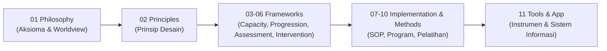

# Matriks Keterlacakan Keputusan Desain (Decision Traceability)

## 1. Prinsip Keterlacakan (Traceability)
Setiap aturan teknis, SOP, instrumen asesmen, dan fitur aplikasi dalam ekosistem TUMBUH harus dapat dilacak alur penurunannya secara logis (*backward & forward traceability*) dari aksioma filosofis dasar.

---

## 2. Contoh Matriks Keterlacakan Sistemik

| Aksioma Filosofis (`01 Philosophy`) | Prinsip Turunan (`02 Principles`) | Kerangka Kerja (`03-06 Framework`) | Implementasi Lapangan (`07-11`) |
| :--- | :--- | :--- | :--- |
| **Aksioma Fitrah (P1-02-01)**: Santri membawa modal dasar kebaikan, bukan objek bermasalah. | *Husnudzan Aktif & Restorasi Fitrah* | **Capacity & Intervention**: Identifikasi kekuatan & Disiplin Positif | Larangan hukuman fisik, dialog reflektif saat melanggar. |
| **Aksioma Qudwah (P1-05-01)**: Keteladanan mendahului instruksi lisan (*Qudwah Qabla ad-Da'wah*). | *Otoritas Berbasis Keteladanan Nyata* | **Implementation**: Standarisasi peran Musyrif & Evaluasi KPI Pembina | Musyrif sholat berjamaah di shaf awal sebelum santri. |
| **Aksioma Tadarruj (P1-06-02)**: Perubahan karakter butuh langkah bertahap & konsisten. | *Gradualisme Berkelanjutan* | **Progression Framework**: Tahapan tangga **T1 s/d T4** | Pembagian kurikulum pembinaan berdasarkan jenjang kelas & level kesiapan. |
| **Aksioma Sunnatullah Bi'ah (P1-06-03)**: Lingkungan menentukan kemudahan berbuat baik. | *Desain Lingkungan Preventif (PBIS)* | **Intervention & Assessment**: PBIS Multi-Tier & Matriks Ekspektasi | Penempatan musyrif di titik rawan (*hotspots*) & form observasi perilaku harian. |
