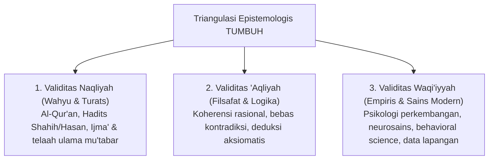

# Protokol Riset & Standar Keilmiahan Sistem TUMBUH

## 1. Pendahuluan
Dokumen ini menetapkan protokol metodologis formal untuk menjamin bahwa seluruh konsep, prinsip, asesmen, dan instrumen dalam ekosistem **TUMBUH** bersifat **ilmiah, koheren, dan dapat dipertanggungjawabkan** secara teologis (*Syar'i*), filosofis (*Ontologis-Epistemologis*), dan ilmiah modern (*Empiris-Psikologis*).

---

## 2. Triangulasi Epistemologis TUMBUH

Setiap dalil atau proposisi yang masuk ke dalam repositori TUMBUH wajib lolos uji triangulasi:

---

## 3. Tingkatan Otoritas Sumber (Hierarchy of Evidence)

1. **Tingkat 1: Nash Qath'i (Al-Qur'an & Hadits Mutawatir/Shahih)**: Menjadi *Foundational Axiom* (kebenaran mutlak penentu arah/tujuan).
2. **Tingkat 2: Khazanah Turats & Ijtihad Ulama Salaf-Khalaf** (*Al-Ghazali, Ibnul Qayyim, Ibn Taimiyyah, Raghib Al-Isfahani, Al-Attas*): Menjadi kerangka teoretis penjelas fitrah, tazkiyah, dan adab.
3. **Tingkat 3: Temuan Sains Kontemporer Berbasis Bukti (*Evidence-Based Science*)** (*CASEL, PBIS, Self-Determination Theory, Restorative Justice*): Menjadi instrumen teknis-metodologis operasional selama tidak bertentangan dengan prinsip Tingkat 1 & 2.
4. **Tingkat 4: Data Empiris & Best Practices Pesantren**: Observasi lapangan, data perilaku santri harian, dan evaluasi berkala.

---

## 4. Kriteria Kelolosan Konsep (Scientific Rigor Checklist)
Sebuah konsep dinyatakan **Valid & Dapat Dipertanggungjawabkan** jika memenuhi 4 syarat:
- [x] **Falsifiability & Clarity**: Batasan istilah terdefinisi jelas dan tidak ambigu.
- [x] **Theological Consistency**: Tidak mengandung reduksionisme sekuler atau relativisme nilai.
- [x] **Empirical Applicability**: Mampu diobservasi dan diterapkan dalam realitas kehidupan santri di pondok.
- [x] **Restorative Ethics**: Menjunjung tinggi martabat insani (*Karamah Insaniyyah*) dan melarang kekerasan fisik/mental.
