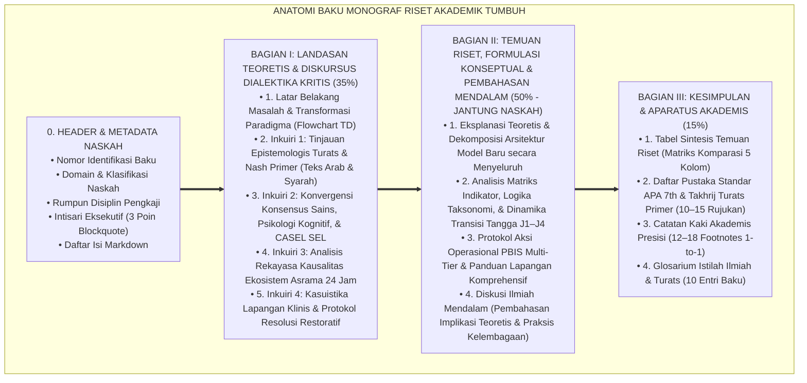

# WORKFLOW STANDAR ISI PENELITIAN & STRUKTUR BAKU MONOGRAF RISET TUMBUH
## *Pedoman Mutu Utama (Master Quality Standard): Standarisasi Penulisan Naskah Monograf Riset Akademik, Diskursus Dialektika Kritis Turats-Sains-Sistemik, Eksplanasi Formulasi Konseptual & Pembahasan Mendalam (Bagian II Berbobot Utama), serta Aparatus Akademis Terpadu*

**Nomor Dokumen Induk**: `METHODOLOGY/TUMBUH-STD-MONOGRAPH-WORKFLOW/2026`  
**Otoritas Pengesahan**: Dewan Keilmuan & Riset Ekosistem TUMBUH Pesantren  
**Status**: 🌟 **Baku & Mengikat Seluruh Agen & Penulis (Master Repository Standard - Edisi Riset Akademik Murni)**  

---

> ### 💡 INTISARI EKSEKUTIF (EXECUTIVE SUMMARY)
>
> * **Tujuan Dokumen:**  
>   Menetapkan cetak biru (*blueprint*) dan alur kerja (*workflow*) baku penulisan naskah riset monograf di seluruh folder proyek (P1 s/d P11) agar memiliki **bobot keilmuan akademis murni (Scholarly Treatise)**, terbebas dari format tanya-jawab artifisial/skrip sandiwara (*Anti-Strawman Q&A*), mengutamakan kedalaman telaah literatur kritis Turats dan sains, menyajikan **pembahasan substantif dan formulasi operasional yang sangat tebal dan mendalam pada Bagian II (50% porsi naskah)**, serta dilengkapi aparatus akademis standar internasional.
> * **Prinsip Utama: Diskursus Ilmiah Kritis & Formulasi Teoretis Substantif (*The Scholarly Synthesis*):**  
>   Setiap naskah monograf disusun dengan gaya penulisan Guru Besar/Akademisi Senior: narasi mengalir, argumentasi logis berwibawa, analisis dekomposisi variabel yang komprehensif, didukung diagram alur Mermaid, teks primer Turats berharakat, konvergensi sains neuroedukasi peer-reviewed, studi kasus klinis 24 jam, tabel sintesis komparatif, catatan kaki presisi, dan glosarium ilmiah.
> * **Triad Pertumbuhan Simbiotik:**  
>   Setiap perumusan modul wajib menguraikan secara eksplisit dan mendalam bagaimana inovasi yang ditawarkan menumbuhkan **Santri Tumbuh** (adab, fitrah, & otonomi moral), **Guru/Musyrif Tumbuh** (kompetensi pedagogis, konseling, & terlindungi dari burnout), dan **Sistem Lembaga Tumbuh** (SOP akuntabel berbasis data PBIS & bebas kekerasan).

---

## 📑 DAFTAR ISI PROTOKOL WORKFLOW

- [BAGIAN 1: ANATOMI STRUKTUR BAKU MONOGRAF RISET](#bagian-1-anatomi-struktur-baku-monograf-riset)
  - [1. Metadata Header & Identifikasi Dokumen](#1-metadata-header--identifikasi-dokumen)
  - [2. Intisari Eksekutif (Executive Summary)](#2-intisari-eksekutif-executive-summary)
  - [3. Daftar Isi Terstruktur](#3-daftar-isi-terstruktur)
  - [4. Bagian I: Landasan Teoretis & Diskursus Dialektika Kritis (Porsi 35%)](#4-bagian-i-landasan-teoretis--diskursus-dialektika-kritis-porsi-35)
  - [5. Bagian II: Temuan Riset, Formulasi Konseptual & Pembahasan Mendalam (Porsi 50% - Jantung Naskah)](#5-bagian-ii-temuan-riset-formulasi-konseptual--pembahasan-mendalam-porsi-50---jantung-naskah)
  - [6. Bagian III: Kesimpulan & Aparatus Akademis (Porsi 15%)](#6-bagian-iii-kesimpulan--aparatus-akademis-porsi-15)
- [BAGIAN 2: PEDOMAN GAYA PENULISAN AKADEMIS (ELIMINASI GAYA TERSETTING)](#bagian-2-pedoman-gaya-penulisan-akademis-eliminasi-gaya-tersetting)
- [BAGIAN 3: CHECKLIST AUDIT MUTU KELOLOSAN NASKAH (QUALITY GATE)](#bagian-3-checklist-audit-mutu-kelolosan-naskah-quality-gate)

---

# BAGIAN 1: ANATOMI STRUKTUR BAKU MONOGRAF RISET

Setiap berkas monograf dalam ekosistem TUMBUH wajib mengikuti proporsi dan pembagian bab berikut:



---

### 1. Metadata Header & Identifikasi Dokumen
Wajib mencantumkan blok identitas standar di awal berkas:
```markdown
# [KODE-BERKAS]: [JUDUL BESAR DOKUMEN]
## *Monograf Riset Akademik: [Sub-judul Komprehensif Memuat Fondasi Filosofis, Konsensus Sains, dan Formulasi Operasional Pesantren 24 Jam]*

**Nomor Identifikasi**: `[KODE]/MONOGRAF-RISET-[TOPIK]/2026`  
**Domain**: `[Nomor Domain]` > `[Nama Folder]` (Sub-Modul `[XX]`: `[Topik]`)  
**Klasifikasi Naskah**: *Academic Research Monograph*  
**Rumpun Disiplin Pengkaji**: [Daftar 4–5 Disiplin Keilmuan Relevan]  
```

---

### 2. Intisari Eksekutif (Executive Summary)
Memuat ringkasan eksekutif 3 poin dalam *blockquote alert*:
* **Kelemahan/Anomali Paradigma Konvensional**: Apa kegagalan mendasar di lapangan pesantren?
* **Inovasi Konseptual & Teoretis TUMBUH**: Apa tawaran model baru dan sintesis keilmuan yang dirumuskan?
* **Formulasi Operasional & Pembuktian Lapangan**: Bagaimana mekanisme implementasi dan dampak simbiotiknya?

---

### 3. Daftar Isi Terstruktur
Memuat tautan jangkar markdown internal (*anchor links*) menuju Bagian I, Bagian II, dan Bagian III secara lengkap.

---

### 4. Bagian I: Landasan Teoretis & Diskursus Dialektika Kritis (Porsi 35%)

Bagian ini membedah akar masalah dan tinjauan literatur kritis melalui **narasi ilmiah mengalir tanpa format tanya-jawab buatan**:

* **1. Latar Belakang Masalah**: Narasi kritis fenomena lapangan (*Ground-zero problem*) disertai Diagram Transformasi Paradigma (`flowchart TD`).
* **2. Inkuiri 1 (Epistemologi Turats & Teologis)**:
  * Kritik terhadap reduksionisme historis / pemahaman sempit.
  * Pemaparan dalil Al-Qur'an dan Hadits primer dengan khat Arab berharakat, terjemahan, dan syarah mendalam (*Ihya', Thahawiyyah, Al-Muwafaqat, Madarijus Salikin, dll.*).
  * Penalaran deduktif mantiqi yang menyatu dalam paragraf argumentasi.
* **3. Inkuiri 2 (Konvergensi Sains Kognitif & Psikologi Perkembangan)**:
  * Tinjauan konsensus sains internasional peer-reviewed (Neurosains PFC-Amigdala, CASEL SEL, *Self-Determination Theory*, *Executive Functions*, dll.).
  * Rekonsiliasi ilmiah antara temuan empiris modern dengan prinsip fitrah Islam.
* **4. Inkuiri 3 (Rekayasa Sistemik & Dinamika Lingkungan 24 Jam)**:
  * Analisis kausalitas tata ruang asrama (Masjid, Kelas, Kamar, Titik Rawan/Hotspots, Fasilitas Gawai).
  * Pemodelan ekosistem pembiasaan karakter (*Habit Loop & Environmental Nudges*).
* **5. Inkuiri 4 (Kasuistika Lapangan Klinis & Resolusi Restoratif)**:
  * Analisis mendalam terhadap dilema nyata pengasuhan asrama (akar penyebab psikosial dan sistemik).
  * Diagram Alur Protokol Restoratif (`flowchart TD`) yang mengedepankan de-eskalasi emosi, tabayyun, restitusi logis, dan pemulihan ukhuwah tanpa kekerasan.

---

### 5. Bagian II: Temuan Riset, Formulasi Konseptual & Pembahasan Mendalam (Porsi 50% - Jantung Naskah)

**Bagian ini adalah INTI DAN BAGIAN PALING TEBAL dari seluruh monograf.** Wajib menguraikan secara luas, detail, dan deskriptif:

* **1. Eksplanasi Teoretis & Arsitektur Konseptual Model Baru**:
  * Menjabarkan secara mendalam filosofi dan definisi operasional dari setiap dimensi/komponen model.
  * Menjelaskan hubungan saling-pengaruh antar-variabel, mekanisme input-proses-output, dan diagram arsitektur sistem.
* **2. Dekomposisi Indikator, Matriks Taksonomi, & Dinamika Transisi Tangga J1–J4**:
  * Menyajikan tabel matriks taksonomi capaian perilaku secara lengkap.
  * **Wajib memberikan narasi eksplanasi mendalam per level (J1, J2, J3, J4)**: Bagaimana transisi psikologis terjadi? Mengapa indikator tertentu ditempatkan di level tertentu? Bagaimana mekanisme kenaikan jenjang (*Level-Up Gateways*) dikawal?
* **3. Protokol Aksi Operasional PBIS Multi-Tier & Panduan Lapangan Komprehensif**:
  * Menjabarkan Standar Operasional Prosedur (SOP) secara terperinci langkah demi langkah.
  * Panduan operasional konkret untuk Musyrif, Guru, dan Santri pada **Tier 1 (Universal 100%)**, **Tier 2 (Targeted 10-15%)**, dan **Tier 3 (Intensive 1-5%)**.
  * Strategi pencegahan kelelahan kerja (*Burnout Protection*) bagi tenaga pendidik.
* **4. Diskusi Ilmiah & Implikasi Kebijakan Kelembagaan (*Scholarly Discussion*)**:
  * Membahas mengapa formulasi ini menjawab kelemahan sistem lama.
  * Implikasi teoretis bagi pengembangan ilmu pendidikan Islam kontemporer.
  * Implikasi praktis bagi penjaminan mutu lembaga pesantren dan kepuasan wali santri.

---

### 6. Bagian III: Kesimpulan & Aparatus Akademis (Porsi 15%)

* **1. Tabel Sintesis Temuan Riset**: Matriks komparasi 5 kolom (*Dimensi Parameter, Paradigma Tradisional, Rekonstruksi TUMBUH, Landasan Rujukan Primer, Implikasi Praksis Lapangan*).
* **2. Daftar Pustaka Akademis & Rujukan Turats Primer**: 10–15 daftar pustaka otoritatif standar APA 7th Edition + Tahqiq Turats Klasik.
* **3. Catatan Kaki Akademis (*Footnotes*)**: 12–18 sitasi catatan kaki presisi (`[^1]` s/d `[^18]`) dengan relasi 1-to-1 terhadap teks.
* **4. Glosarium Istilah Ilmiah & Turats**: 10 entri istilah baku beserta definisi operasionalnya.

---

# BAGIAN 2: PEDOMAN GAYA PENULISAN AKADEMIS (ELIMINASI GAYA TERSETTING)

Untuk memastikan naskah berwibawa dan tidak terasa kaku atau buatan:

1. ❌ **DILARANG MENGGUNAKAN**:
   - Format dialog "🥊 Ronde 1 / Ronde 2 / Ronde 3".
   - Kutipan kartun/strawman seperti *"Pihak A: 'Santri harus dipukul biar jera'..."*.
   - Frasa formulaik kaku *"Premis Mayor: ... Premis Minor: ... Konklusi: ..."* di setiap sub-bab.
2. ✅ **WAJIB MENGGUNAKAN**:
   - Gaya penulisan monograf ilmiah berbobot (*Academic Scholarly Discourse*).
   - Analisis diskursus kritis yang mempertemukan madzhab pemikiran secara objektif.
   - Penjelasan mendalam, deskriptif, dan aplikatif pada Bagian II.
   - Nada tulisan yang ilmiah, mengalir, transformatif, dan sarat adab.

---

# BAGIAN 3: CHECKLIST AUDIT MUTU KELOLOSAN NASKAH (QUALITY GATE)

| No | Parameter Audit Mutu | Kriteria Kelolosan Mutlak | Status Verifikasi |
| :--- | :--- | :--- | :---: |
| 1 | **Proporsi Substantif** | **Bagian II mencakup minimal 45–50% dari total panjang naskah** dengan uraian eksplanatif yang kaya dan mendalam. | [ ] |
| 2 | **Gaya Penulisan Ilmiah** | Bebas 100% dari format dialog ronde tinju / strawman Q&A; naskah mengalir secara akademis murni. | [ ] |
| 3 | **Kedalaman Turats** | Memuat teks Arab berharakat, syarah kitab mu'tabar, dan hermeneutika syar'i yang otoritatif. | [ ] |
| 4 | **Ketajaman Sains** | Mengintegrasikan neurosains kognitif, CASEL SEL, dan teori psikologi perkembangan mutakhir. | [ ] |
| 5 | **Operasionalitas Lapangan** | Menjabarkan protokol PBIS Multi-Tier dan dinamika 4 lokus asrama 24 jam secara terperinci. | [ ] |
| 6 | **Triad Pertumbuhan** | Menguraikan dampak positif serempak bagi Santri, Guru/Musyrif, dan Sistem Lembaga. | [ ] |
| 7 | **Kelengkapan Aparatus** | Tabel Sintesis 5 Kolom, 10–15 Daftar Pustaka APA/Turats, 12–18 Footnotes, dan 10 Glosarium. | [ ] |
