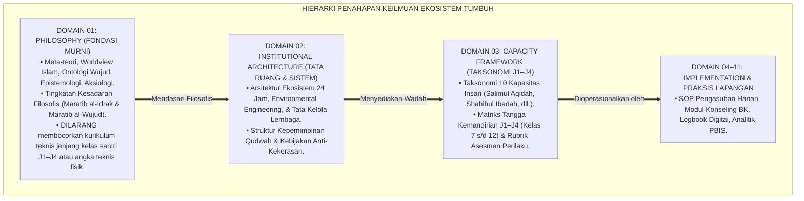
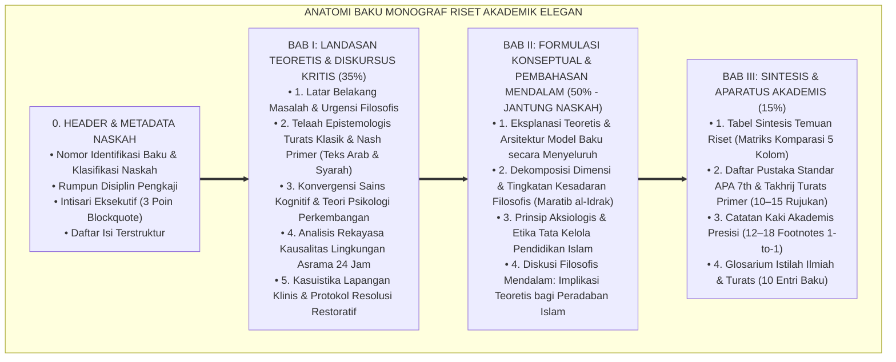

# WORKFLOW STANDAR ISI PENELITIAN & STRUKTUR BAKU MONOGRAF RISET TUMBUH
## *Pedoman Mutu Utama (Master Quality Standard): Standarisasi Penulisan Monograf Akademis Ilmiah Murni, Penahapan Epistemologis Lintas Domain (Domain-Specific Staging), Judul Tematik Mengalir Elegan, serta Aparatus Akademis Terpadu*

**Nomor Dokumen Induk**: `METHODOLOGY/TUMBUH-STD-MONOGRAPH-WORKFLOW/2026`  
**Otoritas Pengesahan**: Dewan Keilmuan & Riset Ekosistem TUMBUH Pesantren  
**Status**: 🌟 **Baku & Mengikat Seluruh Agen & Penulis (Master Repository Standard - Edisi Monograf Akademik Elegan)**  

---

> ### 💡 INTISARI EKSEKUTIF (EXECUTIVE SUMMARY)
>
> * **Tujuan Dokumen:**  
>   Menetapkan cetak biru (*blueprint*) dan pedoman baku penulisan naskah monograf di seluruh folder proyek (P1 s/d P11) agar memiliki **wibawa keilmuan akademis murni (*Scholarly Treatise*) setara karya Guru Besar**, terbebas dari format tanya-jawab artifisial (*Anti-Strawman Q&A*) dan label formulaik kaku (`Inkuiri 1/2/3`), menjaga **penahapan epistemologis lintas domain yang tepat (*Epistemic Staging*)**, menyajikan **pembahasan substantif dan formulasi mendalam pada Bab II (50% porsi naskah)**, serta dilengkapi aparatus akademis standar internasional.
> * **Prinsip Penahapan Epistemologis Lintas Domain (*Anti-Category Mistake*):**  
>   - **Domain 01 (Philosophy)**: Fokus pada **Meta-teori, Worldview, Epistemologi, Hakikat Insan, Aksiologi, & Tingkatan Kesadaran Filosofis Murni (*Maratib al-Idrak & Maratib al-Wujud*)**. Dilarang keras membocorkan detail teknis kurikulum kelas santri J1–J4 (Kelas 7–12) atau angka teknis SOP fisik asrama secara prematur.
>   - **Domain 02 (Institutional Architecture)**: Blueprint Tata Kelola Kelembagaan, Arsitektur Lingkungan 24 Jam (*Environmental Engineering*), dan Manajemen Musyrif.
>   - **Domain 03 (Capacity Framework)**: Tempat perumusan resmi **Taksonomi 10 Kapasitas Insan & Matriks Progresi Tangga J1–J4 (Kelas 7–12)**.
>   - **Domain 04 s/d 11 (Implementation, Counseling, Dormitory, Digital)**: Modul operasional, logbook digital, CICO, dan restorative justice.
> * **Triad Pertumbuhan Simbiotik:**  
>   Setiap perumusan modul wajib menguraikan bagaimana inovasi yang ditawarkan menumbuhkan **Santri Tumbuh** (fitrah, adab, & otonomi moral), **Guru/Musyrif Tumbuh** (kompetensi pedagogis, konseling, & terlindungi dari burnout), dan **Sistem Lembaga Tumbuh** (SOP akuntabel berbasis data PBIS & bebas kekerasan).

---

## 📑 DAFTAR ISI PROTOKOL WORKFLOW

- [BAGIAN 1: PENAHAPAN EPISTEMOLOGIS LINTAS DOMAIN (DOMAIN-SPECIFIC STAGING)](#bagian-1-penahapan-epistemologis-lintas-domain-domain-specific-staging)
- [BAGIAN 2: ANATOMI STRUKTUR BAKU MONOGRAF RISET (35% - 50% - 15%)](#bagian-2-anatomi-struktur-baku-monograf-riset-35---50---15)
  - [1. Metadata Header & Identifikasi Dokumen](#1-metadata-header--identifikasi-dokumen)
  - [2. Intisari Eksekutif (Executive Summary)](#2-intisari-eksekutif-executive-summary)
  - [3. Daftar Isi Terstruktur](#3-daftar-isi-terstruktur)
  - [4. Bab I: Landasan Teoretis & Diskursus Dialektika Kritis (Porsi 35%)](#4-bab-i-landasan-teoretis--diskursus-dialektika-kritis-porsi-35)
  - [5. Bab II: Formulasi Konseptual & Pembahasan Mendalam (Porsi 50% - Jantung Naskah)](#5-bab-ii-formulasi-konseptual--pembahasan-mendalam-porsi-50---jantung-naskah)
  - [6. Bab III: Kesimpulan & Aparatus Akademis (Porsi 15%)](#6-bab-iii-kesimpulan--aparatus-akademis-porsi-15)
- [BAGIAN 3: PEDOMAN GAYA BAHASA ELEGAN & NATURAL](#bagian-3-pedoman-gaya-bahasa-elegan--natural)
- [BAGIAN 4: CHECKLIST AUDIT MUTU KELOLOSAN NASKAH (QUALITY GATE)](#bagian-4-checklist-audit-mutu-kelolosan-naskah-quality-gate)

---

# BAGIAN 1: PENAHAPAN EPISTEMOLOGIS LINTAS DOMAIN (DOMAIN-SPECIFIC STAGING)

Untuk memastikan setiap domain berada pada kedalaman dan proporsi keilmuan yang tepat:



---

# BAGIAN 2: ANATOMI STRUKTUR BAKU MONOGRAF RISET (35% - 50% - 15%)

Setiap naskah monograf disusun dengan proporsi baku dan judul sub-bab tematik yang mengalir alami:



---

### 1. Metadata Header & Identifikasi Dokumen
```markdown
# [KODE-BERKAS]: [JUDUL BESAR DOKUMEN]
## *Monograf Riset: [Sub-judul Komprehensif Memuat Fondasi Filosofis, Konsensus Sains, dan Formulasi Teoretis]*

**Nomor Identifikasi**: `[KODE]/MONOGRAF-RISET-[TOPIK]/2026`  
**Domain**: `[Nomor Domain]` > `[Nama Folder]` (Sub-Modul `[XX]`: `[Topik]`)  
**Klasifikasi Naskah**: *Academic Research Monograph*  
**Rumpun Disiplin Pengkaji**: [Daftar 4–5 Disiplin Keilmuan Relevan]  
```

---

### 2. Intisari Eksekutif (Executive Summary)
Memuat ringkasan eksekutif 3 poin dalam *blockquote alert*:
* **Kelemahan/Anomali Paradigma Konvensional**: Apa kegagalan mendasar dalam cara pandang lama?
* **Inovasi Konseptual & Teoretis TUMBUH**: Apa tawaran model baru dan sintesis keilmuan yang dirumuskan?
* **Formulasi Operasional & Dampak Triad**: Bagaimana transformasi kesadaran dan etika tata kelola yang dihasilkan?

---

### 3. Daftar Isi Terstruktur
Memuat tautan jangkar markdown internal (*anchor links*) menuju Bab I, Bab II, dan Bab III secara lengkap.

---

### 4. Bab I: Landasan Teoretis & Diskursus Dialektika Kritis (Porsi 35%)

Menyajikan diskursus kritis dengan judul sub-bab tematik substantif yang mengalir:
1. **Krisis Paradigma / Latar Belakang Masalah**: Uraian fenomena kritis disertai Diagram Alur Transformasi (`flowchart TD`).
2. **Telaah Epistemologi Turats & Nash Primer**: Teks Arab berharakat, terjemahan, dan syarah mu'tabar (*Ihya', Thahawiyyah, Al-Muwafaqat, Madarijus Salikin, dll.*).
3. **Konvergensi Sains Kognitif & Psikologi**: Tinjauan sains neurobiologis, CASEL SEL, dan Self-Determination Theory.
4. **Analisis Rekayasa Kausalitas Lingkungan 24 Jam**: Penyatuan hukum alam fisik (*'Alam Mulk*) dan spiritual (*'Alam Malakut*).
5. **Kasuistika Lapangan & Resolusi Restoratif**: Studi kasus klinis dan Diagram Alur Resolusi Restoratif (`flowchart TD`).

---

### 5. Bab II: Formulasi Konseptual & Pembahasan Mendalam (Porsi 50% - Jantung Naskah)

**Bagian ini adalah INTI DAN BAGIAN PALING TEBAL dari seluruh monograf.** Wajib menguraikan secara luas, detail, dan deskriptif:
1. **Eksplanasi Teoretis & Arsitektur Konseptual Model Baru**: Penjabaran filosofi, definisi operasional setiap pilar wujud, dan diagram arsitektur sistem.
2. **Dekomposisi Dimensi & Empat Tingkatan Kesadaran Filosofis (*Maratib al-Idrak*)**:
   - *Tingkat 1: Kesadaran Indrawi-Empiris (*Al-Idrak al-Hissiy / 'Alam Mulk*)*
   - *Tingkat 2: Kesadaran Nalar Kausalitas (*Al-Idrak al-'Aqliy / Sunnatullah*)*
   - *Tingkat 3: Kesadaran Ruhani Muraqabah (*Al-Idrak al-Qalbiy / 'Alam Malakut*)*
   - *Tingkat 4: Kesadaran Hikmah & Insan Adabi Paripurna (*Al-Idrak al-Kulliy / Qudwah Hasanah*)*
   - Narasi analitis dinamika transisi filosofis antar-tingkatan.
3. **Prinsip Aksiologis & Etika Tata Kelola Pendidikan Islam**: Prinsip pemuliaan fitrah insan, keadilan syariat, dan proteksi tenaga pendidik dari burnout.
4. **Diskusi Filosofis Mendalam (*Scholarly Discussion*)**: Implikasi teoretis bagi pengembangan ilmu pendidikan Islam dan masa depan peradaban umat.

---

### 6. Bab III: Kesimpulan & Aparatus Akademis (Porsi 15%)

1. **Tabel Sintesis Temuan Riset**: Matriks komparasi 5 kolom (*Dimensi Parameter, Paradigma Tradisional, Rekonstruksi TUMBUH, Landasan Rujukan Primer, Implikasi Praksis Lapangan*).
2. **Daftar Pustaka Akademis & Rujukan Turats Primer**: 10–15 daftar pustaka otoritatif standar APA 7th Edition + Tahqiq Turats Klasik.
3. **Catatan Kaki Akademis (*Footnotes*)**: 12–18 sitasi catatan kaki presisi (`[^1]` s/d `[^18]`) dengan relasi 1-to-1 terhadap teks.
4. **Glosarium Istilah Ilmiah & Turats**: 10 entri istilah baku beserta definisi operasionalnya.

---

# BAGIAN 3: PEDOMAN GAYA BAHASA ELEGAN & NATURAL

1. ❌ **DILARANG MENGGUNAKAN**:
   - Format dialog semu "🥊 Ronde 1 / Ronde 2 / Ronde 3".
   - Label template kaku seperti `Inkuiri 1: ...`, `Inkuiri 2: ...`.
   - Kutipan strawman karikatur.
   - Pembocoran prematur kurikulum kelas santri J1–J4 di Domain 01 Philosophy.
2. ✅ **WAJIB MENGGUNAKAN**:
   - Judul sub-bab tematik substantif yang mengalir dan berwibawa.
   - Gaya penulisan monograf ilmiah tingkat Guru Besar (*Scholarly Treatise*).
   - Analisis diskursus kritis yang mendalam dan deskriptif pada Bab II.
   - Nada tulisan yang akademis, mengalir, transformatif, dan sarat adab.

---

# BAGIAN 4: CHECKLIST AUDIT MUTU KELOLOSAN NASKAH (QUALITY GATE)

| No | Parameter Audit Mutu | Kriteria Kelolosan Mutlak | Status Verifikasi |
| :--- | :--- | :--- | :--- :---: |
| 1 | **Proporsi Substantif** | **Bab II mencakup minimal 45–50% dari total panjang naskah** dengan uraian eksplanatif yang kaya dan mendalam. | [ ] |
| 2 | **Gaya Bahasa Elegan** | Bebas 100% dari label `Inkuiri 1/2/3` dan dialog ronde tinju; sub-bab bertema substantif mengalir alami. | [ ] |
| 3 | **Penahapan Epistemologis** | Domain 01 murni meta-teori & 4 tingkatan kesadaran (*Maratib al-Idrak*); tidak membocorkan teknis jenjang J1–J4. | [ ] |
| 4 | **Kedalaman Turats** | Memuat teks Arab berharakat, syarah kitab mu'tabar, dan hermeneutika syar'i yang otoritatif. | [ ] |
| 5 | **Ketajaman Sains** | Mengintegrasikan neurosains kognitif, CASEL SEL, dan teori psikologi perkembangan mutakhir. | [ ] |
| 6 | **Triad Pertumbuhan** | Menguraikan dampak positif serempak bagi Santri, Guru/Musyrif, dan Sistem Lembaga. | [ ] |
| 7 | **Kelengkapan Aparatus** | Tabel Sintesis 5 Kolom, 10–15 Daftar Pustaka APA/Turats, 12–18 Footnotes, dan 10 Glosarium. | [ ] |
