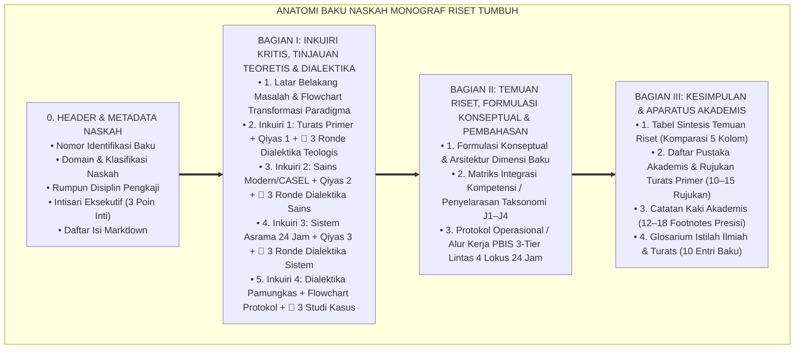
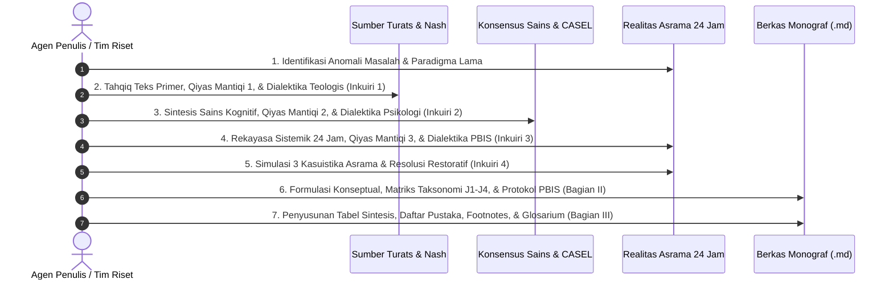

# WORKFLOW STANDAR ISI PENELITIAN & STRUKTUR BAKU MONOGRAF RISET TUMBUH
## *Pedoman Mutu Utama (Master Quality Standard): Standarisasi Penulisan Naskah Monograf Riset Akademik, Triangulasi Metodologi Turats-Sains-Sistem, Dialektika Tanya-Jawab 3 Ronde Sejak Inkuiri 1, serta Aparatus Akademis Terpadu untuk Seluruh Berkas Repositori TUMBUH*

**Nomor Dokumen Induk**: `METHODOLOGY/TUMBUH-STD-MONOGRAPH-WORKFLOW/2026`  
**Otoritas Pengesahan**: Dewan Keilmuan & Riset Ekosistem TUMBUH Pesantren  
**Status**: 🌟 **Baku & Mengikat Seluruh Agen & Penulis (Master Repository Standard)**  

---

> ### 💡 INTISARI EKSEKUTIF (EXECUTIVE SUMMARY)
>
> * **Tujuan Dokumen:**  
>   Menetapkan cetak biru (*blueprint*) dan alur kerja (*workflow*) baku penulisan naskah riset monograf di seluruh folder proyek (P1 s/d P11) agar memiliki keseragaman struktur, kedalaman dialektika filosofis, ketajaman logika silogisme (*Qiyas Mantiqi*), presisi sains neuroedukasi, kepatuhan etika restoratif, dan kelengkapan aparatus akademis (15.000–35.000+ karakter per berkas).
> * **Prinsip Utama: Model Hibrida Riset Dialektis (*The Grand Synthesis*):**  
>   Setiap berkas monograf **wajib memulai dialektika tanya-jawab argumentatif (🥊 Ronde 1, Ronde 2, Ronde 3) sejak Inkuiri 1**, didukung diagram alur Mermaid, teks primer Turats berharakat, formalisasi silogisme logika, konvergensi sains internasional, studi kasus asrama 24 jam, tabel sintesis, catatan kaki presisi, dan glosarium ilmiah.
> * **Triad Pertumbuhan Simbiotik:**  
>   Setiap naskah riset wajib membuktikan bahwa solusi yang ditawarkan menumbuhkan **Santri Tumbuh** (adab & fitrah), **Guru/Musyrif Tumbuh** (kompetensi & terlindungi dari burnout), dan **Sistem Lembaga Tumbuh** (SOP akuntabel & aman dari kekerasan).

---

## 📑 DAFTAR ISI PROTOKOL WORKFLOW

- [BAGIAN 1: ANATOMI STRUKTUR BAKU MONOGRAF RISET](#bagian-1-anatomi-struktur-baku-monograf-riset)
  - [1. Metadata Header & Identifikasi Dokumen](#1-metadata-header--identifikasi-dokumen)
  - [2. Intisari Eksekutif (Executive Summary)](#2-intisari-eksekutif-executive-summary)
  - [3. Daftar Isi Terstruktur](#3-daftar-isi-terstruktur)
  - [4. Bagian I: Inkuiri Kritis, Tinjauan Teoretis & Dialektika (Inkuiri 1 s/d 4)](#4-bagian-i-inkuiri-kritis-tinjauan-teoretis--dialektika-inkuiri-1-sd-4)
  - [5. Bagian II: Temuan Riset, Formulasi Konseptual & Pembahasan](#5-bagian-ii-temuan-riset-formulasi-konseptual--pembahasan)
  - [6. Bagian III: Kesimpulan & Aparatus Akademis](#6-bagian-iii-kesimpulan--aparatus-akademis)
- [BAGIAN 2: WORKFLOW 7 LANGKAH PENYUSUNAN BERKAS](#bagian-2-workflow-7-langkah-penyusunan-berkas)
  - [Langkah 1: Identifikasi Masalah & Paradigma Lama vs Baru](#langkah-1-identifikasi-masalah--paradigma-lama-vs-baru)
  - [Langkah 2: Tahqiq Turats Primer & Formalisasi Qiyas Mantiqi 1 (Inkuiri 1)](#langkah-2-tahqiq-turats-primer--formalisasi-qiyas-mantiqi-1-inkuiri-1)
  - [Langkah 3: Konvergensi Konsensus Sains Modern & Qiyas Mantiqi 2 (Inkuiri 2)](#langkah-3-konvergensi-konsensus-sains-modern--qiyas-mantiqi-2-inkuiri-2)
  - [Langkah 4: Rekayasa Sistemik Asrama 24 Jam & Qiyas Mantiqi 3 (Inkuiri 3)](#langkah-4-rekayasa-sistemik-asrama-24-jam--qiyas-mantiqi-3-inkuiri-3)
  - [Langkah 5: Simulasi Kasuistika Lapangan & Titik Temu Konsensus (Inkuiri 4)](#langkah-5-simulasi-kasuistika-lapangan--titik-temu-konsensus-inkuiri-4)
  - [Langkah 6: Kodifikasi Matriks Formulasi, Taksonomi, & Protokol PBIS (Bagian II)](#langkah-6-kodifikasi-matriks-formulasi-taksonomi--protokol-pbis-bagian-ii)
  - [Langkah 7: Penyusunan Aparatus Akademis, Footnotes, & Glosarium (Bagian III)](#langkah-7-penyusunan-aparatus-akademis-footnotes--glosarium-bagian-iii)
- [BAGIAN 3: CHECKLIST AUDIT MUTU KELOLOSAN NASKAH (QUALITY GATE)](#bagian-3-checklist-audit-mutu-kelolosan-naskah-quality-gate)

---

# BAGIAN 1: ANATOMI STRUKTUR BAKU MONOGRAF RISET

Setiap berkas monograf dalam ekosistem TUMBUH wajib mengikuti format kanonikal berikut tanpa pengecualian:



---

### 1. Metadata Header & Identifikasi Dokumen
Wajib mencantumkan blok identitas standar di awal berkas:
```markdown
# [KODE-BERKAS]: [JUDUL BESAR DOKUMEN]
## *Monograf Riset Akademik: [Sub-judul Lengkap Memuat Teori Turats, Konsensus Sains, dan Implementasi Asrama 24 Jam]*

**Nomor Identifikasi**: `[KODE]/MONOGRAF-RISET-[TOPIK]/2026`  
**Domain**: `[Nomor Domain]` > `[Nama Folder]` (Sub-Modul `[XX]`: `[Topik]`)  
**Klasifikasi Naskah**: *Academic Research Monograph*  
**Rumpun Disiplin Pengkaji**: [Daftar 4–5 Disiplin Keilmuan Relevan]  
```

---

### 2. Intisari Eksekutif (Executive Summary)
Memuat ringkasan eksekutif 3 poin dalam *blockquote alert*:
* **Kelemahan/Anomali Paradigma Konvensional**: Apa masalah nyata di pesantren?
* **Inovasi Konseptual TUMBUH**: Apa temuan kunci dan tawaran keilmuan yang dirumuskan?
* **Model Metodologi & Dampak Lapangan**: Bagaimana sintesis dialektis dan bukti operasionalnya?

---

### 3. Daftar Isi Terstruktur
Memuat tautan jangkar markdown internal (*anchor links*) menuju Bagian I, Bagian II, dan Bagian III secara lengkap.

---

### 4. Bagian I: Inkuiri Kritis, Tinjauan Teoretis & Dialektika (Inkuiri 1 s/d 4)

Setiap sub-bab inkuiri wajib memiliki komponen baku:

#### A. Latar Belakang Masalah (Sub-bab 1):
* Narasi tajam mengenai fenomena lapangan (*Ground-zero problem*).
* **Diagram Flowchart Transformasi Paradigma** (`flowchart TD`): Membandingkan Paradigma Lama (Retributif/Formalistik) vs Paradigma Baru TUMBUH (Restoratif/Holistik).

#### B. Inkuiri 1 (Fondasi Turats & Teologis):
* **Diagram Dialektika 1** (`graph TD`): `Gugatan Pihak A ➔ Tinjauan Nash/Kitab ➔ Titik Temu Konsensus`.
* **Formalisasi Logika Silogisme (*Qiyas Mantiqi 1*)**:
  * Premis Mayor (*al-Muqaddimah al-Kubra*)
  * Premis Minor (*al-Muqaddimah ash-Shughra*)
  * Konklusi (*an-Natijah*)
* **Matan Teks Primer Arab Turats**: Disertai khat Arab berharakat, terjemahan, dan syarah makna (*Ihya', Thahawiyyah, Adab al-'Alim, dll.*).
* **🥊 Sesi Tanya-Jawab Kritis 3 Ronde**:
  * *Ronde 1: Gugatan Formalistik/Tekstual vs Transformasi Batin*.
  * *Ronde 2: Uji Kemurnian Syar'i vs Kompromi Mitos/Kenyamanan*.
  * *Ronde 3: Sanggahan Balik Fatalisme vs Ikhtiar Mujahadah*.

#### C. Inkuiri 2 (Konvergensi Konsensus Sains & Teori Psikologi):
* **Diagram Konvergensi Sains 2** (`graph TD` atau `flowchart LR`).
* **Formalisasi Logika Silogisme (*Qiyas Mantiqi 2*)**.
* **Eksplanasi Konsensus Sains Peer-Reviewed**: (CASEL SEL, *Locus of Control*, Neurosains Kognitif PFC-Amigdala, *Self-Determination Theory*, *Goal-Setting Theory*, dll.).
* **🥊 Sesi Tanya-Jawab Kritis 3 Ronde**:
  * *Ronde 1: Determinisme Biologis/Kognitif vs Agensi Moral Beriman*.
  * *Ronde 2: Bias Kognitif / Rasionalisasi Dosa vs Akuntabilitas Personal*.
  * *Ronde 3: Regulasi Emosi & Reduksi Kecemasan Eksistensial*.

#### D. Inkuiri 3 (Arsitektur Kausalitas & Rekayasa Sistem Pesantren 24 Jam):
* **Diagram Kausalitas Sistemik 3** (`flowchart TD` atau `graph LR`).
* **Formalisasi Logika Silogisme (*Qiyas Mantiqi 3*)**.
* **Analisis Dinamika Asrama 24 Jam**: Bedah lokus (Masjid, Kelas, Kamar, Titik Buta, Gawai) dan Triad Pertumbuhan Simbiotik.
* **🥊 Sesi Tanya-Jawab Kritis 3 Ronde**:
  * *Ronde 1: Kepatuhan Semu (CCTV/Rotan) vs Integritas Radar Batin Muraqabah*.
  * *Ronde 2: Ergonomi Pencatatan Musyrif Rendah Friksi (<30 Detik Fast-Logging)*.
  * *Ronde 3: Keteladanan Qudwah Pendidik & Akuntabilitas Sistem Lembaga*.

#### E. Inkuiri 4 (Arena Sintesis Kasuistika Lapangan 24 Jam & Konsensus Resolusi):
* **🥊🥊 Pertarungan Dialektika Pamungkas**: Perdebatan filosofis-operasional terdalam di asrama.
* **Diagram Alur Protokol Restoratif** (`flowchart TD`): Langkah de-eskalasi, tabayyun privat, dialog sokratik, restitusi 4R, dan reintegrasi (<12 jam).
* **📌 Tiga Kasuistika Lapangan Nyata Asrama**:
  * *Kamus Kasus 1: [Dilema Nyata 1] ➔ [Akar Masalah] ➔ [Titik Temu Konsensus]*
  * *Kamus Kasus 2: [Dilema Nyata 2] ➔ [Akar Masalah] ➔ [Titik Temu Konsensus]*
  * *Kamus Kasus 3: [Dilema Nyata 3] ➔ [Akar Masalah] ➔ [Titik Temu Konsensus]*

---

### 5. Bagian II: Temuan Riset, Formulasi Konseptual & Pembahasan
* **1. Formulasi Konseptual & Arsitektur Dimensi Baku**: Penjabaran teori/model utama dengan diagram arsitektur.
* **2. Matriks Integrasi Kompetensi / Penyelarasan Taksonomi Tangga J1–J4**: Tabel korelasi komprehensif melintasi jenjang kemandirian santri.
* **3. Protokol Operasional / Alur Kerja PBIS 3-Tier Lintas Lokus 24 Jam**: Pedoman aksi implementatif bagi Musyrif, Wali Kelas, dan Konselor BK.

---

### 6. Bagian III: Kesimpulan & Aparatus Akademis
* **1. Tabel Sintesis Temuan Riset**: Matriks 5 Kolom (*Dimensi Parameter, Pendekatan Tradisional, Rekonstruksi TUMBUH, Landasan Rujukan Primer, Implikasi Praksis*).
* **2. Daftar Pustaka Akademis & Rujukan Turats Primer**: 10–15 daftar pustaka otoritatif standar APA + Tahqiq Turats klasik.
* **3. Catatan Kaki Akademis (*Footnotes*)**: 12–18 sitasi catatan kaki presisi (`[^1]` s/d `[^16]`).
* **4. Glosarium Istilah Ilmiah & Turats**: 10 entri istilah baku beserta definisi operasionalnya.

---

# BAGIAN 2: WORKFLOW 7 LANGKAH PENYUSUNAN BERKAS

Setiap penyusunan berkas baru wajib mengikuti 7 tahapan riset berurutan:



---

# BAGIAN 3: CHECKLIST AUDIT MUTU KELOLOSAN NASKAH (QUALITY GATE)

Sebelum sebuah berkas monograf dinyatakan berstatus **🌟 A+ (Tervalidasi & Siap Diimplementasikan)**, berkas tersebut wajib lolos seluruh kriteria audit berikut:

| No | Parameter Audit Mutu | Kriteria Kelolosan Mutlak | Status Verifikasi |
| :---: | :--- | :--- | :---: |
| 1 | **Kedalaman Naskah** | Panjang naskah berkisar antara **15.000 hingga 38.000+ karakter** (350–450 baris markdown padat). | [ ] |
| 2 | **Dialektika Sejak Inkuiri 1** | Inkuiri 1 memuat Diagram Alur, Qiyas Mantiqi 1, Teks Arab Turats, dan **3 Ronde Tanya-Jawab Kritis**. | [ ] |
| 3 | **Dialektika Inkuiri 2 & 3** | Inkuiri 2 (Sains/CASEL) dan Inkuiri 3 (Sistem Asrama) masing-masing memuat Diagram, Qiyas Mantiqi, dan **3 Ronde Tanya-Jawab**. | [ ] |
| 4 | **Arena Kasuistika Inkuiri 4** | Memuat Pertarungan Dialektika Pamungkas, Diagram Alur Protokol Restoratif, dan **3 Studi Kasus Nyata Asrama**. | [ ] |
| 5 | **Triad Pertumbuhan Simbiotik**| Solusi secara eksplisit menumbuhkan **Santri, Musyrif, dan Sistem Lembaga** secara serempak. | [ ] |
| 6 | **Etika Restoratif & Anti-Kekerasan**| Bebas mutlak dari pembenaran hukuman fisik, intimidasi verbal, dan tradisi perpeloncoan feodal. | [ ] |
| 7 | **Kelengkapan Aparatus** | Memuat Tabel Sintesis, **Minimal 10 Rujukan Primer**, **Minimal 12 Footnotes**, dan **10 Entri Glosarium**. | [ ] |

---

> 📌 **Ketentuan Pelaksanaan:**  
> Dokumen workflow ini mengikat seluruh pengerjaan berkas monograf pada Project 1 (*Philosophy*), Project 2 (*Principles*), Project 3 (*Capacity Framework*), Project 4 (*Progression*), Project 5 (*Assessment*), Project 6 (*Intervention*), Project 7 (*Implementation*), Project 8 (*Integrated Approaches*), Project 9 (*Programs*), Project 10 (*Methods*), dan Project 11 (*Tools*).
