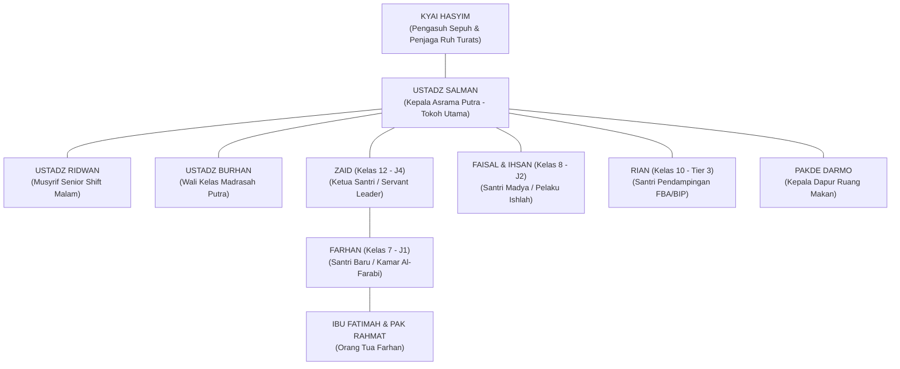

# NOVEL: MENUMBUHKAN CAHAYA DI LANGIT ASRAMA
## *Sebuah Roman Tarbiyah tentang Transformasi Pengasuhan, Ukhuwah Sejati, dan Kematangan Adab di Asrama Santri Putra*

---

**Penulis**: Tim Dewan Keilmuan & Literasi Pesantren TUMBUH  
**Latar Utama**: Kompleks Asrama Santri Putra Pesantren Darul Adab  
**Format**: Roman Edukatif / Pedagogical Narrative Novel (12 Bab Lengkap)  

---

## 🌟 Sinopsis Utama

Di balik megahnya gerbang Pesantren Darul Adab, tersimpan dua realitas yang bertolak belakang. Di permukaan, ratusan santri tampak berbaris rapi dan patuh. Namun di balik pintu-pintu kamar asrama, tersimpan ketakutan semu, dendam batin akibat sanksi fisik, dan jeritan rindu anak-anak belia yang terasing dari kasih sayang. Di sisi lain, para pembina asrama (*musyrif*) berjuang di ambang kelelahan mental (*burnout*) parah karena harus berjaga 24 jam nonstop tanpa sistem yang manusiawi.

Kisah ini mengikuti perjalanan **Ustadz Salman**, seorang musyrif muda yang awalnya percaya bahwa kedisiplinan hanya bisa ditegakkan dengan rotan dan ancaman, hingga pertemuannya dengan kearifan **Kyai Hasyim** membuka matanya tentang hakikat kemurnian fitrah manusia.

Bersama para santri—**Farhan** yang berjuang mengatasi *homesickness*, **Zaid** sang ketua santri yang mempraktikkan kepemimpinan melayani, serta **Faisal & Ihsan** yang terperangkap dalam siklus dendam masa lalu—Salman memimpin sebuah revolusi pengasuhan yang mengubah asrama putra dari tempat yang menakutkan menjadi taman surga persemaian adab dan kasih sayang (*Bi'ah Shalihah*).

---

## 👥 Daftar Tokoh Utama

---

## 📚 Daftar Bab Novel

| Bab | Judul Bab | Fokus Tema & Nilai Tarbiyah |
| :---: | :--- | :--- |
| **01** | [Bab 01: Malam Berkabut dan Pukulan Rotan](./Bab-01-Malam-Berkabut-dan-Pukulan-Rotan.md) | Titik nadir kekerasan lama, kepatuhan semu, dan rasa takut di asrama. |
| **02** | [Bab 02: Koper Biru yang Menangis di Sudut Kamar](./Bab-02-Koper-Biru-yang-Menangis-di-Sudut-Kamar.md) | Krisis adaptasi, homesickness, dan jeritan batin santri baru Jenjang J1. |
| **03** | [Bab 03: Kelelahan Jiwa Sang Penjaga Malam](./Bab-03-Kelelahan-Jiwa-Sang-Penjaga-Malam.md) | Realitas burnout musyrif asrama akibat sistem kerja tanpa shift. |
| **04** | [Bab 04: Percakapan Teh Hangat di Serambi Kiai](./Bab-04-Percakapan-Teh-Hangat-di-Serambi-Kiai.md) | Pencerahan ontologi fitrah insan dan kritik tarbiyah koersif dari Turats. |
| **05** | [Bab 05: Api yang Melalap Buku Hitam](./Bab-05-Api-yang-Melalap-Buku-Hitam.md) | Pembakaran buku pelanggaran & deklarasi mutlak Zero-Violence Pesantren. |
| **06** | [Bab 06: Menata Sepatu, Menata Jiwa](./Bab-06-Menata-Sepatu-Menata-Jiwa.md) | Transformasi kamar 5S, jadwal sirkadian 7 jam, dan 4 shift kerja musyrif. |
| **07** | [Bab 07: Pecahnya Nampan di Lorong Belakang](./Bab-07-Pecahnya-Nampan-di-Lorong-Belakang.md) | Ujian konflik di asrama, de-eskalasi lapangan, dan analisis titik rawan. |
| **08** | [Bab 08: Kartu Biru di Gazebo Pagi](./Bab-08-Kartu-Biru-di-Gazebo-Pagi.md) | Penerapan pendampingan CICO Tier 2 dan analisis FBA/BIP santri khusus. |
| **09** | [Bab 09: Majelis Ishlah dan Nasi Liwet Perdamaian](./Bab-09-Majelis-Ishlah-dan-Nasi-Liwet-Perdamaian.md) | Dialog restoratif 5 pertanyaan, ritus mayoran, dan Clean Slate Policy. |
| **10** | [Bab 10: Jejak Kaki Para Pelayan Umat](./Bab-10-Jejak-Kaki-Para-Pelayan-Umat.md) | Puncak Jenjang J4: Khidmah kepemimpinan melayani di desa dhuafa. |
| **11** | [Bab 11: Sepucuk Surat Cinta dari Kamar Al-Farabi](./Bab-11-Sepucuk-Surat-Cinta-dari-Kamar-Al-Farabi.md) | Rapor naratif karakter ipsatif, keharuan Ibu Fatimah, dan sinergi rumah. |
| **12** | [Bab 12: Menumbuhkan Cahaya di Langit Pesantren](./Bab-12-Menumbuhkan-Cahaya-di-Langit-Pesantren.md) | Epilog: Wisuda kemandirian, fajar generasi insan adabi, dan kemenangan fitrah. |
