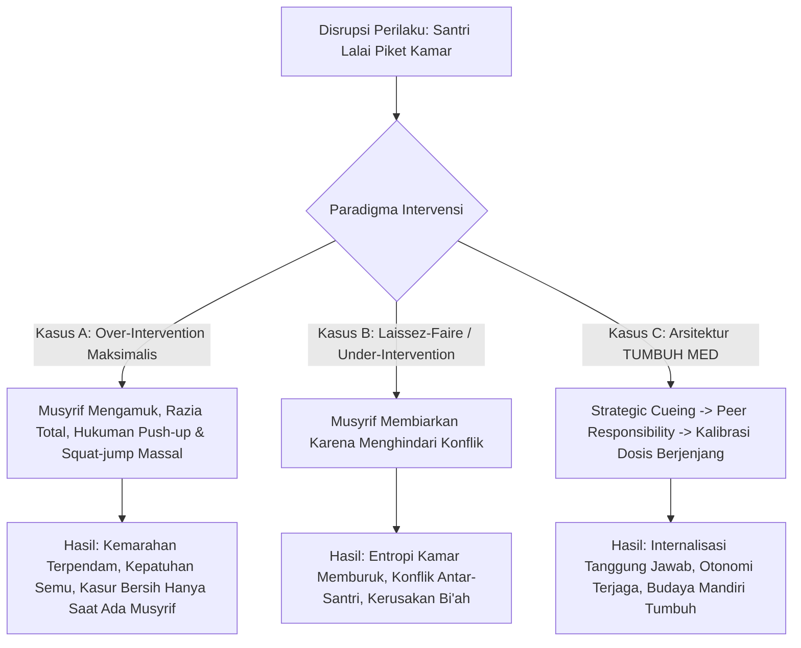

# P0001: Bagaimana Menentukan Dosis Intervensi Terkecil yang Efektif tanpa Merampas Otonomi dan Memicu Ketidakberdayaan Santri?

## 1. Status Dokumen dan Metadata Penyelidikan
- **Nomor Penyelidikan**: P0001
- **Klaster Fokus**: PROBE_07 (Intervention Architecture, Ecological Supports, & Restorative Framework)
- **Status Validasi**: Penyelidikan Aktif Lapangan (Tier 1 to Tier 3 Calibrated Inquiry)
- **Tingkat Kritis Sistem**: Fundamental & Preskriptif Arsitektur
- **Tanggal Pemutakhiran Terakhir**: 2026-10-08
- **Keterlacakan Fondasi**:
  - `01_FUNDAMENTAL/07_INTERVENTION.md` (Prinsip Intervensi Berjenjang & Minimal Effective Dose)
  - `01_FUNDAMENTAL/02_PRINCIPLES.md` (Prinsip Adab Mandiri, Perlindungan Fitrah, dan Anti-Ketergantungan)
  - `01_FUNDAMENTAL/04_CORE_MODEL.md` (Dinamika Ekologi Tarbiyah dan Daya Pulih Jiwa)
  - Turats Rujukan: *Al-Amru bi al-Ma'ruf wa an-Nahyu 'an al-Munkar* (Imam Al-Ghazali, *Ihya 'Ulumiddin* juz 2: kaidah *al-tadarruj fi al-inkar*), *I'lam al-Muwaqqi'in* (Ibnu Qayyim al-Jauziyyah: batas intervensi yang tidak menimbulkan mafsadat lebih besar)
  - Teori Kontemporer: *Minimal Effective Dose (MED) in Behavioral Intervention*, *Self-Determination Theory* (Deci & Ryan: otonomi, kompetensi, keterhubungan), *Learned Helplessness Theory* (Martin Seligman), *Iatrogenic Effects of Over-Intervention* (Dishion et al.)

---

## 2. Latar Belakang dan Urgensi Penyelidikan

Dalam tradisi pengasuhan pesantren konvensional, terdapat asumsi implisit bahwa semakin keras, semakin sering, dan semakin invasif tindakan pembina asrama (musyrif) terhadap penyimpangan santri, maka pembinaan dianggap semakin tegas, bertanggung jawab, dan berhasil. Ketika seorang santri terlambat bangun shalat subuh, ia kerap langsung dihukum fisik (lari keliling lapangan), diceramahi secara publik di hadapan seluruh asrama, dicatat pelanggarannya di papan pengumuman, dan diawasi secara melekat sepanjang hari oleh musyrif.

Namun, pengamatan mendalam pada realitas asrama 24 jam memperlihatkan paradoks yang sangat mencemaskan: **intervensi yang berlebihan (*over-intervention*) dan melampaui batas dosis yang diperlukan justru merusak kapasitas otonomi moral santri, memicu resistensi psikologis (*psychological reactance*), atau menciptakan fenomena ketidakberdayaan yang dipelajari (*learned helplessness*)**. Santri berhenti bertindak atas dorongan kesadaran diri (*muraqabatullah*), dan berpindah menjadi organisme reaktif yang hanya bergerak jika dipicu oleh instruksi, teguran, atau ancaman sanksi luar. Begitu pengawasan musyrif mengendur—misalnya saat liburan semester atau setelah lulus mondok—perilaku santri runtuh total karena struktur regulasi diri internalnya tidak pernah diberi ruang untuk bertumbuh.

Lebih buruk lagi, over-intervensi menciptakan kelelahan struktural (*burnout*) massal pada musyrif. Musyrif menghabiskan 80% energi mentalnya untuk mengurusi persoalan-persoalan mikro (sandal tidak rapi, kasur belum dilipat sempurna, terlambat 3 menit) dengan tensi krisis tingkat tinggi. Ketika krisis perilaku yang sesungguhnya terjadi (perundungan laten, kecemasan akut, krisis akidah), musyrif sudah kehabisan energi emosional dan kapasitas kognitif untuk memberikan pendampingan yang bermakna.

Oleh karena itu, TUMBUH v2.0.0 memerlukan penyelidikan arsitektural yang tuntas: **Bagaimana merumuskan dan mengoperasionalkan prinsip *Dosis Intervensi Terkecil yang Efektif* (*Minimal Effective Dose* / MED)? Bagaimana sistem membedakan situasi yang membutuhkan pembiaran pedagogis (*strategic non-intervention*), isyarat halus (*subtle cueing*), dialog reflektif, hingga intervensi intensif, tanpa merampas lokus kendali internal (*internal locus of control*) santri?**

---

## 3. Pertanyaan Kunci Penyelidikan (Probe Inquiry Questions)

1. **Batas Dosis Minimum**: Apa indikator objektif bahwa suatu intervensi telah mencapai ambang batas minimum yang cukup untuk menghentikan disrupsi atau mengoreksi arah perilaku, tanpa menambah beban traumatik atau resistensi?
2. **Kaidah Turats *Al-Tadarruj***: Bagaimana mengintegrasikan hierarki nahi munkar klasik Imam Al-Ghazali (*al-ta'rif bi luthf* -> *al-wa'zh bi husn* -> *al-taghlizh bi lisan* -> *al-man' bi al-yad*) ke dalam protokol respon bertingkat (Tier 1–3) di asrama modern?
3. **Pencegahan Iatrogenik**: Bagaimana sistem mendeteksi bahwa pembinaan yang diniatkan membantu santri justru memicu efek samping iatrogenik (stigma kelompok, fiksasi identitas penyimpang, hilangnya inisiatif mandiri)?
4. **Kalibrasi Kapasitas Musyrif**: Bagaimana membimbing musyrif agar tidak terjebak dalam dorongan emosional untuk "segera menuntaskan masalah di tempat" (*hyper-corrective impulse*) saat ego mereka terprovokasi oleh ketidakpatuhan santri?

---

## 4. Analisis Teoretis, Turats, dan Sains Modern

### 4.1. Kaidah Turats: *Al-Tadarruj fi al-Inkar* dan Maqashid Intervensi
Imam Abu Hamid Al-Ghazali dalam *Ihya 'Ulumiddin* (Kitab *Al-Amru bi al-Ma'ruf wa an-Nahyu 'an al-Munkar*) merumuskan bahwa amar ma'ruf nahi munkar bukanlah aksi pembalasan atau pelepasan amarah pendidik, melainkan pengobatan (*tibb al-qulub*). Al-Ghazali menetapkan tingkatan intervensi (*maratib al-inkar*) yang sangat presisi:
1. **At-Ta'rif (Pemberitahuan Halus/Edukasi)**: Menyadarkan santri bahwa perbuatannya keliru dengan asumsi ia belum mengetahui atau lalai. Ini dilakukan tanpa celaan dan tanpa nada menghakimi (*bi luthfin wa rifq*).
2. **Al-Wa'zh wa an-Nushh (Nasihat Empatik)**: Mengingatkan konsekuensi ukhrawi dan moral dengan sentuhan kalbu yang lembut, membangkitkan rasa malu (*haya'*) di hadapan Allah.
3. **At-Taghlizh bi al-Kalam (Ketegasan Lisan)**: Bahasa lugas dan tegas yang menunjukkan batas hukum syar'i dan tata tertib, digunakan hanya jika santri menunjukkan pembangkangan sadar, tanpa menggunakan kata-kata keji (*fahsy*) atau merendahkan martabat manusia.
4. **Al-Man' bi al-Mubasyarah (Pencegahan Fisik/Aksi Nyata)**: Mencegah terjadinya kemungkaran secara langsung (misal: menyita barang haram, memisahkan perkelahian), tanpa melampaui batas darurat.

Ibnu Qayyim al-Jauziyyah dalam *I'lam al-Muwaqqi'in* menegaskan kaidah agung: **Jika pengingkaran terhadap suatu kemungkaran justru melahirkan kemungkaran yang lebih besar atau menghilangkan kemaslahatan yang lebih utama, maka intervensi tersebut haram dilakukan**. Dalam konteks asrama, jika memarahi santri di depan umum karena kasur berantakan memicu hilangnya rasa percaya santri kepada musyrif, memicu dendam sosial, atau membunuh fitrah kecintaannya pada majelis ilmu, maka intervensi tersebut secara syar'i telah gagal dan batil secara pedagogis.

### 4.2. Sains Modern: Dosis Intervensi Minimum (MED) dan Otonomi Diri
Dalam farmakologi, *Minimal Effective Dose* (MED) adalah dosis terendah dari suatu senyawa yang menghasilkan efek terapeutik yang diinginkan; penambahan dosis di atas MED tidak meningkatkan kesembuhan, melainkan hanya meningkatkan toksisitas dan efek samping. Prinsip ini diadopsi ke dalam intervensi perilaku modern (*Behavioral Architecture*):
- **Self-Determination Theory (Deci & Ryan)**: Manusia memiliki tiga kebutuhan psikologis dasar: Otonomi (*Autonomy*), Kompetensi (*Competence*), dan Keterhubungan (*Relatedness*). Intervensi yang bersifat memaksa secara eksternal (*controlling behavior*) merampas rasa otonomi santri. Akibatnya, motivasi bergeser dari *autonomous regulation* (melakukan kebaikan karena meyakini nilainya) menjadi *external regulation* (melakukan kebaikan hanya agar tidak dihukum).
- **Learned Helplessness (Seligman)**: Ketika santri terus-menerus diintervensi, dikoreksi, dan diputuskan setiap langkah hidupnya oleh musyrif tanpa diberi ruang untuk memecahkan masalahnya sendiri, sirkuit saraf *ventromedial Prefrontal Cortex* (vmPFC) mengalami penurunan kontrol terhadap respon stres dorsal raphe nucleus. Santri menginternalisasi keyakinan bahwa "apapun yang kulakukan tidak akan pernah cukup benar", sehingga mereka menyerah pada inisiatif mandiri dan menjadi apatis.
- **Iatrogenic Effects (Dishion et al., 1999)**: Pengelompokan santri bermasalah ke dalam intervensi kuratif yang terlalu kaku dan berlebihan sering kali menciptakan "penularan deviasi" (*deviancy training*), di mana santri justru mengonsolidasikan identitas diri mereka sebagai "anak nakal asrama" yang saling memvalidasi perlawanan terhadap otoritas pesantren.

---

## 5. Studi Kasus Komparatif Ekosistem Asrama Pesantren

Untuk menguji bagaimana dosis intervensi bekerja di ranah operasional, disajikan perbandingan penanganan kasus keterlambatan dan kelalaian piket kamar di tiga asrama dengan paradigma berbeda:

### 5.1. Kasus A: Pesantren "Al-Batasy" (Over-Intervention dan Toksisitas Regulasi)
- **Kondisi**: Musyrif mendapati kamar 204 berantakan pada pukul 06.30 pagi (sprei belum rapi, baju kotor menumpuk di lantai).
- **Tindakan**: Musyrif membunyikan peluit keras di dalam kamar, mengumpulkan 8 santri, membentak mereka selama 20 menit, membuang semua baju kotor ke lapangan tengah, dan menghukum seluruh penghuni kamar lari keliling lapangan 10 kali serta membersihkan selokan.
- **Dampak Psikologis & Perilaku**:
  - Santri yang sebenarnya rajin piket merasa dizalimi (*injustice trauma*) karena dihukum secara kolektif tanpa proporsionalitas.
  - Santri yang lalai tidak merasa bersalah atas ketidakrapian kamar, melainkan merasa menjadi "korban kezaliman ustadz".
  - Terjadi kepatuhan superfisial: kamar hanya rapi ketika bayangan musyrif terlihat. Saat liburan, kamar mereka di rumah menjadi sangat berantakan karena regulasi diri tidak terbentuk.
  - Dosis intervensi beracun (*toxic overdose*), membakar energi musyrif dan mematikan fitrah tanggung jawab santri.

### 5.2. Kasus B: Pesantren "As-Sahl" (Under-Intervention dan Entropi Sosial)
- **Kondisi**: Masalah yang sama di kamar 102.
- **Tindakan**: Musyrif melihat kondisi berantakan namun tidak menegur karena menganggap "mereka masih anak-anak, nanti sadar sendiri" atau musyrif malas terlibat konflik dengan santri.
- **Dampak Psikologis & Perilaku**:
  - Norma kamar runtuh (*norm erosion*). Santri yang terbiasa rapi akhirnya ikut melempar baju sembarangan karena ketiadaan batas (*boundary failure*).
  - Terjadi pertengkaran horizontal antar-santri: santri yang terganggu mulai membully santri yang paling jorok tanpa mediasi pendidik.
  - Under-intervensi menciptakan kebingungan kognitif: ketiadaan struktur lingkungan menghambat pembentukan kebiasaan adab yang sehat.

### 5.3. Kasus C: Pendekatan TUMBUH MED di Pesantren Ekologis
- **Kondisi**: Masalah yang sama di kamar 305.
- **Protokol Dosis Terkecil Efektif (MED)**:
  1. *Langkah 1 (Environmental/Subtle Cue)*: Pada pukul 06.15, musyrif masuk, menyapa hangat, berdiri di dekat pintu kamar, memandang tumpukan baju, lalu bertanya santai kepada ketua kamar (santri J3): *"Akhi, bagaimana kesepakatan visual kamar kita sebelum bel halaqah berbunyi?"* (Intervensi verbal minimal 5 detik, mengaktifkan memori kerja santri).
  2. *Langkah 2 (Peer Agency)*: Ketua kamar langsung menyadari, menoleh ke rekannya yang bertugas piket hari itu, dan berkata: *"Ahmad, giliran antum sebelum jam 06.30 ya."*
  3. *Langkah 3 (Follow-through tanpa eskalasi)*: Musyrif tersenyum, mengangguk, dan melanjutkan patroli tanpa menceramahi, tanpa hukuman fisik, dan tanpa kemarahan.
  4. *Evaluasi*: Pukul 06.30 kamar rapi. Santri merasakan kepuasan otonom (*sense of self-efficacy*) bahwa mereka mampu menertibkan lingkungan mereka sendiri tanpa harus diintimidasi.
  5. *Eskalasi Terukur*: Jika jam 06.30 tetap belum selesai, musyrif baru menerapkan *Tier 2 micro-session*: mengajak santri piket berbicara empat mata selama 3 menit untuk memetakan kendala (apakah sakit, kelelahan, atau kesulitan manajemen waktu) dan menetapkan konsekuensi logis restoratif (menyelesaikan piket sebelum istirahat siang).

---

## 6. Taksonomi Dosis Intervensi TUMBUH (The TUMBUH MED Hierarchy)

Untuk memastikan musyrif tidak salah melangkah, sistem menetapkan tangga dosis intervensi terstandarisasi dari yang paling ringan (paling memberdayakan) hingga yang paling intensif:

| Level Dosis | Nama Protokol | Intervensi Musyrif | Peran Santri | Beban Kognitif Musyrif | Indikasi Penggunaan |
| :--- | :--- | :--- | :--- | :--- | :--- |
| **Dosis 0** | *Strategic Inaction* (Pembiaran Terencana) | Menahan diri untuk tidak mengintervensi; mengamati secara diskret. | Membiarkan konsekuensi alamiah bekerja (misal: santri merasakan sendiri repotnya mencari kaos kaki yang tidak ditaruh di tempatnya). | Sangat Rendah (menuntut kesabaran) | Kesalahan minor yang tidak membahayakan keselamatan atau adab syar'i. |
| **Dosis 1** | *Environmental Cueing* (Isyarat Lingkungan) | Mengubah tata letak, menunjuk papan jadwal, kontak mata lembut, gestur tangan tanpa kata. | Menyadari isyarat lingkungan dan mengoreksi diri secara otonom. | Rendah | Kelalaian ringan akibat distraksi sesaat santri Jenjang J2–J3. |
| **Dosis 2** | *Reflective Inquiry* (Pertanyaan Reflektif Singkat) | Mengajukan 1 pertanyaan terbuka: *"Apa yang sedang kita lakukan sekarang?"* atau *"Bagaimana komitmen kita?"* | Menjawab dan merumuskan langkah koreksi secara mandiri. | Rendah | Santri melamun, berbicara saat hening, atau menunda tugas rutin. |
| **Dosis 3** | *Direct Boundary Statement* (Pernyataan Batas Lugas) | Menyatakan fakta objektif dan ekspektasi tanpa kemarahan: *"Buku ditaruh di rak sebelum tidur. Silakan dirapikan sekarang."* | Mengeksekusi instruksi dengan kejelasan batas yang tegas. | Sedang | Penolakan halus atau kegagalan merespon Dosis 1 & 2. |
| **Dosis 4** | *Restorative Mini-Conference* (Dialog Restoratif Mikro) | Pertemuan 5 menit empat mata: validasi emosi, bedah dampak, rancang restitusi logis. | Menjelaskan perspektif batin, mengakui dampak perbuatan, menyepakati perbaikan. | Tinggi | Pelanggaran berulang, konflik antar-santri, disrupsi emosional. |
| **Dosis 5** | *Tier 3 Intensive Containment* (Stabilisasi Krisis Terpadu) | Penghentian total aktivitas santri, pengamanan fisik non-kekerasan, pelibatan tim BK dan Musyrif Senior. | Mengikuti protokol stabilisasi, de-eskalasi emosional, observasi intensif. | Sangat Tinggi (Tim Terpadu) | Agresi fisik, perundungan berat, krisis histeria, ancaman keselamatan jiwa. |

---

## 7. Dialektika Arsitektural: Ketegangan Desain dan Titik Keseimbangan

### 7.1. Ketegangan A: Kepastian Kepatuhan Instan vs. Waktu Tumbuh Jiwa
- **Tesis Kontrol Ketat**: Pengasuh asrama sering menuntut kepatuhan 100% saat itu juga (*instant compliance*). Sikap lambat santri dianggap sebagai pelecehan terhadap wibawa asrama.
- **Antitesis Otonomi**: Memaksa santri patuh seketika melalui ketakutan hanya menghasilkan santri penjilat (*munafiq behavior*) yang berpura-pura patuh di depan musyrif namun memberontak di belakang.
- **Sintesis TUMBUH**: **Kaidah Waktu Jeda Kognitif (*The 10-Second Processing Buffer*)**. Setelah memberikan Dosis 2 atau Dosis 3, musyrif diwajibkan memberikan jeda 10–15 detik bagi santri untuk mencerna informasi dan mengambil keputusan sadar, tanpa musyrif menatap dengan tatapan mengintimidasi tepat di depan wajahnya. Menghargai jeda pemrosesan otak adalah pembeda antara tarbiyah adab dan penjinakan hewan sirkus.

### 7.2. Ketegangan B: Kelelahan Musyrif vs. Komitmen Dosis Terkecil
- **Tesis Realitas Musyrif**: Musyrif yang mengasuh 30–40 santri sering tidak memiliki kesabaran untuk memulai dari Dosis 0 atau 1; berteriak dan menghukum massal dianggap cara tercepat menghemat energi jangka pendek.
- **Antitesis Beban Sistemik**: Teriakan dan hukuman massal justru menciptakan lingkaran setan kelelahan (*burnout cycle*). Karena otonomi santri mati, musyrif harus terus berteriak setiap hari seumur hidupnya di asrama.
- **Sintesis TUMBUH**: **Investasi Ekologis J-Level Empowerment**. Memanfaatkan santri jenjang kepemimpinan (J3 dan J4) sebagai jangkar pengasuhan sebaya (*peer-anchors*). Musyrif mengintervensi level kamar melalui pemberdayaan ketua kamar, bukan mengurusi 40 individu secara mikroskopis setiap detik.

---

## 8. Prinsip Negatif: Apa yang TIDAK Boleh Dilakukan (Negative Guardrails)

1. **Dilarang Escalation Leaping**: Musyrif tidak boleh langsung meloncat ke Dosis 4 atau 5 (marah besar atau membawa ke sidang pelanggaran) untuk masalah yang belum pernah direspons dengan Dosis 1 atau Dosis 2, kecuali terjadi ancaman keselamatan fisik mendesak.
2. **Dilarang Public Humiliation sebagai Intervensi**: Mengumumkan kesalahan individu, memajang nama santri di "papan dosa", atau menyuruh santri berdiri di depan masjid dengan kalung tulisan pelanggaran adalah **diharamkan secara mutlak** dalam arsitektur TUMBUH karena merusak fitrah *muru'ah* dan harga diri manusia seutuhnya.
3. **Dilarang Chronic Micro-Managing**: Mengomentari setiap gerak-gerik santri secara terus-menerus (misal: "cara jalanmu salah", "sendokmu miring", "bicaramu kependekan") menciptakan neurosis kecemasan kronis pada santri.
4. **Dilarang Collective Punishment**: Menghukum seluruh anggota kamar atau satu angkatan atas kesalahan satu atau dua individu yang tidak diketahui pelakunya. Hukuman kolektif melanggar prinsip keadilan Al-Qur'an (*wa la taziru waziratun wizra ukhra*) dan memicu alienasi sosial santri yang tidak bersalah.

---

## 9. Implikasi Operasional pada Dokumen Hilir

1. **Ke `01_FUNDAMENTAL/07_INTERVENTION.md`**: Menetapkan formula matematis konseptual MED: *Kualitas Intervensi berbanding terbalik dengan intensitas paksaan eksternal yang dibutuhkan untuk mencapai keteraturan adab*.
2. **Ke `03_OPERATIONAL/SOP_MUSYRIF_RESPONSE.md`**: Menyusun algoritma keputusan 5 detik bagi musyrif: *Observe -> Pause -> Select Lowest Dose -> Execute Firmly & Kindly -> Fade Out*.
3. **Ke `03_OPERATIONAL/INSTRUMEN_EVALUASI_MUSYRIF.md`**: Menilai kompetensi musyrif bukan dari seberapa banyak hukuman yang ia jatuhkan, melainkan dari seberapa tinggi rasio Dosis 1–2 yang berhasil menyelesaikan disrupsi tanpa harus eskalasi ke Dosis 4–5.

---

## 10. Catatan Penyelidik dan Rencana Uji Empiris
Penyelidikan P0001 membuktikan bahwa kehebatan seorang murabbi/musyrif tidak diukur dari gemuruh suaranya di lorong asrama, melainkan dari keheningan wibawa (*haibah*) dan ketepatan dosis tindakannya yang membangkitkan akal budi serta kesadaran tauhid santri secara mandiri. Tahap uji empiris selanjutnya akan mengukur korelasi antara penurunan frekuensi hukuman musyrif dengan peningkatan skor inisiatif adab mandiri santri pada logbook harian.
