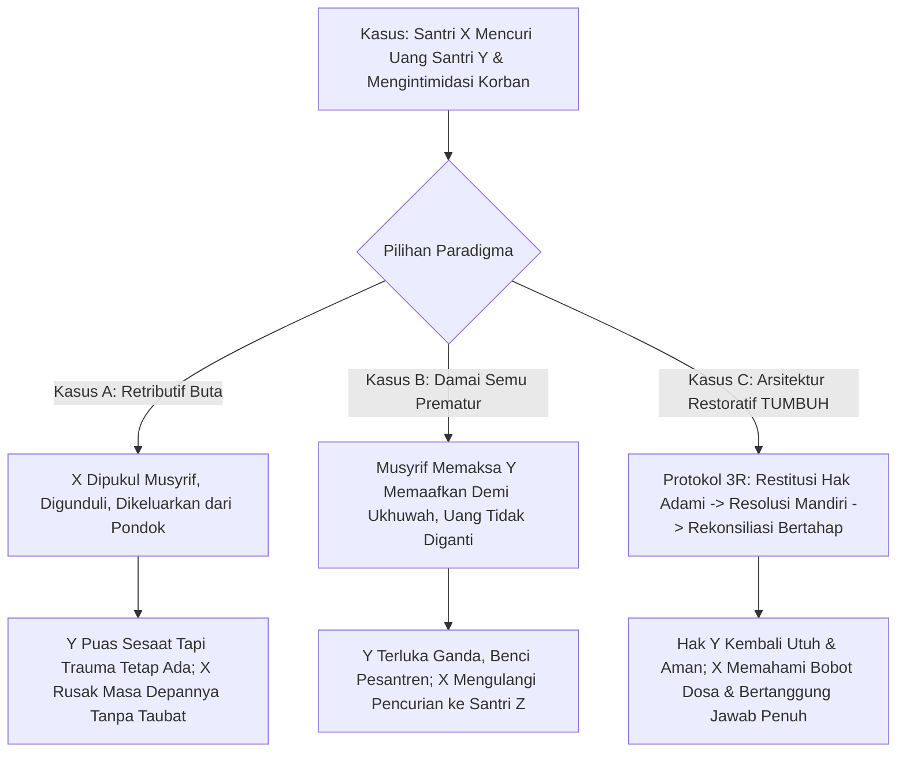

# P0002: Bagaimana Menyelesaikan Ketegangan Keadilan Restoratif: Rehabilitasi Pelaku vs. Pemulihan Utuh Korban tanpa Terjebak Impunitas?

## 1. Status Dokumen dan Metadata Penyelidikan
- **Nomor Penyelidikan**: P0002
- **Klaster Fokus**: PROBE_07 (Intervention Architecture, Ecological Supports, & Restorative Framework)
- **Status Validasi**: Penyelidikan Aktif Lapangan (Restorative Justice Calibration Inquiry)
- **Tingkat Kritis Sistem**: Fundamental & Etis-Syar'i
- **Tanggal Pemutakhiran Terakhir**: 2026-10-08
- **Keterlacakan Fondasi**:
  - `01_FUNDAMENTAL/07_INTERVENTION.md` (Pilar Restoratif: Restitusi, Resolusi, Rekonsiliasi)
  - `01_FUNDAMENTAL/02_PRINCIPLES.md` (Keadilan Proporsional, Perlindungan Santri Lemah, Ishlah Sejati)
  - `01_FUNDAMENTAL/01_PHILOSOPHY.md` (Keseimbangan Hak Adami dan Hak Allah dalam Tarbiyah)
  - Turats Rujukan: *Al-Mughni* (Ibnu Qudamah: bab jinayat dan syarat sahnya pemaafan hak adami), *Ahkam al-Qur'an* (Ibnul 'Arabi: kaidah *fa man 'afa wa ashlaha fa ajruhu 'alallah*), *I'lam al-Muwaqqi'in* (Ibnu Qayyim: pembedaan antara pemaafan yang mendidik vs pembiaran yang melahirkan kezaliman berulang)
  - Teori Kontemporer: *Restorative Justice in Schools* (Howard Zehr, Brenda Morrison), *Victim-Offender Mediation (VOM)*, *Trauma-Informed Care*, *Secondary Victimization through Premature Forgiveness* (Laura Davis)

---

## 2. Latar Belakang dan Urgensi Penyelidikan

Salah satu patologi paling berbahaya dalam penyelesaian konflik dan kekerasan di lembaga pendidikan Islam dan pesantren adalah fenomena **pemaafan prematur (*premature forced forgiveness*) atas nama "ukhuwah", "ikhlas", atau "menutup aib lembaga"**. Ketika seorang santri menjadi korban pemukulan, perundungan verbal sistematis, pencurian barang berharga, atau pelecehan martabat oleh santri lain, pengasuh sering kali mempertemukan kedua belah pihak di ruang pimpinan, lalu menuntut: *"Sudahlah, sesama santri harus saling memaafkan, bersalaman, pelukan, dan lupakan masalah ini demi rida Allah."*

Dalam skenario ini, pendekatan yang mengatasnamakan "damai" dan "islami" justru menjadi bentuk **kezaliman struktural sekunder (*secondary institutional victimization*)**:
1. **Peniadaan Hak Korban (*Victim Erasure*)**: Kerugian fisik, trauma emosional, ketakutan mendalam, dan hilangnya barang milik korban tidak pernah dipulihkan. Korban dipaksa menelan rasa sakitnya dan dibebani rasa bersalah jika ia menolak memaafkan.
2. **Impunitas Terselubung Pelaku (*Offender Impunity*)**: Pelaku pelanggaran belajar bahwa ia cukup meminta maaf secara lisan, menangis di depan ustadz, dan bersalaman, untuk terbebas dari tanggung jawab memperbaiki kerusakan yang ia timbulkan. Pelaku tidak pernah mengalami proses belajar moral mengenai bobot derita yang dialami korbannya.
3. **Siklus Kekerasan Berulang (*Recidivism Loop*)**: Karena tidak ada restitusi nyata dan tidak ada resolusi akar masalah, pelaku mengulangi perbuatannya kepada korban lain, sementara korban awal kehilangan kepercayaan total pada keadilan pesantren dan mengalami depresi berkepanjangan.

Di kutub ekstrem sebaliknya, terdapat pendekatan retributif murni (*punitive paradigm*) yang membalas kekerasan dengan kekerasan institusional: pelaku dipukul balik, digunduli kepalanya, dipermalukan di lapangan, atau langsung dikeluarkan (*drop-out*) seketika tanpa proses rehabilitasi fitrah. Pendekatan ini tidak menyembuhkan korban (hanya memuaskan dendam sesaat), sekaligus membuang pelaku ke jurang kehancuran sosial di luar pesantren.

TUMBUH v2.0.0 menolak kedua kutub sesat ini. Penyelidikan ini difokuskan untuk menjawab pertanyaan arsitektural: **Bagaimana merancang ekosistem Keadilan Restoratif Islami yang menempatkan pemulihan martabat dan hak korban sebagai prioritas utama yang tidak dapat ditawar, seraya menuntut pertanggungjawaban nyata dan rehabilitasi fitrah pelaku, tanpa sedikit pun memberi celah bagi impunitas atau pemaafan manipulatif?**

---

## 3. Pertanyaan Kunci Penyelidikan (Probe Inquiry Questions)

1. **Hierarki Perlindungan Korban**: Apa saja indikator hak adami korban (*haqqul adami*) yang wajib dipulihkan secara konkret sebelum proses rekonsiliasi emosional atau pemaafan dapat dipertimbangkan?
2. **Kaidah Syar'i Pemaafan vs. Ketertiban Sosial**: Bagaimana mendudukkan ayat-ayat pemaafan (*al-'afw*) dalam Al-Qur'an agar tidak disalahgunakan untuk melindungi pelaku zalim yang terus-menerus berbuat onar (*al-mufsid fi al-ardh*)?
3. **Desain Restitusi Bermakna**: Bagaimana membedakan antara sanksi hukuman yang tidak relevan (lari lapangan) dengan restitusi logis-restoratif yang terhubung langsung dengan perbaikan kerugian korban?
4. **Protokol Perlindungan dari Trauma Sekunder**: Bagaimana prosedur isolasi dan mediasi yang aman agar korban tidak mengalami viktimisasi ulang saat harus berhadapan dengan pelaku?

---

## 4. Analisis Teoretis, Turats, dan Sains Modern

### 4.1. Kaidah Turats: Distingsi Haqqul Adami dan Haqqullah
Dalam ushul fiqh dan fikih jinayat para ulama mazhab, terdapat prinsip aksiomatis mengenai keadilan:
- **Haqqullah (Hak Allah)**: Pelanggaran terhadap syariat yang menjadi hak mutlak Allah dapat gugur melalui taubat nasuha, istighfar, dan rahmat Allah. Allah Mahapengampun dan Maha Melimpahkan maghfirah.
- **Haqqul Adami (Hak Hamba/Manusia)**: Kezaliman terhadap sesama manusia—baik menyangkut darah/fisik, harta, kehormatan (*'irdh*), maupun rasa aman—**tidak akan pernah gugur oleh taubat semata dan tidak bisa dihapuskan oleh pengasuh pesantren sekalipun**, kecuali korban sendiri yang secara sukarela dan sadar (*'an thibin nafsin*) merelakannya setelah haknya dipenuhi atau diganti.

Ibnu Qayyim al-Jauziyyah dalam *I'lam al-Muwaqqi'in* dan *Thariq al-Hijratain* membedah hakikat ayat:
> *"Maka barang siapa memaafkan dan berbuat kebaikan (ishlah), maka pahalanya di sisi Allah..."* (QS. Asy-Syura: 40).

Ibnu Qayyim menegaskan: **Allah menggandengkan kata pemaafan (*al-'afw*) dengan perbaikan (*al-ishlah*)**. Ini bermakna bahwa pemaafan hanya disyariatkan dan bernilai ibadah jika membawa kemaslahatan dan perbaikan. Jika pemaafan justru membuat pelaku semakin congkak, merasa kebal hukum, dan mengulangi kezalimannya kepada orang lain, maka memaafkan dalam kondisi tersebut **tidak disyariatkan, bahkan tercela secara syar'i**. Keadilan syariat menuntut penegakan batas agar orang zalim terhalang dari perbuatan zalimnya (*unsur akhaka zhaliman aw mazhluman*).

### 4.2. Sains Restoratif Modern dan Psikologi Trauma
Howard Zehr (*The Little Book of Restorative Justice*) merumuskan pergeseran paradigma dari keadilan retributif konvensional ke keadilan restoratif:

| Dimensi | Keadilan Retributif (Konvensional) | Keadilan Restoratif TUMBUH |
| :--- | :--- | :--- |
| **Definisi Pelanggaran** | Pelanggaran terhadap aturan asrama/ustadz. | Kerusakan hubungan, rasa sakit manusia, dan perusakan hak sesama. |
| **Fokus Perhatian** | Menemukan siapa yang salah dan hukuman apa yang pantas. | Siapa yang terluka, apa kebutuhan pemulihannya, dan siapa yang bertanggung jawab memperbaikinya. |
| **Peran Korban** | Diabaikan; hanya sebagai saksi pelapor; haknya dikesampingkan. | Menjadi pusat pertimbangan; suara, keamanan, dan pemulihannya adalah prioritas mutlak. |
| **Peran Pelaku** | Pasif; hanya menerima sanksi penderitaan tanpa refleksi. | Aktif; wajib memahami dampak perbuatannya dan bekerja keras melakukan restitusi nyata. |
| **Hasil Akhir** | Kebencian, dendam terpendam, stigma pelaku, pengulangan kasus. | Pemulihan korban, pertanggungjawaban matang pelaku, rekonsiliasi sejati (*ishlah*). |

Dari perspektif neurobiologi trauma (*Trauma-Informed Framework*), memaksa korban untuk memaafkan pelaku ketika amigdala korban masih berada dalam status siaga darurat (*threat response state*) memicu disosiasi traumatis. Korban merasa tidak berdaya, kehilangan kepercayaan pada figur otoritas (musyrif), dan meyakini bahwa institusi pesantren berpihak pada pelaku penindas. Pemulihan amigdala dan integrasi hippocampus korban menuntut adanya **pengakuan eksplisit atas kebenaran penderitaannya**, **jaminan keamanan fisik dan sosial 100%**, serta **tindakan nyata reparasi dari pihak pelaku**.

---

## 5. Studi Kasus Komparatif Ekosistem Asrama Pesantren

Berikut perbandingan riil penanganan kasus pencurian uang tabungan dan perundungan di kamar asrama santri:



### 5.1. Kasus A: Pesantren "Al-Jaza'" (Retributif Buta)
- **Peristiwa**: Santri X (kelas 2 SMP) mencuri uang tabungan Rp 300.000 milik Santri Y dan mengancam akan memukulinya jika melapor. Musyrif akhirnya mengetahui peristiwa ini dari penggeledahan.
- **Tindakan**: Musyrif menampar Santri X di depan seluruh santri asrama, menyuruhnya berdiri dengan satu kaki selama 3 jam, menggunduli kepalanya, dan malam itu juga mengusir X pulang ke orang tuanya (drop-out). Uang Rp 300.000 tidak pernah dikembalikan karena orang tua X malu dan tidak mau berkomunikasi lagi.
- **Evaluasi**:
  - Santri Y tetap rugi Rp 300.000, merasa ketakutan karena ancaman teman-teman kelompok X yang masih berada di pondok.
  - Santri X mengalami trauma kekerasan fisik dari musyrif, mengkristalkan dendam sosial, dan di lingkungan barunya menjadi pelaku kriminal remaja.
  - Sistem gagal total mendidik kedua belah pihak.

### 5.2. Kasus B: Pesantren "As-Salam Asy-Syakli" (Damai Semu Prematur)
- **Peristiwa**: Kasus identik dengan di atas.
- **Tindakan**: Musyrif memanggil X dan Y. Musyrif menasihati Y: *"Y, jadilah pemaaf seperti Nabi Yusuf. Antum ikhlaskan uang Rp 300.000 itu sebagai sedekah. Pahala antum besar di surga."* X disuruh meminta maaf dan menangis. Keduanya dipaksa bersalaman dan berpelukan di depan ustadz.
- **Evaluasi**:
  - Santri Y pulang ke kamarnya dengan tangis tertahan, merasa dizalimi dua kali: pertama oleh pencuri, kedua oleh ustadznya sendiri. Uang tabungan yang dikumpulkannya dari uang jajan hilang sia-sia.
  - Santri X merasa sangat lega karena lolos tanpa konsekuensi riil. Dua minggu kemudian, X mencuri jam tangan milik Santri Z.
  - Institusi telah menumbuhsuburkan kemunafikan dan impunitas di bawah jubah agama.

### 5.3. Kasus C: Protokol Keadilan Restoratif TUMBUH di Pesantren Ekologis
- **Peristiwa**: Kasus identik dengan di atas.
- **Tindakan Protokol 3R Terpadu**:
  1. **Fase 1: Isolasi dan Pengamanan Korban (Safety First)**
     - Musyrif memisahkan X dan Y tanpa intimidasi. Santri Y dipindahkan sementara ke ruang aman atau ditemani teman asrama pilihannya.
     - Tim BK/Musyrif memvalidasi penderitaan Y: *"Y, antum tidak salah. Uang antum berhak kembali, dan keselamatan antum di asrama ini kami jamin sepenuhnya. Antum tidak diwajibkan memaafkan saat ini jika hati antum belum siap."*
  2. **Fase 2: Pertanggungjawaban Penuh Pelaku (Full Accountability)**
     - Musyrif mendudukkan X dalam dialog reflektif: membongkar motif, membedah konsep *ghasab* dan kezaliman hak adami, serta menyadarkan X atas rasa sakit dan pengorbanan Y mengumpulkan uang tersebut.
     - **Restitusi Konkret**: X wajib mengembalikan Rp 300.000 secara utuh. Jika X tidak memiliki uang pribadi, X membuat rencana restitusi kerja kebajikan di pondok (misal: membantu operasional laundry asrama selama 2 minggu di luar jam belajar, di mana upah kerjanya dialokasikan langsung untuk mengganti uang Y), atau orang tua X diwajibkan mengganti uang tersebut secara formal dengan kehadiran X.
  3. **Fase 3: Resolusi dan Konsekuensi Logis**
     - X menjalankan tugas pemulihan lingkungan: membersihkan area publik asrama dan membuat surat refleksi tertulis mengenai apa yang ia pahami tentang hak kepemilikan orang lain.
     - Status kepemimpinan atau keistimewaan X ditangguhkan sementara hingga ia membuktikan konsistensi adabnya.
  4. **Fase 4: Rekonsiliasi Sukarela (True Reconciliation)**
     - Setelah uang kembali 100% dan rasa aman Y pulih (terbukti setelah 2 minggu tidak ada ancaman lanjutan), fasilitator restoratif menanyakan kesiapan Y untuk menerima permohonan maaf formal dari X dalam *Restorative Circle* tertutup.
     - Jika Y siap, proses ikrar maaf dilakukan dengan tulus; jika Y belum siap, sistem tidak memaksanya, dan hak Y tetap dilindungi secara mutlak.

---

## 6. Protokol Restoratif Tiga Pilar (3R Framework) TUMBUH

Sistem TUMBUH menetapkan tiga pilar wajib yang harus dipenuhi secara berurutan (*in strict sequence*), di mana pilar sebelumnya menjadi syarat sah bagi pilar berikutnya:

```text
+-------------------------------------------------------------------------+
| PILAR 1: RESTITUTION (Pemulihan Kerugian Nyata / Hak Adami)             |
| - Pengembalian barang/harta yang dicuri atau dirusak 100%                |
| - Kompensasi biaya medis jika ada luka fisik                            |
| - Jaminan rasa aman dan penghapusan total ancaman lanjutan              |
+-------------------------------------------------------------------------+
                                    ↓ (Hanya jika Pilar 1 Terpenuhi)
+-------------------------------------------------------------------------+
| PILAR 2: RESOLUTION (Penyelesaian Akar Masalah & Rekayasa Perilaku)     |
| - Pengakuan jujur tanpa manipulasi oleh pelaku                          |
| - Analisis pemicu emosional / lingkungan (FBA - Functional Assessment)  |
| - Sanksi restoratif bermakna (kerja kebajikan yang relevan)              |
+-------------------------------------------------------------------------+
                                    ↓ (Hanya jika Pilar 2 Terpenuhi & Sukarela)
+-------------------------------------------------------------------------+
| PILAR 3: RECONCILIATION (Pemulihan Hubungan Kalbu / Ishlah Sukarela)    |
| - Fasilitasi pertemuan empat mata / lingkaran restoratif aman           |
| - Permohonan maaf tulus dari pelaku yang mengakui detail perbuatannya   |
| - Pemaafan sukarela korban tanpa paksaan moralitas institusi            |
| - Reintegrasi sosial pelaku ke dalam bi'ah asrama tanpa stigma abadi    |
+-------------------------------------------------------------------------+
```

---

## 7. Taksonomi Pelanggaran dan Batas Ambang Keadilan Restoratif

Tidak semua pelanggaran dapat diselesaikan hanya melalui mediasi restoratif internal kamar. Sistem membagi pelanggaran ke dalam tiga kategori yurisdiksi:

| Kategori Pelanggaran | Karakteristik Perbuatan | Batas Kewenangan Restoratif | Jalur Intervensi Wajib |
| :--- | :--- | :--- | :--- |
| **Tier 1 (Minor Interpersonal)** | Saling ejek nama orang tua, pinjam barang tanpa izin (*fasad 'adi*), perselisihan antrean mandi. | Restoratif penuh difasilitasi oleh Musyrif Kamar atau Ketua Kamar (J3). | *Restorative Chat* 10 menit, permintaan maaf langsung, restitusi tugas piket. |
| **Tier 2 (Moderate Violation)** | Pencurian bernilai sedang, perusakan fasilitas bersama, pengucilan sosial kelompok (*peer bullying*), perkelahian fisik ringan. | Restoratif dipimpin oleh Tim BK dan Pengasuhan Pusat Pesantren. | *Restorative Circle*, restitusi materiil penuh, program pembinaan adab intensif 1 bulan, pengawasan berkala. |
| **Tier 3 (Severe / Critical Boundary)** | Kekerasan fisik berat (memar parah, patah tulang), pelecehan seksual, konsumsi napza/miras, perundungan sistemik menahun. | Restoratif **TIDAK BISA** menggugurkan sanksi hukum kelembagaan atau pidana negara. | Penanganan krisis darurat, perlindungan total korban, keterlibatan pimpinan tertinggi, rujukan ke ranah hukum jika memenuhi delik pidana, terminasi santri demi keselamatan ekosistem. |

---

## 8. Prinsip Negatif: Larangan Mutlak (Negative Guardrails)

1. **Dilarang Toxic Forgiveness**: Musyrif, ustadz, atau pengasuh **dilarang keras** membujuk atau menekan korban untuk segera memaafkan pelaku dengan dalih "demi nama baik pondok", "biar cepat selesai", atau "pahala sabar", sebelum kerugian korban diganti dan rasa aman terbukti pulih.
2. **Dilarang Pemaksaan Rekonsiliasi Tatap Muka**: Korban trauma tidak boleh dipertemukan satu ruangan dengan pelaku yang masih bersikap agresif, defensif, atau meremehkan.
3. **Dilarang Hukuman Fisik Menghinakan (Degrading Corporal Punishment)**: Dilarang memukul, menampar, menelanjangi, atau mempermalukan pelaku di depan khalayak santri. Hukuman yang merendahkan martabat hanya melahirkan dendam dan tidak memicu pertanggungjawaban nurani.
4. **Dilarang Stigmatisasi Abadi (The Label of Doom)**: Pelaku yang telah menyelesaikan seluruh tahapan restitusi dan pembinaan tidak boleh terus-menerus diungkit masa lalunya atau dilabeli sebagai "anak kriminal" oleh asatidzah. Pintu reintegrasi sosial harus dibuka selebar-lebarnya (*taubat nasuha menghapus dosa masa lalu*).

---

## 9. Implikasi Operasional pada Dokumen Hilir

1. **Ke `01_FUNDAMENTAL/07_INTERVENTION.md`**: Menetapkan kodifikasi hukum: *Dalam setiap intervensi kuratif terhadap pelanggaran hak sesama, hak pemulihan korban mendahului proses rehabilitasi pelaku*.
2. **Ke `03_OPERATIONAL/SOP_PENANGANAN_PELANGGARAN_SANTRI.md`**: Menghapus mekanisme "salam damai kilat" tanpa restitusi. Setiap kasus Tier 2 wajib memiliki *Lembar Rencana Restitusi Tertulis* yang ditandatangani pelaku, orang tua, dan disetujui korban.
3. **Ke `03_OPERATIONAL/PANDUAN_FASILITATOR_RESTORATIF.md`**: Menyusun skrip panduan bagi musyrif dalam memfasilitasi dialog restoratif agar tidak bias membela pelaku yang pandai berdalih.

---

## 10. Catatan Penyelidik dan Rencana Uji Empiris
Penyelidikan P0002 mengembalikan esensi keadilan Islam yang sering terdistorsi di asrama: Islam adalah agama rahmah, namun rahmah bagi korban adalah perlindungan dan pemulihan haknya, sedangkan rahmah bagi pelaku adalah pencegahan dirinya dari kezaliman melalui pertanggungjawaban nyata. Tahap pengujian empiris berikutnya akan mengamati tingkat residivisme (pengulangan pelanggaran) santri pasca-penerapan Protokol 3R dibandingkan dengan metode penghukuman konvensional.
