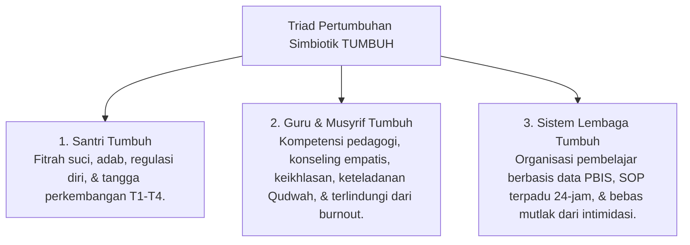

# Ekosistem TUMBUH Pesantren
## Model Integratif Pembinaan Santri, Pengasuhan Asrama 24-Jam, SW-PBIS Multi-Tier, & Restoratif Disiplin Berbasis Fitrah dan Turats Islam

**TUMBUH** (*Tarbiyah, Ukhuwah, Mutawaazin, Barakah, Unggul, & Hasanah*) adalah kerangka kerja (*framework*) dan ekosistem pendidikan karakter terpadu 24-jam di lingkungan pesantren. Ekosistem ini mengintegrasikan kekayaan **Turats Islam** (*Ta'dib, Tazkiyatun Nafs, Qudwah Hasanah*) dengan konsensus **Sains Pembelajaran Modern** (*SW-PBIS Multi-Tier, CASEL SEL, Neurosains Perkembangan, Self-Determination Theory, & Whole-School Restorative Justice*).

---

## 🏛️ Falsafah Utama: Triad Pertumbuhan Simbiotik

Ekosistem TUMBUH berdiri di atas prinsip mutlak bahwa proses pendidikan pesantren hanya berhasil jika 3 entitas bertumbuh serempak:

---

## 📚 Navigasi Master 11 Domain Arsitektur TUMBUH

 Seluruh kerangka kerja disusun secara berjenjang dalam **11 Domain Utama** yang saling terhubung:

| Domain | Deskripsi Kerangka Kerja | Indeks Dokumen Master |
| :--- | :--- | :--- |
| **01 Philosophy** | Falsafah dasar, worldview tauhid, ontologi fitrah, & meta-naratif TUMBUH. | 📄 [01 Philosophy/README.md](./01%20Philosophy/README.md) |
| **02 Principles** | 10 Prinsip baku pembinaan, *Firm & Kind*, & eliminasi mutlak hukuman fisik/feodalisme. | 📄 [02 Principles/README.md](./02%20Principles/README.md) |
| **03 Capacity Framework** | Kerangka kapasitas 10 Muwashafat karakter & pengembangan kompetensi santri. | 📄 [03 Capacity Framework/README.md](./03%20Capacity%20Framework/README.md) |
| **04 Progression Framework**| Trajektori biososial-spiritual & 4 Tangga TUMBUH (T1 Adaptasi $\rightarrow$ T4 Qudwah). | 📄 [04 Progression Framework/README.md](./04%20Progression%20Framework/README.md) |
| **05 Assessment Framework** | Sistem asesmen ipsatif, validasi psikometri, & evaluasi pertumbuhan berkelanjutan. | 📄 [05 Assessment Framework/README.md](./05%20Assessment%20Framework/README.md) |
| **06 Intervention Framework**| Sistem intervensi PBIS Multi-Tier (Tier 1-3), de-eskalasi ghadhab, & restoratif. | 📄 [06 Intervention Framework/README.md](./06%20Intervention%20Framework/README.md) |
| **07 Implementation Framework**| Struktur organisasi terpadu 24-jam (Tanpa Dikotomi Madrasah-Asrama) & SOP Kerja. | 📄 [07 Implementation Framework/README.md](./07%20Implementation%20Framework/README.md) |
| **08 Integrated Approaches**| Integrasi pendekatan PBIS, CASEL SEL, Mentoring, Coaching, & Restorative Circle. | 📄 [08 Integrated Approaches/README.md](./08%20Integrated%20Approaches/README.md) |
| **09 Programs** | Program 24-jam (Core, Character, Leadership Qudwah T4, Institutional, Special). | 📄 [09 Programs/README.md](./09%20Programs/README.md) |
| **10 Methods** | Metodologi pedagogi (Sorogan, Bandongan, Suhbah 1-on-1, GROW, Habit Loop 66-Hari). | 📄 [10 Methods/README.md](./10%20Methods/README.md) |
| **11 Tools** | Rubrik 10 Muwashafat, Logbook Musyrif App, CICO Card, & Arsitektur Database Digital. | 📄 [11 Tools/README.md](./11%20Tools/README.md) |

---

## 🎓 Dewan Keilmuan Aktif (21 Custom Skills di `.agents/skills/`)

Repositori ini dikembangkan dan diaudit oleh **21 Custom Skills Dewan Keilmuan** yang tersimpan di direktori `.agents/skills/`:

1. `pakar-filosofi-tumbuh` & `pakar-epistemologi-turats`
2. `pakar-pbis` & `pakar-arsitektur-pbis-restoratif`
3. `pakar-social-emotional-learning` & `pakar-neurosains-perkembangan`
4. `pakar-disiplin-positif` & `pakar-pedagogi-master-guru`
5. `pakar-intervensi-preventif` & `pakar-pengasuhan-asrama`
6. `pakar-kuratif-restoratif` & `pakar-bimbingan-konseling`
7. `pakar-psikologi-belajar`, `pakar-psikologi-sosial-santri`, `pakar-desain-kurikulum-adab`
8. `pakar-tata-kelola-qudwah`, `pakar-metodologi-riset-tumbuh`, `pakar-arsitektur-digital-pesantren`
9. `pakar-kritikus-dan-auditor-kualitas`, `pakar-psikometri-dan-validasi-instrumen`, `pakar-perlindungan-anak-dan-advokasi-santri`

---

## 📖 Rujukan & Dokumentasi Pendukung

- 🛡️ **[REFERENCES/Laporan-Audit-Kualitas-Akademis-TUMBUH.md](./REFERENCES/Laporan-Audit-Kualitas-Akademis-TUMBUH.md)**: Laporan Audit Kualitas Akademis & Kepatuhan Resmi (Predikat A+ Paripurna).
- 📘 **[AGENTS.md](./AGENTS.md)**: Pedoman & Aturan Baku Agen Ekosistem TUMBUH Pesantren.
- 📖 **[GLOSSARY.md](./GLOSSARY.md)** & **[REFERENCES/Kamus-Istilah-TUMBUH.md](./REFERENCES/Kamus-Istilah-TUMBUH.md)**: Kamus Resmi 5 Kategori Istilah Syar'i, Neurosains, PBIS, & Digital.
- 🔬 **[METHODOLOGY/README.md](./METHODOLOGY/README.md)**: Protokol Riset Integratif & Penelusuran Keputusan Repositori.
- 📜 **[CHANGELOG.md](./CHANGELOG.md)**: Riwayat Rilis Resmi & Catatan Perubahan Versi.

---

## ⚖️ Lisensi & Aturan Kepatuhan

Seluruh isi repositori ini terikat oleh **[AGENTS.md](./AGENTS.md)** yang melarang keras segala bentuk hukuman fisik, pembentakan, intimidasi, dan feodalisme senioritas dalam pendidikan pesantren.
