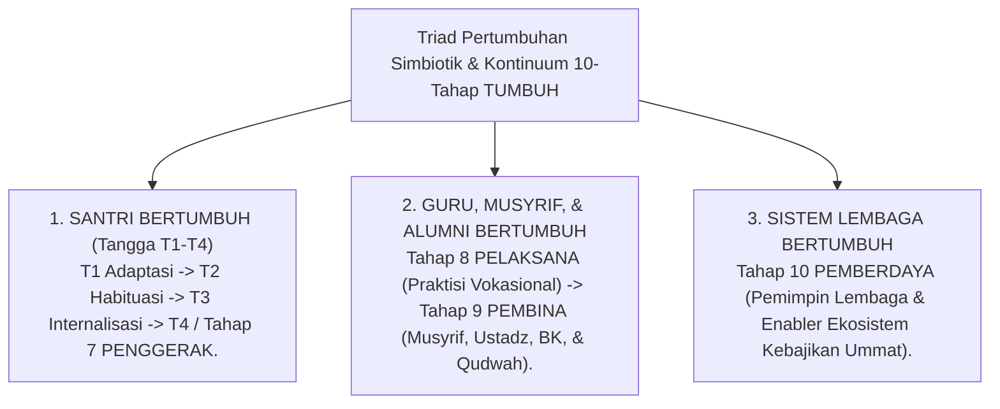

# Ekosistem TUMBUH Pesantren
## Induk Naskah Kajian Penelitian & Monograf Riset Akademis Sistem Pembinaan Santri 24-Jam Berbasis Fitrah dan Turats Islam

**TUMBUH** (*Tarbiyah, Ukhuwah, Mutawaazin, Barakah, Unggul, & Hasanah*) adalah kerangka kerja (*framework*) dan ekosistem pendidikan karakter terpadu 24-jam di lingkungan pesantren. Seluruh repositori ini dirancang sebagai **Naskah Kajian Penelitian Akademis & Monograf Riset (*Academic Research Monograph & Journal Papers*)** yang mengintegrasikan kekayaan **Turats Islam** (*Ta'dib, Tazkiyatun Nafs, Qudwah Hasanah*) dengan konsensus **Sains Pembelajaran Modern** (*SW-PBIS Multi-Tier, CASEL SEL, Neurosains Perkembangan, Self-Determination Theory, & Whole-School Restorative Justice*).

---

## 🏛️ Falsafah Utama: Triad Pertumbuhan Simbiotik & Kontinuum 10-Tahap

Ekosistem TUMBUH berdiri di atas prinsip mutlak bahwa proses pendidikan pesantren hanya berhasil jika 3 entitas bertumbuh serempak melintasi **Kontinuum 10 Tahap Pertumbuhan**:

---

## 📚 Navigasi Master 11 Domain Naskah Kajian Penelitian (*Research Monographs*)

Seluruh naskah riset akademis disusun secara berjenjang dalam **11 Domain Utama** yang memuat Monograf Riset Ilmiah masing-masing:

| Domain | Deskripsi Naskah Kajian Penelitian Akademis | Naskah Monograf Riset Utama |
| :--- | :--- | :--- |
| **01 Philosophy** | Kajian Ontologi Fitrah, Epistemologi Turats, 10 Jawaban Filosofis, & Worldview Islam. | 📄 [Jurnal Monograf Riset Filosofi](./01%20Philosophy/Jurnal-Monograf-Riset-Filosofi-TUMBUH.md) |
| **02 Principles** | Kajian Aksiomatika Prinsip Baku Pembinaan, *Firm & Kind*, & Zero Violence. | 📄 [Jurnal Monograf Riset Prinsip](./02%20Principles/Jurnal-Monograf-Riset-Prinsip-TUMBUH.md) |
| **03 Capacity Framework** | Kajian Taksonomi Kapasitas Holistik & 10 Muwashafat Karakter Santri. | 📄 [Jurnal Monograf Riset 10 Muwashafat](./03%20Capacity%20Framework/Jurnal-Monograf-Riset-Kapasitas-10-Muwashafat-TUMBUH.md) |
| **04 Progression Framework**| Kajian Trajektori Biososial-Spiritual, Tangga T1-T4, & Kontinuum Tahap 7-10. | 📄 [Jurnal Monograf Riset Progresi Tangga](./04%20Progression%20Framework/Jurnal-Monograf-Riset-Progresi-Tangga-TUMBUH.md) |
| **05 Assessment Framework** | Kajian Asesmen Ipsatif, Validasi Psikometri, Rater Calibration, & Raport Orang Tua. | 📄 [Jurnal Monograf Riset Asesmen Ipsatif](./05%20Assessment%20Framework/Jurnal-Monograf-Riset-Asesmen-Ipsatif-TUMBUH.md) |
| **06 Intervention Framework**| Kajian Arsitektur Intervensi PBIS Multi-Tier 1-3, Restorative Circle, & SOP BK. | 📄 [Jurnal Monograf Riset Intervensi PBIS](./06%20Intervention%20Framework/Jurnal-Monograf-Riset-Intervensi-PBIS-Restoratif-TUMBUH.md) |
| **07 Implementation Framework**| Kajian Struktur Terpadu 24-Jam Non-Dikotomis, Batas Tugas Musyrif Asrama vs Walas Madrasah, RACI, & Shift Anti-Burnout. | 📄 [Jurnal Monograf Riset Struktur Pengasuhan](./07%20Implementation%20Framework/Jurnal-Monograf-Riset-Struktur-Terpadu-Pengasuhan.md) |
| **08 Integrated Approaches**| Kajian Sintesis Pendekatan Terintegrasi (PBIS, SEL, Mentoring, Coaching, Positive Discipline). | 📄 [Jurnal Monograf Riset Pendekatan Terintegrasi](./08%20Integrated%20Approaches/Jurnal-Monograf-Riset-Pendekatan-Terintegrasi-TUMBUH.md) |
| **09 Programs** | Kajian Handover KBM Walas (07.00-15.00) vs Asrama Musyrif (15.00-07.00), Kurikulum Pondok (Dirasah, Qur'an, Bahasa Arab), 8 Sekbid OSIS, & Hybrid Parent School. | 📄 [Jurnal Monograf Riset Program 24Jam](./09%20Programs/Jurnal-Monograf-Riset-Program-Pembinaan-24Jam-TUMBUH.md) |
| **10 Methods** | Kajian Metodologi Didaktik Turats (Sorogan/Bandongan), Habit Loop 66-Hari, & Paspor Adab Rumah. | 📄 [Jurnal Monograf Riset Metodologi Pedagogi](./10%20Methods/Jurnal-Monograf-Riset-Metodologi-Pedagogi-TUMBUH.md) |
| **11 Tools** | Kajian Instrumen Operasional, Rubrik 10 Muwashafat, Logbook Musyrif App, Offline-First Syncing, & Cybersecurity App. | 📄 [Jurnal Monograf Riset Digital Tools](./11%20Tools/Jurnal-Monograf-Riset-Instrumen-dan-Arsitektur-Digital-TUMBUH.md) |

---

## 🎓 Dewan Keilmuan Aktif (21 Custom Skills di `.agents/skills/`)

Repositori ini dikembangkan dan diaudit oleh **21 Custom Skills Dewan Keilmuan** yang tersimpan di direktori `.agents/skills/`:

1. `pakar-filosofi-tumbuh` & `pakar-epistemologi-turats`
2. `pakar-pbis` & `pakar-arsitektur-pbis-restoratif`
3. `pakar-social-emotional-learning` & `pakar-neurosains-perkembangan`
4. `pakar-disiplin-positif` & `pakar-pedagogi-master-guru`
5. `pakar-intervensi-preventif` & `pakar-pengasuhan-asrama`
6. `pakar-kuratif-restoratif` & `pakar-bimbingan-konseling`
7. `pakar-psikologi-belajar`, `pakar-psikologi-sosial-santri`, `pakar-desain-kurikulum-adab`
8. `pakar-tata-kelola-qudwah`, `pakar-metodologi-riset-tumbuh`, `pakar-arsitektur-digital-pesantren`
9. `pakar-kritikus-dan-auditor-kualitas`, `pakar-psikometri-dan-validasi-instrumen`, `pakar-perlindungan-anak-dan-advokasi-santri`

---

## 📖 Rujukan & Dokumentasi Pendukung

- 🔍 **[REFERENCES/Analisis-Kritis-dan-Kekurangan-11-Domain-TUMBUH.md](./REFERENCES/Analisis-Kritis-dan-Kekurangan-11-Domain-TUMBUH.md)**: Dokumen Bedah Kritis & Evaluasi Kekurangan 11 Domain Proyek.
- 🛡️ **[REFERENCES/Laporan-Audit-Kualitas-Akademis-TUMBUH.md](./REFERENCES/Laporan-Audit-Kualitas-Akademis-TUMBUH.md)**: Laporan Audit Kualitas Akademis & Kepatuhan Resmi (Predikat A+ Paripurna).
- 📘 **[AGENTS.md](./AGENTS.md)**: Pedoman & Aturan Baku Agen Ekosistem TUMBUH Pesantren.
- 📖 **[GLOSSARY.md](./GLOSSARY.md)** & **[REFERENCES/Kamus-Istilah-TUMBUH.md](./REFERENCES/Kamus-Istilah-TUMBUH.md)**: Kamus Resmi 5 Kategori Istilah Syar'i, Neurosains, PBIS, & Digital.
- 🔬 **[METHODOLOGY/README.md](./METHODOLOGY/README.md)**: Protokol Riset Integratif & Penelusuran Keputusan Repositori.
- 📜 **[CHANGELOG.md](./CHANGELOG.md)**: Riwayat Rilis Resmi & Catatan Perubahan Versi.

---

## ⚖️ Lisensi & Aturan Kepatuhan

Seluruh isi repositori ini terikat oleh **[AGENTS.md](./AGENTS.md)** yang melarang keras segala bentuk hukuman fisik, pembentakan, intimidasi, dan feodalisme senioritas dalam pendidikan pesantren.
