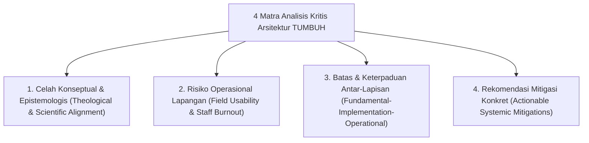
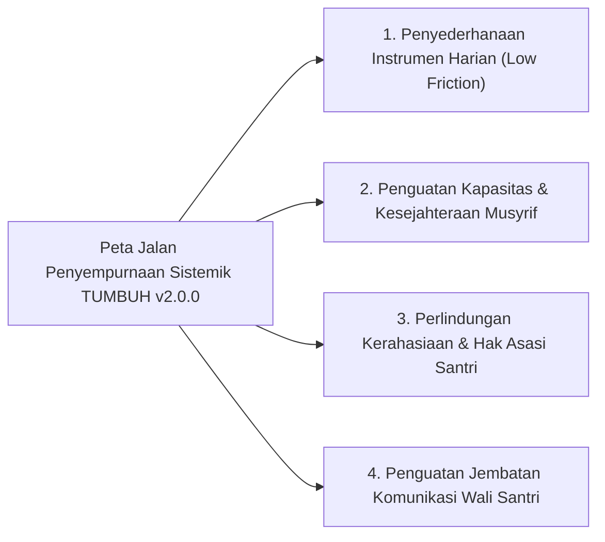

# DOKUMEN ANALISIS KRITIS & EVALUASI ARSITEKTUR EKOSISTEM TUMBUH
## Audit Kualitatif: Deteksi Celah Konseptual, Risiko Lapangan, dan Rekomendasi Mitigasi Sistemik v2.0.0

**Dewan Keilmuan Auditor & Pakar Kritikus Kualitas Ekosistem TUMBUH**  
*Dokumen Rujukan Audit Internal*: `CRITIQUE-TUMBUH-v2.0.0`  
*Klasifikasi*: Dokumen Pustaka Rujukan & Evaluasi Independen (`REFERENCES/`)

---

## 1. Pendahuluan & Metodologi Analisis Kritis

Dokumen ini disusun untuk memberikan **analisis kritis yang tajam, objektif, dan dapat ditindaklanjuti** terhadap arsitektur kanonikal ekosistem **TUMBUH v2.0.0**: mencakup 6 klaster pada lapisan `01_FUNDAMENTAL`, penerjemahan kelembagaan pada `02_IMPLEMENTATION`, serta perangkat kerja praktis pada `03_OPERATIONAL`.

Evaluasi ini bertujuan mengidentifikasi celah teoritis, titik rawan friksi operasional di dunia nyata pesantren, potensi kelelahan administratif (*administrative burnout*) musyrif, serta memastikan setiap klaim sistemik memiliki keterlacakan (*traceability*) dan terbebas dari klaim berlebihan (*overclaim*).

---

## 2. Bedah Kritis Klaster Fondasi (`01_FUNDAMENTAL`)

### 🏛️ Klaster 01: Falsafah Pendidikan (`01_PHILOSOPHY`)
- **Tantangan & Risiko Konseptual**:
  1. *Abstraksi Epistemologis Tinggi*: Sintesis antara realisme teosentris (*Theocentric Realism*) dan realisme kritis (*Critical Realism*) memerlukan jembatan pemahaman yang membumi bagi dewan asatidz dan musyrif lapangan.
  2. *Potensi Penolakan Konservatif*: Pemaduan metode perilaku modern (PBIS, CASEL) dengan turats adab rentan disalahpahami sebagai sekularisasi tersembunyi jika dalil ontologisnya tidak dijelaskan secara gamblang.
- **Rekomendasi Mitigasi**: Menyediakan panduan populer (*popular philosophy brief*) yang menerjemahkan prinsip filosofis ke dalam hikmah tarbiyah praktis sehari-hari.

---

### 📜 Klaster 02: Prinsip Dasar (`02_PRINCIPLES`)
- **Tantangan & Risiko Konseptual**:
  1. *Ambiguasi Penerapan "Firm & Kind"*: Tanpa kalibrasi berulang, musyrif rentan tergelincir antara kekakuan yang menghakimi (*punitive*) atau kehangatan yang membiarkan pelanggaran (*permissive*).
  2. *Resistensi terhadap Tradisi Hukuman Fisik*: Pendidik senior yang telah puluhan tahun terbiasa dengan metode represif memerlukan bukti konkret bahwa disiplin positif mampu menjaga ketertiban asrama secara lebih berkelanjutan.
- **Rekomendasi Mitigasi**: Mengembangkan simulasi kasus nyata (*role-play scenarios*) dan studi komparasi lapangan yang menunjukkan efektivitas pemulihan relasi dan konsekuensi logis.

---

### 📊 Klaster 03: Model Inti & Kapasitas Karakter (`03_CORE_MODEL`)
- **Tantangan & Risiko Konseptual**:
  1. *Beban Pengamatan Multi-Indikator*: Pemantauan 10 Profil Karakter Utama dan 8 Core Capacities pada puluhan santri per asrama berisiko menimbulkan kelelahan asesmen (*assessment fatigue*).
  2. *Subjektivitas Observasi Dimensi Batin*: Karakter spiritual seperti keikhlasan dan kejujuran batiniah tidak dapat diukur semata-mata dari gestur fisik sesaat.
- **Rekomendasi Mitigasi**: Memfokuskan pengamatan harian musyrif pada indikator perilaku observable spesifik dan memanfaatkan asesmen refleksi mandiri (*self-reflection*) santri secara berkala.

---

### 📈 Klaster 04: Kerangka Progresi Santri (`04_PROGRESSION`)
- **Tantangan & Risiko Konseptual**:
  1. *Mitigasi Regresi Santri (Relapse Gap)*: Santri yang telah mencapai Jenjang J3 atau J4 dapat mengalami penurunan perilaku akibat pemicu emosional, konflik sebaya, atau krisis keluarga.
  2. *Standarisasi Penilaian Kenaikan Jenjang (J1 $\rightarrow$ J4)*: Penentuan ambang kesiapan naik jenjang harus terhindar dari formalitas administratif semata.
- **Rekomendasi Mitigasi**: Menegakkan protokol pemulihan dan reintegrasi tanpa pencabutan status martabat santri, disertai portofolio ipsatif longitudinal yang memotret tren jangka panjang.

---

### 📏 Klaster 05: Asesmen Karakter (`05_ASSESSMENT`)
- **Tantangan & Risiko Konseptual**:
  1. *Pemahaman Wali Santri terhadap Laporan Ipsatif*: Wali santri yang terbiasa dengan sistem perangkingan angka sering kali membutuhkan adaptasi untuk membaca grafik pertumbuhan karakter individual.
  2. *Variasi Toleransi Pengamat (Inter-Rater Reliability)*: Standar ketat seorang musyrif bisa berbeda dengan musyrif lainnya dalam menilai pelanggaran ringan.
- **Rekomendasi Mitigasi**: Menyelenggarakan lokakarya orientasi berkala bagi wali santri dan sesi kalibrasi rubrik rutin antarmusyrif setiap awal semester.

---

### 🛡️ Klaster 06: Kerangka Intervensi Bertingkat (`06_INTERVENTION`)
- **Tantangan & Risiko Konseptual**:
  1. *Kapasitas Teknis Bimbingan Kasus Khusus (Tier 3)*: Pelaksanaan *Functional Behavior Assessment* (FBA) dan *Behavior Support Plan* (BSP) menuntut kompetensi konseling terstandar yang perlu terus dilatihkan.
  2. *Integritas Proses Lingkaran Restoratif*: Sesi mediasi ishlah harus dijamin keasliannya agar santri tidak sekadar menghafal skrip permohonan maaf semu demi lolos dari konsekuensi.
- **Rekomendasi Mitigasi**: Pelatihan berkelanjutan bagi musyrif asrama, penyediaan lembar verifikasi komitmen perbaikan, serta pengawasan berjenjang oleh konselor BK pondok.

---

## 3. Bedah Kritis Lapisan Implementasi & Operasional

### 🏢 Lapisan 02: Implementasi Kelembagaan (`02_IMPLEMENTATION`)
- **Tantangan & Risiko**:
  1. *Silo Antar-Departemen*: Friksi antara dewan madrasah/guru kelas dengan pembina asrama/musyrif dalam penyelarasan jadwal santri dan pembagian tanggung jawab.
  2. *Beban Kerja Musyrif 24 Jam*: Jam kerja pembinaan yang panjang tanpa rotasi shift teratur berisiko memicu kelelahan fisik dan kejenuhan empati (*compassion fatigue*).
- **Rekomendasi Mitigasi**: Penerapan matriks peran dan akuntabilitas terstandar, penjadwalan shift musyrif yang adil, serta ruang rekreasi dan istirahat yang manusiawi.

---

### 📱 Lapisan 03: Perangkat Operasional & Digital (`03_OPERATIONAL`)
- **Tantangan & Risiko**:
  1. *Ketergantungan Infrastruktur*: Perangkat digital pencatatan adab santri rentan terkendala jika koneksi internet pesantren di pelosok tidak stabil.
  2. *Perlindungan Kerahasiaan Data Santri*: Rekam jejak konseling, pelanggaran, dan catatan kejiwaan santri harus dilindungi secara ketat agar tidak bocor dan memicu stigmatisasi.
- **Rekomendasi Mitigasi**: Pemanfaatan sistem dengan kapabilitas sinkronisasi luar jaringan (*offline-first*), enkripsi berkas, dan pembatasan hak akses berjenjang (*Role-Based Access Control*).

---

## 4. Peta Jalan Mitigasi Sistemik Berkelanjutan

---

## 5. Pernyataan Penutup Dokumen Evaluasi

Dokumen analisis kritis ini berfungsi sebagai instrumen audit reflektif dalam repositori `REFERENCES/` untuk memastikan bahwa pengembangan ekosistem TUMBUH v2.0.0 senantiasa berpijak pada integritas ilmiah, kejujuran empiris di lapangan, dan kepatuhan mutlak terhadap pedoman tata kelola `AGENTS.md`.
