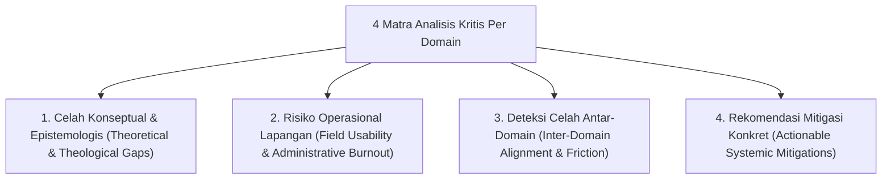
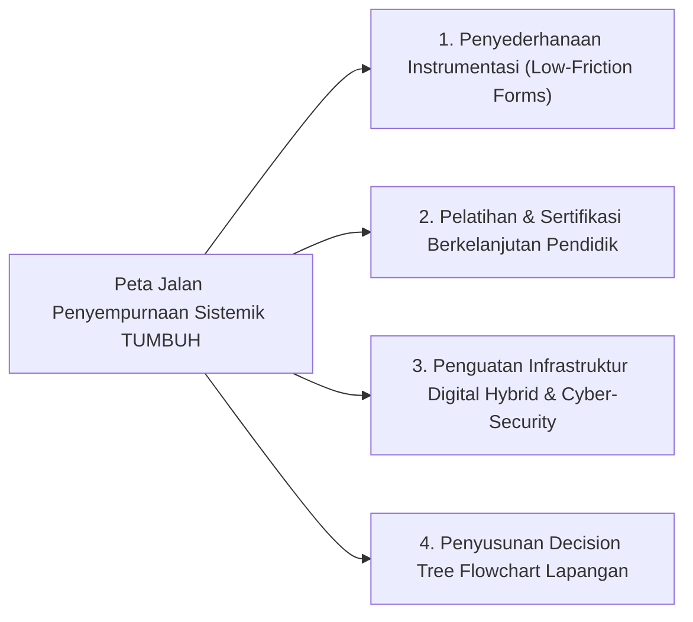

# DOKUMEN ANALISIS KRITIS & EVALUASI KEKURANGAN 11 DOMAIN PROYEK TUMBUH
## Audit Kualitatif: Deteksi Celah Konseptual, Risiko Lapangan, dan Rekomendasi Mitigasi Systemic

**Dewan Keilmuan Auditor & Pakar Kritikus Kualitas Ekosistem TUMBUH**  
*Dokumen Rujukan Audit Internal*: `CRITIQUE-TUMBUH-2026-v1.0`  
*Tanggal Pelaksanaan Audit*: 21 Agustus 2026

---

## 1. PENDAHULUAN & METODOLOGI ANALISIS KRITIS

Dokumen ini disusun untuk memberikan **kritik akademis yang tajam, objektif, dan tanpa kompromi** terhadap seluruh 11 Domain proyek ekosistem **TUMBUH**. 

Analisis ini bertujuan mengidentifikasi celah teoritis, titik rawan hambatan operasional di lapangan, serta potensi kelelahan administratif (*administrative burnout*) agar sistem ini tidak sekadar menjadi utopia di atas kertas, melainkan benar-benar tangguh (*robust*) saat diterapkan di dunia pesantren.

---

## 2. BEDAH KRITIS DAN KEKURANGAN 11 DOMAIN PROYEK

### 🏛️ DOMAIN 01: PHILOSOPHY (`01 Philosophy`)
- **Kritik & Kekurangan Utama**:
  1. *Abstraksi Filosofis Terlalu Tinggi*: Konseptualisasi *Theocentric Realism* dan *Critical Realism* berisiko terlalu abstrak untuk dipahami oleh musyrif atau pengasuh lapangan awam tanpa latar belakang epistemologi formal.
  2. *Risiko Salah Paham De-sekularisasi*: Tanpa pelatihan khusus, pemaduan antara Turats dan sains modern (CASEL SEL/PBIS) rentan dituduh sebagai "bida'ah metodologis" atau "westernisasi pesantren" oleh kalangan konservatif ekstrim.
- **Rekomendasi Mitigasi**: Menyusun modul *Popular Philosophy Breakdown* yang menerjemahkan 10 Aksioma ke dalam bahasa praktis pengasuhan sehari-hari.

---

### 📜 DOMAIN 02: PRINCIPLES (`02 Principles`)
- **Kritik & Kekurangan Utama**:
  1. *Ambiguasi Praktis Batas "Firm & Kind"*: Di lapangan, Musyrif sering kesulitan membedakan antara "Tegas (*Firm*)" dengan "Bentuk Pembentakan Keras Baru", atau antara "Ramah (*Kind*)" dengan "Sikap Permisif Pembiaran".
  2. *Resistensi Kebiasaan Koersif Lama*: Musyrif senior yang terbiasa menggunakan hukuman fisik/acak cenderung menganggap prinsip *Zero Violence* sebagai sikap yang "melemahkan mental santri".
- **Rekomendasi Mitigasi**: Menyusun *Video Simulation & Role-Play Playbook* yang mendemonstrasikan secara pasti contoh nada suara, gestur, dan pilihan kata *Firm & Kind*.

---

### 📊 DOMAIN 03: CAPACITY FRAMEWORK (`03 Capacity Framework`)
- **Kritik & Kekurangan Utama**:
  1. *Beban Pengukuran 10 Muwashafat*: Menilai 10 Karakter Muwashafat secara berkelanjutan pada puluhan santri per kamar berisiko menimbulkan *Assessment Overload* jika pencatatan masih dilakukan secara manual.
  2. *Subjektivitas Penilaian Karakter*: Karakter seperti *Salimul Aqidah* atau *Mujahadatun Linafsih* bersifat batiniah, sehingga indikator observasi fisiknya rentan terdistorsi oleh penilaian subjektif Musyrif.
- **Rekomendasi Mitigasi**: Mengotomatiskan perekaman data melalui aplikasi digital mobile (*Logbook Musyrif App*) dan mengombinasikannya dengan instrumen *Self-Assessment Fitrah*.

---

### 📈 DOMAIN 04: PROGRESSION FRAMEWORK (`04 Progression Framework`)
- **Kritik & Kekurangan Utama**:
  1. *Risiko Penurunan/Regresi Santri (Relapse Gap)*: Model progresi bertahap T1 $\rightarrow$ T4 sering kali tidak memperhitungkan dinamika regresi emosional santri (misal santri T3 mendadak melanggar akibat masalah keluarga).
  2. *Ambiguasi Kriteria Transisi Tangga*: Penentuan kapan seorang santri resmi "naik kelas" dari T2 ke T3 masih rentan bias jika tidak disertai skor ambang batas ipsatif yang ketat.
- **Rekomendasi Mitigasi**: Membangun *Re-entry & Regressive Support Protocol* yang mengatur tata cara penanganan santri yang mengalami regresi tanpa membatalkan status pencapaian sebelumnya.

---

### 📏 DOMAIN 05: ASSESSMENT FRAMEWORK (`05 Assessment Framework`)
- **Kritik & Kekurangan Utama**:
  1. *Tantangan Pemahaman Skala Ipsatif oleh Orang Tua*: Orang tua santri yang terbiasa dengan raport nilai angka dan ranking klasikal sering kali bingung membaca Raport Karakter Ipsatif berbasis grafik radar.
  2. *Inter-Rater Reliability Low*: Dua Musyrif yang berbeda bisa memberikan skor rubrik PBIS yang berbeda signifikan untuk perilaku santri yang sama akibat perbedaan ambang toleransi pribadi.
- **Rekomendasi Mitigasi**: Mengadakan *Parent Orientation Workshops* dan pelatihan kalibrasi pengamatan (*Rater Calibration Training*) bagi seluruh Musyrif sebelum awal semester.

---

## 🛡️ DOMAIN 06: INTERVENTION FRAMEWORK (`06 Intervention Framework`)
- **Kritik & Kekurangan Utama**:
  1. *Keterbatasan Personel BK untuk FBA Tier 3*: Pelaksanaan *Functional Behavior Assessment (FBA)* dan dokumen *Behavior Intervention Plan (BIP)* memerlukan keahlian psikologi/BK tinggi yang sering kali langka di pesantren daerah.
  2. *Risiko Manipulasi Sesi Restorative Chat*: Santri yang cerdik berpotensi berpura-pura kooperatif dalam sesi *Restorative Chat* 5-pertanyaan hanya untuk menghindari konsekuensi tanpa benar-benar meresapi penyelesaian masalah.
- **Rekomendasi Mitigasi**: Memberikan sertifikasi bimbingan dasar BK bagi Musyrif senior dan memperketat tahap verifikasi tindak lanjut kesepakatan restoratif (*Follow-up Monitoring*).

---

### 🏢 DOMAIN 07: IMPLEMENTATION FRAMEWORK (`07 Implementation Framework`)
- **Kritik & Kekurangan Utama**:
  1. *Gesekan Struktural Birokrasi*: Penggabungan tanggung jawab antara Kepala MA/MTs dengan Pengasuhan Asrama 24-jam di bawah 4 Wakamad rentan memicu perebutan pengaruh (*turf war*) antara guru formal dan musyrif asrama.
  2. *Beban Kerja Musyrif 24-Jam*: Tanpa pengaturan sistem shift kerja yang ketat, Musyrif asrama rentan mengalami kelelahan kronis (*severe burnout*) dan kehilangan motivasi *Qudwah*.
- **Rekomendasi Mitigasi**: Penegakan SOP RACI (*Responsible, Accountable, Consulted, Informed*) yang tegas dan pembagian shift kerja Musyrif (Shift Pagi, Sore, Malam) secara adil.

---

### 🔀 DOMAIN 08: INTEGRATED APPROACHES (`08 Integrated Approaches`)
- **Kritik & Kekurangan Utama**:
  1. *Keconfusion Terminologi (*Methodology Overload*)**: Penggabungan 7 pendekatan sekaligus (PBIS, SEL, Mentoring, Coaching, Positive Discipline, Restorative, Future) berisiko membingungkan pelaksana di lapangan terkait metode mana yang harus dipakai pada situasi tertentu.
  2. *Risiko Fragmentasi Implementasi*: Lembaga rentan hanya menerapkan sebagian metode yang disukai (misal hanya PBIS) dan mengabaikan metode lainnya (misal Restorative Circle).
- **Rekomendasi Mitigasi**: Menyusun *Decision Tree Flowchart* (Pohon Keputusan Metodologis) yang memandu Musyrif memilih metode yang tepat secara intuitif.

---

### 📑 DOMAIN 09: PROGRAMS (`09 Programs`)
- **Kritik & Kekurangan Utama**:
  1. *Kepadatan Jadwal Santri (*Programmatic Fatigue*)*: Banyaknya daftar program 24-jam (Core, Character, Leadership, Special) berisiko menguras energi santri dan mengurangi waktu istirahat/rekreasi mandiri.
  2. *Tantangan Keberlanjutan Program Orang Tua*: Program Sekolah Orang Tua sering mengalami penurunan tingkat kehadiran seiring berjalannya waktu.
- **Rekomendasi Mitigasi**: Melakukan *Schedule Streamlining* (Penyederhanaan Jadwal) dengan menetapkan jam istirahat mutlak (*Uninterrupted Rest Hours*) dan menyediakan opsi Sekolah Orang Tua secara hybrid/digital.

---

### 🎓 DOMAIN 10: METHODS (`10 Methods`)
- **Kritik & Kekurangan Utama**:
  1. *Kerentanan Siklus Habit Loop 66-Hari Terhadap Liburan*: Kebiasaan adab yang sudah terbangun selama puluhan hari di asrama rentan runtuh kembali saat santri pulang liburan semester ke rumah (*Vacation Relapse*).
  2. *Kesulitan Transisi dari Bandongan ke Sorogan Mandiri*: Santri yang terbiasa pasif dalam metode Bandongan sering kali canggung dan takut saat diuji dalam metode Sorogan atau Muzakarah.
- **Rekomendasi Mitigasi**: Penerbitan *Home Habit Passport* (Paspor Adab Rumah) selama liburan dan pelaksanaan program matrikulasi Sorogan bagi santri pemula.

---

### 📱 DOMAIN 11: TOOLS (`11 Tools`)
- **Kritik & Kekurangan Utama**:
  1. *Ketergantungan Infrastruktur Teknologi*: Aplikasi digital (*Logbook Musyrif App* & *Parent Portal*) sangat bergantung pada stabilitas jaringan internet dan listrik pesantren yang di beberapa daerah masih sering bermasalah.
  2. *Risiko Keamanan Data & Privasi Santri*: Penyimpanan data perilaku dan catatan konseling BK dalam database digital rentan terhadap kebocoran data jika arsitektur cybersecurity tidak diperkuat.
- **Rekomendasi Mitigasi**: Mengembangkan fitur *Offline-First Syncing* pada aplikasi mobile dan menerapkan enkripsi data *End-to-End* serta kontrol akses RBAC yang ketat pada database.

---

## 3. REKOMENDASI LINTAS DOMAIN & PETA JALAN PENYEMPURNAAN

---

## 4. LEMBAR PENGESAHAN KRITIK AKADEMIS

Dokumen analisis kritis ini disahkan oleh Dewan Keilmuan Auditor sebagai landasan penyempurnaan implementasi di lapangan dan bahan utama pengayaan naratif pada **BOOK-SERIES Volume 01 s/d 05**.

*Disahkan pada tanggal 21 Agustus 2026.*
