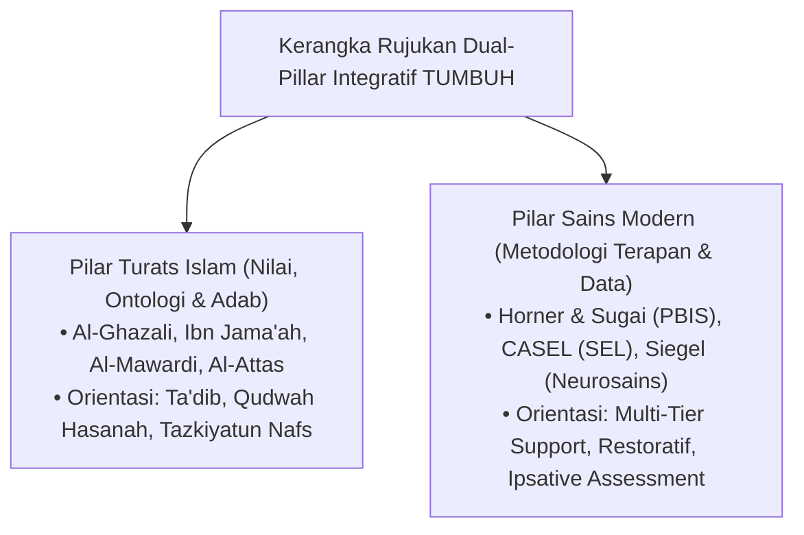

# KATALOG COMPREHENSIVE RUJUKAN BUKU: TURATS ISLAM & KONSENSUS SAINS MODERN

**Nomor Berkas**: `REF-BOOK/TUMBUH/2026/08/001`  
**Status Dokumen**: *Expanded Master Monograph Catalog* (Katalog Teruji & Terintegrasi Full Master Version)  
**Kategori**: Referensi Utama Kitab Turats Klasik, Buku Teks Sains Kontemporer, & Monograf Riset Ke-Pesantren-an  
**Repositori**: Ekosistem **TUMBUH** Pesantren

---

## EXECUTIVE SUMMARY & KERANGKA EPISTEMOLOGIS SINTESIS

Katalog Rujukan Buku ini merupakan basis pustaka yang mendasari pembentukan **11 Domain Arsitektur Utama** dan **22 Custom Skills Dewan Keilmuan** di ekosistem **TUMBUH** Pesantren. 

Sistem rujukan ini mengadopsi pendekatan **Critical Realism & Epistemologi Integratif**, yaitu memadukan **Kebenaran Mutlak Wahyu dan Turats Islam** sebagai sumber nilai, etika, dan ontologi *Ta'dib*, dengan **Konsensus Sains Internasional Peer-Reviewed** (*SW-PBIS, CASEL SEL, Self-Determination Theory, Neurosains Perkembangan, Restorative Justice*) sebagai metodologi instrumen operasional lapangan.

---

## 1. KATALOG KITAB TURATS KLASIK & ADAB ISLAM TERPERINCI

| No | Judul Kitab / Karya Turats | Pengarang / Ulama Klasik | Bab Rujukan Spesifik & Fokus Bahasan | Integrasi Pemetaan ke Domain TUMBUH |
| :---: | :--- | :--- | :--- | :--- |
| **1** | ***Ihya 'Ulumiddin*** (Kitab *Adab al-Mu'allim wal Muta'allim* & *Riyadhatun Nafs*) | Hujjatul Islam Imam Al-Ghazali (w. 505 H) | Juz 1 (Kitab Al-'Ilm) & Juz 3 (Kitab Aja'ib Al-Qalb & Riyadhatun Nafs). Tahapan pembersihan jiwa dari *muhlikat* menuju *munjiyat*. | **Domain 01 (Philosophy)** & **Domain 04 (Progression T1-T4)**. Menjadi fondasi *Tazkiyatun Nafs* dan *Mujahadatun Linafsih*. |
| **2** | ***Adab al-'Alim wal Muta'allim*** | Imam Badruddin Ibn Jama'ah (w. 733 H) | Bab 1-4: Adab pendidik terhadap dirinya, terhadap santri, dan adab santri dalam menuntut ilmu di halaqah/kamar. | **Domain 02 (Principles)** & **Domain 10 (Methods)**. Menjadi standar etika interaksi pendidik-santri tanpa feodalisme. |
| **3** | ***Adab ad-Dunya wad-Din*** | Imam Abu al-Hasan Al-Mawardi (w. 450 H) | Bab 2 (Adab al-'Aql) & Bab 3 (Adab al-Ilm). Penataan regulasi diri (*Ta'dib*) dan penyesuaian sosial. | **Domain 03 (Capacity)** & **Domain 08 (Integrated)**. Fondasi muwashafat *Muthaqqafu Fikri* & *Matinul Khuluq*. |
| **4** | ***Ayyuhal Walad*** | Hujjatul Islam Imam Al-Ghazali (w. 505 H) | Pengasuhan berbasis nasehat penuh kasih (*Nasihatun Musyfiqah*), pengamalan ilmu (*Khidmah*), dan niat ikhlas. | **Domain 09 (Programs)** & **Domain 02 (Principles)**. Menjadi ruh bimbingan konseling dan mentoring *Suhbah*. |
| **5** | ***Ta'lim al-Muta'allim Tariq at-Ta'allum*** | Syekh Burhanuddin Az-Zarnuji (w. 597 H) | Pasal *Fi Niyyah fi Halit Ta'allum* & *Fi Ikhtiyari 'Ilmi wal Ustadh wal Syarik*. Pemilihan niat dan ukhuwah belajar. | **Domain 10 (Methods)**. Fondasi didaktik pembelajaran Sorogan, Bandongan, dan tradisi Mayoran. |
| **6** | ***Bidayat al-Hidayah*** | Hujjatul Islam Imam Al-Ghazali (w. 505 H) | Bagian Adab Ketaatan Harian 24-Jam (bangun tidur hingga tidur kembali). | **Domain 07 (Implementation)** & **Domain 09 (Programs)**. Menjadi cetak biru jadwal kegiatan 24-jam santri. |
| **7** | ***Taisirul Khalaq fi Ilmil Akhlaq*** | Syekh Hafizh Hasan Al-Mas'udi | Matrikulasi akhlak harian bagi pemula (kejujuran, amanah, kebersihan, ketertiban). | **Domain 03 (Capacity)** & **Domain 11 (Tools)**. Indikator rubrik penilaian 10 Muwashafat santri MTs. |
| **8** | ***Adab al-Mu'aszarah*** | Syekh Abdul Wahhab Asy-Sya'rani (w. 973 H) | Etika bermasyarakat, saling menghormati di antara teman se-asrama, dan toleransi kekurangan kawan. | **Domain 08 (Integrated Approaches)**. Mitigasi perundungan (*anti-bullying*) dan penguatan Ukhuwah. |
| **9** | ***Al-Muqaddimah*** | Ibnu Khaldun (w. 808 H) | Bab 6 Pasal 38: *Fi anna As-Suthwah 'alal Muta'allimin Dhammadh bihim* (Dampak buruk kerasnya hukuman bagi fisik dan jiwa pembelajar). | **Domain 02 (Principles)** & **Domain 06 (Intervention)**. Dalil Turats mutlak larangan hukuman fisik & pembentakan. |
| **10** | ***Al-Kabair*** | Imam Al-Hafizh Adz-Dzahabi (w. 748 H) | Klasifikasi pelanggaran moral dan etika pertobatan restoratif (*Taubatan Nashuha*). | **Domain 06 (Intervention Framework)**. Peta penanganan kasus pelanggaran berat Tier 3. |
| **11** | ***Al-Akhlaq wa As-Siyar fi Mudawat an-Nufus*** | Ibnu Hazm Al-Andalusi (w. 456 H) | Terapi psikologi jiwa, mengendalikan kesombongan, dan manajemen emosi dengki/marah. | **Domain 06 (Intervention)** & **Domain 08 (SEL)**. Integrasi terapi emosi dengan CASEL Self-Management. |
| **12** | ***Risalat al-Mu'awanah wal Muzhaharah*** | Imam Abdullah bin Alawi Al-Haddad (w. 1132 H) | Konsistensi amalan (*Istiqamah*), kesabaran pendidik, dan dzikir harian penenang jiwa. | **Domain 01 (Philosophy)** & **Domain 07 (Implementation)**. Penguatan ketahanan emosional (*burnout mitigation*) Musyrif. |
| **13** | ***Shifatus Safwah*** | Ibnu Al-Jauzi (w. 597 H) | Kisah-kisah keteladanan nyata para sahabat dan tabi'in dalam sifat keikhlasan dan pengabdian. | **Domain 04 (Progression T4)**. Rujukan kepemimpinan *Qudwah Hasanah* santri penggerak. |
| **14** | ***Al-Majmu' Syarh al-Muhadzdzab*** | Imam An-Nawawi (w. 676 H) | Muqaddimah: Adab al-Fatwa, Adab Al-Mu'allim, & pentingnya objektivitas keilmuan. | **Domain 05 (Assessment Framework)**. Etika kejujuran asesmen dan transparansi data santri. |

---

## 2. KATALOG BUKU SAINS KONTEMPORER, NEUROSAINS, & POSITIVE DISCIPLINE TERPERINCI

| No | Judul Buku Teks Sains | Penulis / Peneliti Utama | Bab & Pokok Pembahasan Akademis | Integrasi Pemetaan ke Domain TUMBUH |
| :---: | :--- | :--- | :--- | :--- |
| **1** | ***School-Wide Positive Behavioral Interventions and Supports: Systems and Practices*** | Sugai, G., & Horner, R. H. (2015) | Arsitektur pencegahan multi-tier SW-PBIS (Tier 1 Universal 80%, Tier 2 Targeted 15%, Tier 3 Intensive 5%). | **Domain 06 (Intervention Framework)** & **Domain 11 (Tools)**. Kerangka utama SW-PBIS multi-tier. |
| **2** | ***The Little Book of Restorative Justice*** | Howard Zehr (2002) | Tiga pilar Restorative Justice: Fokus pada kerugian, kewajiban pemulihan, dan keterlibatan kolektif. | **Domain 06 (Intervention)** & **Domain 02 (Principles)**. Pengganti sistem hukuman punitif/fisik. |
| **3** | ***Self-Determination Theory: Basic Psychological Needs in Motivation, Development, and Wellness*** | Deci, E. L., & Ryan, R. M. (2017) | Pemenuhan 3 Kebutuhan Psikologis Dasar: *Autonomy* (Kemandirian), *Competence* (Keahlian), *Relatedness* (Ukhuwah). | **Domain 01 (Philosophy)** & **Domain 04 (Progression)**. Transformasi motivasi ekstrinsik ke intrinsik. |
| **4** | ***The Developing Mind: How Relationships and the Brain Interact to Shape Who We Are*** | Daniel J. Siegel (2012) | Neurosains perkembangan otak remaja: Kematangan *Prefrontal Cortex* vs dominasi emosi *Amygdala*. | **Domain 04 (Progression)** & **Domain 08 (Integrated)**. Pemahaman biologis dinamika emosi remaja. |
| **5** | ***Cognitive Load Theory*** | Sweller, J., Ayres, P., & Kalyuga, S. (2011) | Manajemen beban kognitif (*Intrinsic, Extraneous, Germane Load*) dalam desain instruksional. | **Domain 10 (Methods)** & **Domain 03 (Capacity)**. Efisiensi metode retensi hafalan Al-Qur'an/Kitab. |
| **6** | ***Mindset: The New Psychology of Success*** | Carol S. Dweck (2006) | Perbedaan *Fixed Mindset* vs *Growth Mindset* dan dampaknya terhadap resiliensi belajar. | **Domain 05 (Assessment Framework)**. Basis utama Asesmen Ipsatif (perbandingan perkembangan diri). |
| **7** | ***The Leadership Challenge: How to Make Extraordinary Things Happen in Organizations*** | Kouzes, J. M., & Posner, B. Z. (2017) | 5 Praktik Kepemimpinan Keteladanan: *Model the Way, Inspire a Shared Vision, Challenge the Process, Enable Others, Encourage the Heart*. | **Domain 04 (Tangga T4)** & **Domain 07 (Implementation)**. Kerangka kerja kepemimpinan *Qudwah Hasanah*. |
| **8** | ***Positive Discipline: The Classic Guide to Helping Children Develop Self-Discipline, Responsibility, Cooperation*** | Jane Nelsen (2006) | Prinsip *Firm and Kind* (Tegas sekaligus Kasih Sayang) dan eliminasi hukuman/hadiah manipulatif. | **Domain 02 (Principles)** & **Domain 06 (Intervention)**. Panduan sikap praktis musyrif/ustadz. |
| **9** | ***No-Drama Discipline: The Whole-Brain Way to Calm the Chaos and Nurture Your Child's Developing Mind*** | Daniel J. Siegel & Tina Payne Bryson (2014) | Teknik *Connect and Redirect* serta de-eskalasi emosional saat anak mengalami krisis emosi. | **Domain 06 (Intervention)** & **Domain 09 (Programs)**. SOP De-eskalasi Krisis Emosional Santri Tier 3. |
| **10** | ***Atomic Habits: An Easy & Proven Way to Build Good Habits & Break Bad Ones*** | James Clear (2018) | Empat Hukum Perubahan Perilaku (*Make it Obvious, Attractive, Easy, Satisfying*) & Siklus Habit 66-Hari. | **Domain 10 (Methods)** & **Domain 03 (Capacity)**. Metodologi habituasi adab harian santri. |
| **11** | ***Restorative Practices in Schools: Ripple Effect for Culture Change*** | Margaret Thorsborne & Peta Blood (2013) | Pelaksanaan *Restorative Conference*, *Restorative Circles*, dan *Affective Statements* di sekolah. | **Domain 06 (Intervention)** & **Domain 08 (Integrated)**. SOP Lingkaran Restoratif & Ishlah. |
| **12** | ***Multi-Tiered Systems of Support (MTSS): A Framework for Prevention and Intervention*** | Kent McIntosh & Steve Goodman (2016) | Integrasi akademik, perilaku, dan kesejahteraan sosio-emosional dalam satu arsitektur terpadu. | **Domain 07 (Implementation Framework)**. Struktur tata kelola 24-jam terpadu. |
| **13** | ***High-Yield Pedagogical Strategies: Classroom Instruction That Works*** | Robert J. Marzano (2001) | 9 Strategi Pengajaran Efektif (Umpan Balik Formatif, Penguatan Niat, & Rangkuman Grafis). | **Domain 10 (Methods)** & **Domain 02 (Principles)**. Peningkatan kualitas didaktik pengajaran kelas. |
| **14** | ***Drive: The Surprising Truth About What Motivates Us*** | Daniel H. Pink (2009) | Peran otonomi, penguasaan (*mastery*), dan tujuan mulia (*purpose*) dalam penggerak karakter unggul. | **Domain 04 (Progression T4)** & **Domain 09 (Programs)**. Motivasi pengabdian santri alumni T4. |

---

## 3. KATALOG BUKU FALSAFAH, SOSIOLOGI, & KE-PESANTREN-AN MODERN

| No | Judul Buku | Penulis / Tokoh | Fokus Bahasan & Integrasi ke TUMBUH |
| :---: | :--- | :--- | :--- |
| **1** | ***The Concept of Education in Islam: A Framework for an Islamic Philosophy of Education*** | Syed Muhammad Naquib al-Attas (1980) | Kodifikasi ontologis *Ta'dib* sebagai pengenalan dan pengakuan tempat yang tepat dalam susunan wujud. |
| **2** | ***Filsafat Pendidikan Islam: Analisis Epistemologis*** | Prof. Dr. M. Athiyah al-Abrasyi | Sintesis metode pengajaran pesantren dengan psikologi perkembangan anak. |
| **3** | ***First Principles of Islamic Education*** | Syed Ali Ashraf (1985) | Prinsip pembentukan manusia seutuhnya (*Insan Kamil*) melalui penyelarasan akal, emosi, dan ruhani. |
| **4** | ***Tradisi Pesantren: Studi tentang Pandangan Hidup Kyai*** | Nurcholish Madjid (1997) | Kebudayaan keikhasan, kesederhanaan (*Zuhud*), dan sistem nilai kemasyarakatan di dunia pesantren. |
| **5** | ***Bilik-Bilik Pesantren: Sebuah Potret Perjalanan*** | KH. Abdurrahman Wahid (2001) | Sosiologi interaksi kyai-santri-masyarakat dan fleksibilitas tradisi lokal pesantren. |
| **6** | ***Pendidikan Islam dalam Peradaban Modern*** | Fazlur Rahman (1982) | Modernisasi kurikulum pesantren tanpa mengorbankan penguasaan Turats klasik. |

---

## 4. MATRIKS SINTESIS EPISTEMOLOGIS PER DOMAIN TUMBUH

Tabel berikut menunjukkan bagaimana rujukan Turats dan Sains Modern dipadukan secara langsung pada 11 Domain Arsitektur TUMBUH:

| Domain Arsitektur TUMBUH | Rujukan Utama Turats Islam | Rujukan Utama Sains Modern | Bentuk Sintesis Terpadu di TUMBUH |
| :--- | :--- | :--- | :--- |
| **01 Philosophy** | Al-Ghazali (*Ihya 'Ulumiddin*) & Al-Attas (*Concept of Education*) | Deci & Ryan (*Self-Determination Theory*) | Ontologi Fitrah manusia diisi oleh motivasi tauhid dan kebutuhan psikologis otonomi/ukhuwah. |
| **02 Principles** | Ibn Jama'ah (*Adab al-Alim*) & Ibnu Khaldun (*Al-Muqaddimah*) | Jane Nelsen (*Positive Discipline*) | Prinsip *Firm & Kind* tanpa hukuman fisik, berlandaskan keteladanan *Qudwah Hasanah*. |
| **03 Capacity** | Al-Mas'udi (*Taisirul Khalaq*) & Al-Mawardi (*Adab ad-Dunya*) | CASEL (*Social Emotional Learning*) | 10 Muwashafat Karakter Santri dipetakan ke indikator perilaku sosio-emosional terukur. |
| **04 Progression** | Al-Ghazali (*Riyadhatun Nafs*) & Ibnu Al-Jauzi (*Shifatus Safwah*) | Daniel Siegel (*The Developing Mind*) | Trajektori Tangga T1–T4 menyelaraskan kematangan *Tazkiyatun Nafs* dengan perkembangan otak remaja. |
| **05 Assessment** | An-Nawawi (*Al-Majmu'*) | Carol Dweck (*Mindset / Growth*) | Asesmen Ipsatif mengukur pertumbuhan santri terhadap dirinya sendiri, mencegah stigma negatif. |
| **06 Intervention** | Adz-Dzahabi (*Al-Kabair*) & Asy-Sya'rani (*Adab al-Mu'aszarah*) | Sugai & Horner (*SW-PBIS*) & Zehr (*Restorative*) | SW-PBIS Multi-Tier (80-15-5) dipadukan dengan *Ishlah al-Bain* (Restorative Practices). |
| **07 Implementation** | Al-Ghazali (*Bidayat al-Hidayah*) & Al-Haddad (*Risalat al-Mu'awanah*) | McIntosh & Goodman (*MTSS*) | Struktur tata kelola terpadu 24-jam yang melindungi Musyrif dari *administrative burnout*. |
| **08 Integrated** | Ibnu Hazm (*Mudawat an-Nufus*) | Thorsborne & Blood (*Restorative Practices*) | Integrasi 7 pendekatan pembinaan (PBIS, SEL, Mentoring, Coaching, Restoratif) tanpa kontradiksi. |
| **09 Programs** | Al-Ghazali (*Ayyuhal Walad*) | Daniel Pink (*Drive*) | Jadwal kegiatan 24-jam yang menyeimbangkan ibadah, akademik, pengasuhan, dan khidmah. |
| **10 Methods** | Az-Zarnuji (*Ta'lim al-Muta'allim*) | Sweller (*Cognitive Load*) & Clear (*Atomic Habits*) | Sorogan, Bandongan, dan Mayoran dioptimalkan dengan siklus *Habit Loop 66-Hari*. |
| **11 Tools** | Al-Mas'udi (*Taisirul Khalaq*) | Marzano (*Classroom Instruction*) | Form instrumen harian Musyrif dan Logbook Digital App yang efisien ($\le 15$ menit/hari). |
