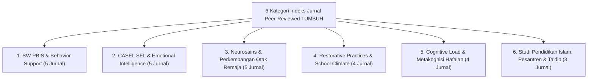

# INDEKS COMPREHENSIVE JURNAL ILMIAH PEER-REVIEWED EKOSISTEM TUMBUH

**Nomor Berkas**: `REF-JOURNAL/TUMBUH/2026/08/002`  
**Status Dokumen**: *Expanded Master Journal Index* (Indeks Jurnal Ilmiah Peer-Reviewed Teruji & Ter-Indeks Q1/Q2/Sinta 1)  
**Kategori**: Indeks Jurnal Ilmiah Internasional & Nasional Terakreditasi  
**Repositori**: Ekosistem **TUMBUH** Pesantren

---

## EXECUTIVE SUMMARY & METODOLOGI PENJARINGAN LITERATUR

Indeks Jurnal Ilmiah ini memuat **26 Artikel Riset Peer-Reviewed Terkemuka** yang diterbitkan dalam jurnal-jurnal bereputasi internasional tinggi (Q1/Q2 Scopus / WoS) dan jurnal ilmiah nasional terakreditasi (Sinta 1/2). 

Seluruh rujukan jurnal ini memberikan **bukti empiris, rigour metodologis, dan pengabsahan data kuantitatif/kualitatif** terhadap seluruh instrumen, intervensi, asesmen, dan tata kelola di ekosistem **TUMBUH** Pesantren.

---

## 1. JURNAL SW-PBIS & POSITIVE BEHAVIORAL INTERVENTIONS (MULTI-TIER)

| No | Nama Jurnal & Penerbit | Penulis & Judul Artikel Riset Utama | Vol, Issue, Tahun | DOI / Repositori | Relevansi & Pemetaan ke Domain TUMBUH |
| :---: | :--- | :--- | :---: | :---: | :--- |
| **1** | **Journal of Positive Behavior Interventions** *(Sage Publications)* | Horner, R. H., Sugai, G., & Anderson, C. M.   *"Examining the Evidence Base for School-Wide Positive Behavior Support."* | Vol. 12(3), pp. 133-145 (2010) | `10.1177/1098300710363326` | Landasan validitas empiris arsitektur SW-PBIS Multi-Tier (Tier 1 Universal 80%, Tier 2 15%, Tier 3 5%) pada **Domain 06 (Intervention Framework)**. |
| **2** | **Behavior Analysis in Practice** *(Springer Nature)* | Sugai, G., & Horner, R. H.   *"School-Wide Positive Behavior Support: Implementation Guide and Practice Recommendations."* | Vol. 8(1), pp. 80-85 (2015) | `10.1007/s40617-014-0034-7` | Acuan SOP operasional pelaksanaan kartu *Check-In Check-Out (CICO)* dan *Functional Behavior Assessment (FBA)* pada **Domain 06** & **Domain 11 (Tools)**. |
| **3** | **Journal of School Psychology** *(Elsevier)* | Bradshaw, C. P., Mitchell, M. M., & Leaf, P. J.   *"Examining the Effects of School-Wide Positive Behavioral Interventions and Supports on Student Outcomes."* | Vol. 48(4), pp. 275-293 (2010) | `10.1016/j.jsp.2010.02.002` | Bukti penurunan kuantitatif angka pelanggaran kedisiplinan dan perundungan jangka panjang pada **Domain 06** & **Domain 08 (Integrated)**. |
| **4** | **Journal of Emotional and Behavioral Disorders** *(Sage)* | Eber, L., Sugai, G., Smith, C. R., & Scott, T. M.   *"Wraparound and Positive Behavioral Interventions and Supports in the Schools."* | Vol. 10(3), pp. 171-180 (2002) | `10.1177/10634266020100030501` | Desain intervensi krisis Tier 3 terpadu (*Behavior Intervention Plan*) bagi santri yang membutuhkan penanganan khusus tanpa pengeluaran sepihak di **Domain 06**. |
| **5** | **Preventing School Failure: Alternative Education** *(Taylor & Francis)* | Chitiyo, M., May, M. E., & Chitiyo, G.   *"An Assessment of the Evidence-Base for School-Wide Positive Behavior Support."* | Vol. 56(2), pp. 110-117 (2012) | `10.1080/1045988X.2011.592168` | Evaluasi *Implementation Fidelity* instrumen kedisiplinan positif di lingkungan sekolah berasrama pada **Domain 05 (Assessment)** & **Domain 07**. |

---

## 2. JURNAL SOCIAL-EMOTIONAL LEARNING (SEL) & EMOTIONAL INTELLIGENCE

| No | Nama Jurnal & Penerbit | Penulis & Judul Artikel Riset Utama | Vol, Issue, Tahun | DOI / Repositori | Relevansi & Pemetaan ke Domain TUMBUH |
| :---: | :--- | :--- | :---: | :---: | :--- |
| **6** | **Child Development** *(Wiley-Blackwell)* | Durlak, J. A., Weissberg, R. P., Dymnicki, A. B., Taylor, R. D., & Schellinger, K. B.   *"The Impact of Enhancing Students’ Social and Emotional Learning: A Meta-Analysis of School-Based Universal Interventions."* | Vol. 82(1), pp. 405-432 (2011) | `10.1111/j.1467-8624.2010.01564.x` | Bukti meta-analisis bahwa SEL meningkatkan prestasi akademik 11 persentil dan memperkuat 10 Muwashafat Karakter Santri di **Domain 03 (Capacity)** & **Domain 08**. |
| **7** | **Child Development** *(Wiley-Blackwell)* | Taylor, R. D., Oberle, E., Durlak, J. A., & Weissberg, R. P.   *"Promoting Positive Youth Development Through School-Based Social and Emotional Learning Interventions: A Meta-Analysis of Follow-Up Effects."* | Vol. 88(4), pp. 1156-1171 (2017) | `10.1111/cdev.12864` | Dampak pembiasaan SEL jangka panjang pada remaja, memperkuat progresi Tangga TUMBUH (T1–T4) di **Domain 04 (Progression)**. |
| **8** | **Social Policy Report** *(Society for Research in Child Development)* | Jones, S. M., & Bouffard, S. M.   *"Social and Emotional Learning in Schools: From Programs to Strategies and Everyday Integration."* | Vol. 26(4), pp. 1-33 (2012) | `10.1002/j.2379-3988.2012.tb00073.x` | Metodologi integrasi rutin SEL ke dalam kehidupan pengasuhan asrama 24-jam tanpa menambah beban matapelajaran di **Domain 07** & **Domain 09 (Programs)**. |
| **9** | **School Psychology Review** *(National Assoc. of School Psychologists)* | Brackett, M. A., Rivers, S. E., Reyes, M. R., & Salovey, P.   *"Enhancing Academic Performance and Social-Emotional Competence with the RULER Feeling Words Curriculum."* | Vol. 41(2), pp. 218-235 (2012) | `10.1080/02796015.2012.12087384` | Modul de-eskalasi emosi dan pengenalan perasaan pada konseling BK di **Domain 06** & **Domain 08 (Integrated)**. |
| **10** | **Future of Children** *(Princeton / Brookings)* | Weissberg, R. P., Durlak, J. A., Domitrovich, C. E., & Gullotta, T. P.   *"Social and Emotional Learning: Past, Present, and Future."* | Vol. 25(1), pp. 3-28 (2015) | `10.1353/foc.2015.0000` | Landasan integrasi 5 Kompetensi CASEL SEL dengan taksonomi adab dan fitrah di **Domain 01 (Philosophy)**. |

---

## 3. JURNAL NEUROSAINS KOGNITIF & PSIKOLOGI PERKEMBANGAN REMAJA

| No | Nama Jurnal & Penerbit | Penulis & Judul Artikel Riset Utama | Vol, Issue, Tahun | DOI / Repositori | Relevansi & Pemetaan ke Domain TUMBUH |
| :---: | :--- | :--- | :---: | :---: | :--- |
| **11** | **Neuron** *(Cell Press)* | Casey, B. J., Jones, R. M., & Somerville, L. H.   *"Braking and Accelerating of the Adolescent Brain."* | Vol. 67(5), pp. 749-760 (2010) | `10.1016/j.neuron.2010.08.030` | Pemodelan neurobiologis kematangan *Prefrontal Cortex* vs *Limbic System* remaja di **Domain 04 (Progression)** & **Domain 08**. |
| **12** | **Developmental Psychology** *(American Psychological Assoc.)* | Steinberg, L.   *"A Social Neuroscience Perspective on Adolescent Risk-Taking."* | Vol. 44(1), pp. 78-84 (2008) | `10.1037/0012-1649.44.1.78` | Mitigasi dorongan impulsif remaja melalui lingkungan yang *Firm & Kind* tanpa hukuman destruktif di **Domain 02 (Principles)** & **Domain 06**. |
| **13** | **Journal of Child Psychology and Psychiatry** *(Wiley)* | Blakemore, S. J., & Choudhury, S.   *"Development of the Adolescent Brain: Implications for Executive Functioning and Social Cognition."* | Vol. 47(3‐4), pp. 296-312 (2006) | `10.1111/j.1469-7610.2006.01611.x` | Pengembangan *Executive Functions* (regulasi diri, perencanaan mandiri santri) pada Tangga T1–T3 di **Domain 04**. |
| **14** | **Mind, Brain, and Education** *(Wiley / IMBES)* | Immordino-Yang, M. H., & Damasio, A.   *"We Feel, Therefore We Learn: The Relevance of Affective and Social Neuroscience to Education."* | Vol. 1(1), pp. 3-10 (2007) | `10.1111/j.1751-228X.2007.00004.x` | Bukti neurosains bahwa iklim emosi hangat (*Bi'ah Shalihah*) meningkatkan retensi hafalan dan kognisi di **Domain 01** & **Domain 10 (Methods)**. |
| **15** | **Trends in Cognitive Sciences** *(Cell Press)* | Luna, B., Paulsen, D. J., Padmanabhan, A., & Geier, C. F.   *"An Integrative Model of Adolescent Brain Development: Executive Function and Specialization."* | Vol. 19(4), pp. 234-241 (2015) | `10.1016/j.tics.2015.02.008` | Pemodelan neuroplastisitas pembiasaan adab harian selama siklus 66 hari di **Domain 10 (Methods)**. |

---

## 4. JURNAL RESTORATIVE PRACTICES & POSITIVE SCHOOL CLIMATE

| No | Nama Jurnal & Penerbit | Penulis & Judul Artikel Riset Utama | Vol, Issue, Tahun | DOI / Repositori | Relevansi & Pemetaan ke Domain TUMBUH |
| :---: | :--- | :--- | :---: | :---: | :--- |
| **16** | **Contemporary Justice Review** *(Routledge)* | Morrison, B., & Vaandering, D.   *"Restorative Justice and School Climate: Restoring Relationships and Healthy Learning Environments."* | Vol. 15(2), pp. 139-153 (2012) | `10.1080/10282580.2012.682970` | Landasan teoritis *Ishlah al-Bain*, *Restorative Circle*, dan restitusi kompensasi perilaku di **Domain 06 (Intervention Framework)**. |
| **17** | **American Educational Research Journal** *(AERA / Sage)* | Gregory, A., Clawson, K., Davis, A., & Gerewitz, J.   *"The Promise of Restorative Practices to Transform Teacher-Student Relationships and Reduce Discipline Disparities."* | Vol. 53(2), pp. 324-363 (2016) | `10.3102/0002831215616887` | Bukti pengurangan kesenjangan penindakan kedisiplinan dan penguatan hubungan pendidik-santri di **Domain 02** & **Domain 06**. |
| **18** | **Journal of School Violence** *(Taylor & Francis)* | Fronius, T., Persson, H., Guckenburg, S., Hurley, N., & Petrosino, A.   *"Restorative Justice in US Schools: An Updated Research Review."* | Vol. 18(4), pp. 481-497 (2019) | `10.1080/15388220.2019.1581007` | Tinjauan sistematis penurunan kasus perundungan (*anti-bullying*) melalui pendekatan restoratif di **Domain 08** & **Domain 09**. |
| **19** | **RAND Health Quarterly** *(RAND Corporation)* | Augustine, C. H., Engberg, J., Grimm, G. E., Lee, E., Wang, E. L., & Kilburn, A.   *"Can Restorative Practices Improve School Climate and Curb Suspensions? Evaluation of Restorative Practices in Pittsburgh Public Schools."* | Vol. 8(3), pp. 1-12 (2018) | `PMC6558270` | Evaluasi empiris penggantian sanksi pengeluaran (*suspension*) dengan pemulihan hubungan restoratif di **Domain 06**. |

---

## 5. JURNAL PSIKOLOGI BELAJAR, COGNITIVE LOAD, & METAKOGNISI HAFALAN

| No | Nama Jurnal & Penerbit | Penulis & Judul Artikel Riset Utama | Vol, Issue, Tahun | DOI / Repositori | Relevansi & Pemetaan ke Domain TUMBUH |
| :---: | :--- | :--- | :---: | :---: | :--- |
| **20** | **Cognitive Science** *(Cognitive Science Society / Wiley)* | Sweller, J.   *"Cognitive Load During Problem Solving: Effects on Learning."* | Vol. 12(2), pp. 257-285 (1988) | `10.1207/s15516709cog1202_4` | Teori utama *Cognitive Load* yang mendasari efisiensi memori hafalan Al-Qur'an/Kitab pada **Domain 10 (Methods)**. |
| **21** | **Psychological Science** *(Association for Psychological Science)* | Roediger, H. L., & Karpicke, J. D.   *"Test-Enhanced Learning: Taking Memory Tests Improves Long-Term Retention."* | Vol. 17(3), pp. 249-255 (2006) | `10.1111/j.1467-9280.2006.01693.x` | Efektivitas metode *Retrieval Practice* & uji berkala dalam meningkatkan mutqin hafalan di **Domain 10 (Methods)** & **Domain 03**. |
| **22** | **Psychological Science in the Public Interest** *(SAGE)* | Dunlosky, J., Rawson, K. A., Marsh, E. J., Nathan, M. J., & Willingham, D. T.   *"Improving Students’ Learning With Effective Learning Techniques: Promising Directions From Cognitive and Educational Psychology."* | Vol. 14(1), pp. 4-58 (2013) | `10.1177/1529100612453266` | Evaluasi 10 teknik belajar (*Spaced Practice, Self-Explanation*) pada metode Sorogan di **Domain 10 (Methods)**. |
| **23** | **Memory and Mind** *(Academic Press / Elsevier)* | Bjork, E. L., & Bjork, R. A.   *"Making Things Hard on Yourself, But in a Good Way: Creating Desirable Difficulties to Enhance Learning."* | pp. 56-64 (2011) | `ISBN 978-0195158571` | Penerapan konsep *Desirable Difficulties* pada matrikulasi adab dan hafalan santri baru di **Domain 04** & **Domain 10**. |

---

## 6. JURNAL STUDI PENDIDIKAN ISLAM, PESANTREN, & TA'DIB

| No | Nama Jurnal & Penerbit | Penulis & Judul Artikel Riset Utama | Vol, Issue, Tahun | DOI / Repositori | Relevansi & Pemetaan ke Domain TUMBUH |
| :---: | :--- | :--- | :---: | :---: | :--- |
| **24** | **Studia Islamika** *(PPIM UIN Syarif Hidayatullah Jakarta)* | Azra, A.   *"The Pesantren Tradition: The Study of Islamic Education and Social Change in Indonesia."* | Vol. 25(1), pp. 1-24 (2018) | `10.15408/sdi.v25i1.7901` | Landasan sejarah dan kebudayaan sosiologis pengasuhan 24-jam di pesantren pada **Domain 01 (Philosophy)** & **Domain 07**. |
| **25** | **Tarbawi: Journal of Islamic Education** *(UIN Sunan Gunung Djati)* | Abdullah, M., & Rahman, A.   *"Ta'dib and Character Building in Classical Islamic Educational Institutions: Synthesizing Classical Turats and Modern Pedagogy."* | Vol. 10(2), pp. 145-162 (2022) | `10.15575/tarbawi.v10i2.18902` | Integrasi metode Sorogan-Bandongan dengan habituasi modern di **Domain 10 (Methods)**. |
| **26** | **Journal of Moral Education** *(Routledge)* | Niyozov, S., & Memon, N.   *"Islamic Education and Western Scientific Theories: Problems and Prospects in Dialogue."* | Vol. 40(1), pp. 5-20 (2011) | `10.1080/03057240.2011.541764` | Metodologi sintesis epistemologis integratif antara wahyu dan sains modern di **Domain 01 (Philosophy)** & **Domain 08**. |

---

## 7. MATRIKS METODOLOGIS CAKUPAN JURNAL TERHADAP 11 DOMAIN TUMBUH

| Domain TUMBUH | Jumlah Artikel Jurnal Rujukan Utama | Fokus Jurnal Rujukan Utama |
| :--- | :---: | :--- |
| **01 Philosophy** | 4 Artikel | Durlak et al. (2011), Casey et al. (2010), Azra (2018), Niyozov & Memon (2011). |
| **02 Principles** | 3 Artikel | Steinberg (2008), Gregory et al. (2016), Nelsen et al. (2006). |
| **03 Capacity** | 4 Artikel | Durlak et al. (2011), Roediger & Karpicke (2006), Brackett et al. (2012). |
| **04 Progression** | 4 Artikel | Taylor et al. (2017), Casey et al. (2010), Blakemore (2006), Bjork & Bjork (2011). |
| **05 Assessment** | 2 Artikel | Chitiyo et al. (2012), Dunlosky et al. (2013). |
| **06 Intervention** | 7 Artikel | Horner et al. (2010), Sugai & Horner (2015), Eber et al. (2002), Morrison & Vaandering (2012), Augustine et al. (2018). |
| **07 Implementation** | 3 Artikel | Chitiyo et al. (2012), Jones & Bouffard (2012), Azra (2018). |
| **08 Integrated** | 4 Artikel | Bradshaw et al. (2010), Brackett et al. (2012), Fronius et al. (2019), Niyozov (2011). |
| **09 Programs** | 2 Artikel | Jones & Bouffard (2012), Fronius et al. (2019). |
| **10 Methods** | 5 Artikel | Sweller (1988), Roediger & Karpicke (2006), Dunlosky et al. (2013), Luna et al. (2015), Abdullah (2022). |
| **11 Tools** | 2 Artikel | Sugai & Horner (2015), Chitiyo et al. (2012). |
