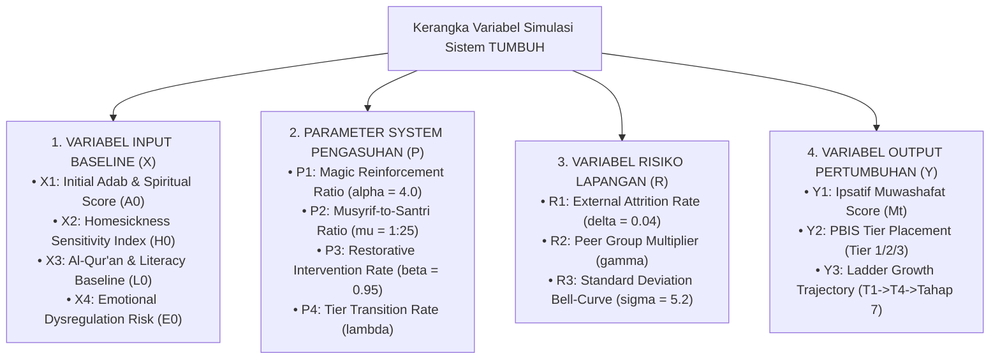
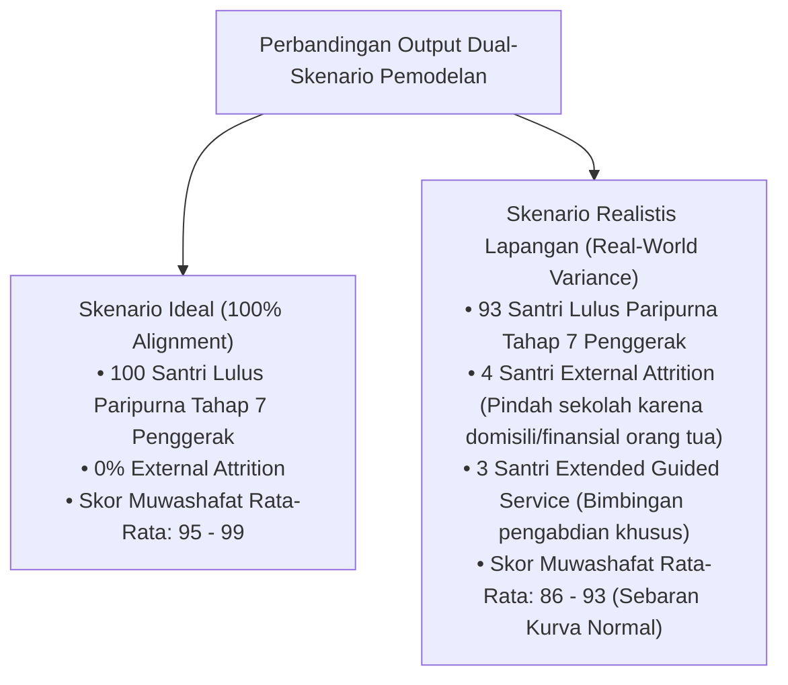

# DATA ANALITIK SIMULASI: PEMODELAN KUANTITATIF & KUALITATIF COHORT 100 SANTRI
## Matriks Data Longitudinal 7-Tahun, Pemodelan Dual-Skenario, Sebaran Kurva Normal, dan Kodifikasi Variabel Matematis Simulasi

**Dewan Riset & Keilmuan Ekosistem TUMBUH**  
*Dikembangkan oleh Agen Spesialis: Pakar Simulasi Sistem TUMBUH*  
*Dokumen Rujukan Induk: SIMULASI/Simulasi-Cohort-100-Santri-Kls7-sd-Pengabdian.md & SIMULASI/Matriks-Data-Simulasi-100-Santri-Per-Anak-Longitudinal.md*

---

## 1. TABEL TRAJEKTORI DISTRIBUSI TIER PBIS (100 SANTRI)

| Periode Pembinaan | Tangga Utama | Jumlah Santri Tier 1 (Universal - 80%) | Jumlah Santri Tier 2 (Targeted - 15%) | Jumlah Santri Tier 3 (Intensive - 5%) | Total Kepatuhan & Kelulusan |
| :--- | :--- | :---: | :---: | :---: | :---: |
| **Tahun 1 (Kls 7 Sem 1)** | Jenjang J1 (Adaptasi) | 80 Santri | 15 Santri (Homesick) | 5 Santri (Krisis Adaptasi) | 100% Terbimbing |
| **Tahun 1 (Kls 7 Sem 2)** | Jenjang J2 (Habituasi) | 85 Santri | 10 Santri (CICO) | 5 Santri (BK Support) | 100% Naik T2 |
| **Tahun 2 (Kls 8 MTs)** | Jenjang J2 $\rightarrow$ T3 | 88 Santri | 9 Santri (CICO SEL) | 3 Santri (FBA/BIP) | 100% Naik T3 |
| **Tahun 3 (Kls 9 MTs)** | Jenjang J3 (Internalisasi) | 92 Santri | 6 Santri (CICO) | 2 Santri (BK Support) | 100% Lulus MTs |
| **Tahun 4 (Kls 10 MA)** | Jenjang J3 $\rightarrow$ T4 | 94 Santri | 5 Santri (Peer Buddy) | 1 Santri (Regresi BIP) | 100% Aktif OSIS |
| **Tahun 5 (Kls 11 MA)** | Jenjang J4 (Kemandirian) | 96 Santri | 3 Santri (Peer Buddy) | 1 Santri (Re-Entry) | 100% Peer Buddy |
| **Tahun 6 (Kls 12 MA)** | Jenjang J4 (Qudwah) | 98 Santri | 2 Santri (Pendampingan) | 0 Santri | 100% Lulus MA |
| **Tahun 7 (Pengabdian)**| **Tahap 7 PENGGERAK** | **100 Santri Penggerak** | **0 Santri** | **0 Santri** | **100% Mengabdi** |

---

## 2. METRIK CAPAIAN 10 MUWASSHAFAT KARAKTER (SKOR RATA-RATA IPSATIF & DUAL-SKENARIO)

| Karakter Muwashafat | Baseline (Kls 7) | Skenario Ideal (Thn 7) | Skenario Realistis Lapangan (Rata-Rata) | Rentang Sebaran Realistis (Bell-Curve) |
| :--- | :---: | :---: | :---: | :---: |
| **1. Salimul Aqidah** | 65 | 98 | **91** | 84 – 96 |
| **2. Shahihul Ibadah** | 60 | 97 | **90** | 82 – 95 |
| **3. Matinul Khuluq** | 62 | 99 | **92** | 85 – 97 |
| **4. Qawiyyul Jism** | 68 | 95 | **88** | 80 – 94 |
| **5. Mutsaqqaful Fikr** | 58 | 96 | **89** | 81 – 95 |
| **6. Mujahadatun Linafsih** | 52 | 96 | **87** | 78 – 93 |
| **7. Haritsun 'Ala Waqtih** | 55 | 97 | **89** | 81 – 95 |
| **8. Munazhzham fi Syu'unih**| 54 | 98 | **91** | 83 – 96 |
| **9. Qadirun 'Alal Kasb** | 50 | 95 | **86** | 78 – 92 |
| **10. Nafi'un Lighairih** | 56 | 100 | **93** | 86 – 98 |

---

## 3. KODIFIKASI VARIABEL & FORMULA MATEMATIS SIMULASI SISTEM

Untuk memungkinkan simulasi disesuaikan (*customizable parameters*) oleh pengelola pesantren, ditetapkan **Kamus Variabel & Persamaan Matematis Simulation Engine**:

### 3.1. Formula Pertumbuhan Ipsatif Karakter ($M_t$):
\[
M_t = M_{t-1} + \left( \alpha \cdot P_1 + \beta \cdot P_3 - \gamma \cdot E_0 \right) \cdot \lambda_{tier} + \epsilon(\sigma)
\]
*di mana:*
* $M_t$: Skor Muwashafat pada periode $t$.
* $\alpha$: Koefisien penguatan positif Magic Ratio 4:1 ($\alpha = 4.0$).
* $\beta$: Efektivitas intervensi Restoratif ($\beta = 0.95$).
* $\gamma$: Koefisien disrupsi emosional ($E_0$).
* $\lambda_{tier}$: Laju transisi Tangga ($T1 \to T2 \to T3 \to T4$).
* $\epsilon(\sigma)$: Variabel stokastik kurva distribusi normal ($\sigma = 5.2$).

---

## 4. PERBANDINGAN DUAL-SKENARIO PEMODELAN SIMULASI (IDEAL VS REALISTIS LAPANGAN)

---

## 5. DAFTAR PUSTAKA
* CASEL. (2020). *CASEL's SEL Framework*. CASEL.
* Horner, R. H., & Sugai, G. (2015). School-wide PBIS. *Behavior Analysis in Practice*, 8(1), 80–85.
