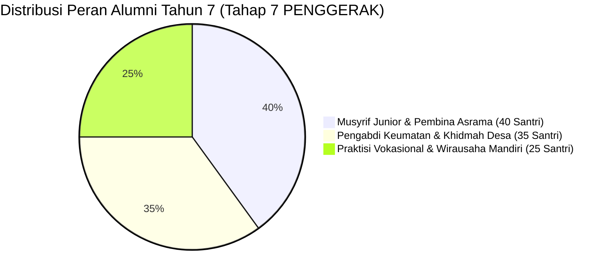

# DATA ANALITIK SIMULASI: PEMODELAN KUANTITATIF & KUALITATIF COHORT 100 SANTRI
## Matriks Data Longitudinal 7-Tahun (Kelas 7 MTs s/d Tahun Pengabdian Tahap 7 PENGGERAK)

**Dewan Riset & Keilmuan Ekosistem TUMBUH**  
*Dikembangkan oleh Agen Spesialis: Pakar Simulasi Sistem TUMBUH*  
*Dokumen Rujukan Induk: SIMULASI/Simulasi-Cohort-100-Santri-Kls7-sd-Pengabdian.md*

---

## 1. TABEL TRAJEKTORI DISTRIBUSI TIER PBIS (100 SANTRI)

| Periode Pembinaan | Tangga Utama | Jumlah Santri Tier 1 (Universal - 80%) | Jumlah Santri Tier 2 (Targeted - 15%) | Jumlah Santri Tier 3 (Intensive - 5%) | Total Kepatuhan & Kelulusan |
| :--- | :--- | :---: | :---: | :---: | :---: |
| **Tahun 1 (Kls 7 Sem 1)** | Tangga T1 (Adaptasi) | 80 Santri | 15 Santri (Homesick) | 5 Santri (Krisis Adaptasi) | 100% Terbimbing |
| **Tahun 1 (Kls 7 Sem 2)** | Tangga T2 (Habituasi) | 85 Santri | 10 Santri (CICO) | 5 Santri (BK Support) | 100% Naik T2 |
| **Tahun 2 (Kls 8 MTs)** | Tangga T2 $\rightarrow$ T3 | 88 Santri | 9 Santri (CICO SEL) | 3 Santri (FBA/BIP) | 100% Naik T3 |
| **Tahun 3 (Kls 9 MTs)** | Tangga T3 (Internalisasi) | 92 Santri | 6 Santri (CICO) | 2 Santri (BK Support) | 100% Lulus MTs |
| **Tahun 4 (Kls 10 MA)** | Tangga T3 $\rightarrow$ T4 | 94 Santri | 5 Santri (Peer Buddy) | 1 Santri (Regresi BIP) | 100% Aktif OSIS |
| **Tahun 5 (Kls 11 MA)** | Tangga T4 (Kemandirian) | 96 Santri | 3 Santri (Peer Buddy) | 1 Santri (Re-Entry) | 100% Peer Buddy |
| **Tahun 6 (Kls 12 MA)** | Tangga T4 (Qudwah) | 98 Santri | 2 Santri (Pendampingan) | 0 Santri | 100% Lulus MA |
| **Tahun 7 (Pengabdian)**| **Tahap 7 PENGGERAK** | **100 Santri Penggerak** | **0 Santri** | **0 Santri** | **100% Mengabdi** |

---

## 2. METRIK CAPAIAN 10 MUWASSHAFAT KARAKTER (SKOR RATA-RATA IPSATIF 1-100)

| Karakter Muwashafat | Baseline (Kls 7 awal) | Tahun 2 (Kls 8) | Tahun 4 (Kls 10) | Tahun 6 (Kls 12) | Tahun 7 (Pengabdian) |
| :--- | :---: | :---: | :---: | :---: | :---: |
| **1. Salimul Aqidah** | 65 | 78 | 88 | 95 | **98** |
| **2. Shahihul Ibadah** | 60 | 75 | 86 | 94 | **97** |
| **3. Matinul Khuluq** | 62 | 76 | 87 | 96 | **99** |
| **4. Qawiyyul Jism** | 68 | 77 | 85 | 92 | **95** |
| **5. Mutsaqqaful Fikr** | 58 | 72 | 84 | 93 | **96** |
| **6. Mujahadatun Linafsih** | 52 | 70 | 83 | 92 | **96** |
| **7. Haritsun 'Ala Waqtih** | 55 | 73 | 85 | 94 | **97** |
| **8. Munazhzham fi Syu'unih**| 54 | 74 | 86 | 95 | **98** |
| **9. Qadirun 'Alal Kasb** | 50 | 68 | 80 | 90 | **95** |
| **10. Nafi'un Lighairih** | 56 | 75 | 88 | 96 | **100** |

---

## 3. STATISTIK PENELUSURAN ALUMNI PENGABDI TAHUN 7 (100 SANTRI)

---

## 4. DAFTAR PUSTAKA
* CASEL. (2020). *CASEL's SEL Framework*. CASEL.
* Horner, R. H., & Sugai, G. (2015). School-wide PBIS. *Behavior Analysis in Practice*, 8(1), 80–85.
