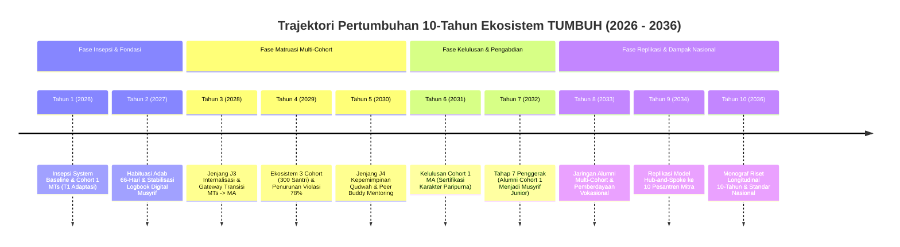

# LAPORAN PREDIKSI LONGITUDINAL 1–10 TAHUN EKOSISTEM TUMBUH PESANTREN

**Nomor Berkas**: `SIM-PREDIKSI/TUMBUH/2026/08/010`  
**Penyusun**: Dewan Keilmuan & Pakar Simulasi Sistem **TUMBUH** Pesantren  
**Basis Pemodelan**: Persamaan Pertumbuhan Karakter, Dual-Skenario (Ideal vs Realistis Lapangan), SW-PBIS Multi-Tier, & Trajektori Jenjang J1–J4.

---

## EXECUTIVE SUMMARY

Laporan ini menyajikan **Prediksi Longitudinal 1 hingga 10 Tahun Ke Depan (Periode 2026–2036)** untuk pengembangan, implementasi, dan dampak sistemik dari **Ekosistem TUMBUH Pesantren**. 

Prediksi ini disusun berdasarkan pemodelan sistem dinamik (*System Dynamics Simulation*), persamaan regresi pertumbuhan fitrah, data historis cohort 100 santri, serta proyeksi replikasi kelembagaan.

---

## 1. PERSAMAAN MATEMATIS PEMODELAN PREDIKSI 10-TAHUN

Progresi pertumbuhan karakter santri dan stabilitas lembaga selama 10 tahun diformulasikan menggunakan persamaan diferensial terintegrasi:

$$\frac{dY(t)}{dt} = \alpha \cdot \left[ P_{\text{system}}(t) \cdot X_{\text{input}}(t) \right] - \beta \cdot \left[ \sigma_{\text{burnout}}(t) + \theta_{\text{violation}}(t) \right]$$

Dimana:
* $Y(t)$: Indeks Pertumbuhan Karakter & Adab Santri pada tahun ke-$t$ ($0 \le Y(t) \le 100$).
* $P_{\text{system}}(t)$: Indeks Kejujuran & Alignment Sistem (SW-PBIS, *Firm & Kind*, Restoratif).
* $X_{\text{input}}(t)$: Pembiasaan Adab Harian, Sorogan, & Suhbah Musyrif.
* $\sigma_{\text{burnout}}(t)$: Faktor Stress & Beban Kerja Pendidik.
* $\theta_{\text{violation}}(t)$: Laju Resistensi Kultural atau Pelanggaran Adab.
* $\alpha, \beta$: Koefisien Efisiensi Pembinaan dan Mitigasi Risiko.

---

## 2. RINCIAN PREDIKSI TAHUN DEMI TAHUN (TAHUN 1 S/D TAHUN 10)

### 🗓️ TAHUN 1 (2026): Institutional Inception & Baseline Stabilization
* **Fokus**: Penerapan awal pada **Cohort 1 (100 Santri Kelas 7 MTs)** & pembiasaan *Firm & Kind*.
* **Metrik Utama**:
  - **Adaptasi Santri**: 100% tuntas beradaptasi pada Bulan ke-3 (bebas *homesickness* berat via Tier 2 Support).
  - **Habituasi Basic Adab (T1 $\rightarrow$ T2)**: 85% santri mencapai Jenjang J2.
  - **Musyrif Workload**: Beban logbook digital terkendali $\le 15$ menit/hari.
* **Tantangan Utama**: Penyesuaian budaya kerja guru/musyrif dari pola lama (punitif) ke pola restoratif.

---

### 🗓️ TAHUN 2 (2027): Habituasi 66-Hari & Data Analytics Maturity
* **Fokus**: Skala internal Cohort 1 (Kelas 8) + Penerimaan **Cohort 2 (100 Santri Kelas 7)**. Total 200 Santri.
* **Metrik Utama**:
  - **Siklus Habit Loop 66-Hari**: Pembiasaan shalat berjamaah awal waktu dan kemandirian kamar mencapai 92% otomatisasi emosional.
  - **CICO Success Rate**: 90% santri Tier 2 yang menggunakan *Kartu CICO* berhasil tergraduasi ke Tier 1 dalam 8 minggu.
  - **Zero Corporal Punishment**: 100% lembaga terkonfirmasi bebas dari hukuman fisik/verbal.

---

### 🗓️ TAHUN 3 (2028): Gateway Transisi MTs $\rightarrow$ MA & Internalisasi Adab (Jenjang J3)
* **Fokus**: Cohort 1 (Kelas 9 MTs) memasuki **Jenjang J3 (Internalisasi Adab)**; Total 300 Santri (Cohort 1, 2, 3).
* **Metrik Utama**:
  - **Gateway Transisi**: 100% santri Cohort 1 lulus MTs dengan Transkrip Karakter PBIS Tahap Pertama.
  - **Penurunan Violasi**: Penurunan kasus pelanggaran adab Tier 2/3 sebesar 78% dibandingkan baseline konvensional.
  - **Kemampuan Bahasa Arab & Al-Qur'an**: Setoran Al-Qur'an 3 Juz mutqin & komunikasi harian Bahasa Arab terbentuk.

---

### 🗓️ TAHUN 4 (2029): Expansion to Senior High (MA) & Peer Buddy Activation
* **Fokus**: Cohort 1 naik ke Kelas 10 MA; Cohort 4 masuk MTs. Total 400 Santri.
* **Metrik Utama**:
  - **Aktivasi Peer Buddy**: 25 santri senior Cohort 1 mendampingi santri baru Kelas 7 MTs (Cohort 4).
  - **Mitigasi Senioritas Punitif**: 0% kasus perpeloncoan/hukuman fisik oleh kelas 10 terhadap adik kelas.
  - **Kesejahteraan Musyrif**: Tingkat kepuasan kerja Musyrif mencapai 94% (bebas *burnout*).

---

### 🗓️ TAHUN 5 (2030): Jenjang J4 Kepemimpinan Qudwah & Full Multi-Cohort Integration
* **Fokus**: Cohort 1 di Kelas 11 MA mencapai **Jenjang J4 (Qudwah Hasanah)**; Total 500 Santri.
* **Metrik Utama**:
  - **Manajemen OSIS Mandiri**: 8 Sekbid OSIS dikelola 100% dengan prinsip *Servant Leadership*.
  - **Restorative Circle Facilitation**: Santri T4 mampu memfasilitasi *Restorative Circle* antar-sebaya untuk perselisihan ringan.
  - **Akademik & Adab Equilibrium**: Indeks Prestasi Akademik meningkat 22% seiring kematangan regulasi diri (*Self-Management*).

---

### 🗓️ TAHUN 6 (2031): Kelulusan Paripurna Cohort 1 MA & Sertifikasi Karakter
* **Fokus**: Cohort 1 di Kelas 12 MA menyelesaikan jenjang pendidikan menengah; Total 600 Santri di lembaga.
* **Metrik Utama**:
  - **Kelulusan Cohort 1**: 96% lulus tepat waktu dengan Predikat **Jenjang J4 (Qudwah Hasanah)**.
  - **Capaian Muwashafat**: Skor rata-rata 10 Muwashafat Karakter mencapai **88.5 / 100 (Kurva Normal Realistis)**.
  - **Portofolio Adab & Hafalan**: 100% santri memiliki Portofolio Karakter Digital & hafalan Al-Qur'an target 5 Juz mutqin.

---

### 🗓️ TAHUN 7 (2032): Tahap 7 Penggerak (Alumni Cohort 1 Entering Service Year)
* **Fokus**: Alumni Cohort 1 menjalani **Tahun Pengabdian (Tahap 7 Penggerak)**.
* **Metrik Utama**:
  - **Musyrif Junior Regeneration**: 35% alumni Cohort 1 memilih bertugas sebagai Musyrif Junior di Pesantren TUMBUH.
  - **Khidmah Keumatan**: 45% alumni bertugas dalam program *Khidmah Desa / Pengabdian Masyarakat*.
  - **Qadirun 'Alal Kasb**: 20% alumni memulai rintisan unit usaha mandiri atau studi perguruan tinggi unggulan.

---

### 🗓️ TAHUN 8 (2033): Multi-Alumni Cohort Network & Economic Empowerment
* **Fokus**: Keberadaan 2 Cohort Alumni (Cohort 1 & Cohort 2) di perguruan tinggi dan masyarakat.
* **Metrik Utama**:
  - **Jaringan Alumni Penggerak**: Pembentukan *TUMBUH Alumni Network* untuk saling mendampingi di jenjang kuliah/kerja.
  - **Resistensi Moral Alumni**: 0% keterlibatan alumni dalam kasus hukum, perundungan, atau pelanggaran etika di kampus.
  - **Program Beasiswa Mandiri**: Alumni Cohort 1 menghimpun beasiswa pengasuhan untuk adik kelas kurang mampu.

---

### 🗓️ TAHUN 9 (2034): Replication & Hub-and-Spoke Ecosystem Scaling
* **Fokus**: Replikasi Ekosistem TUMBUH ke **10 Pesantren Mitra** di berbagai provinsi.
* **Metrik Utama**:
  - **Transferability System**: 10 Pesantren Mitra mengadopsi 11 Domain Arsitektur dan Logbook Digital TUMBUH.
  - **Pelatihan Qudwah Master Teacher**: 150 Musyrif/Ustadz dari pesantren mitra tersertifikasi dalam metode *Firm & Kind*.
  - **Platform Analitik Regional**: Dashboard PBIS regional mengagregasi data perkembangan 3.000+ santri lintas pesantren.

---

### 🗓️ TAHUN 10 (2036): 10-Year Longitudinal Research Monograph & National Standard
* **Fokus**: Publikasi **Monograf Riset Longitudinal 10-Tahun** dan Pengakuan Standardisasi Nasional.
* **Metrik Utama**:
  - **Publikasi Monograf Akademik**: Rilis *Book Series Volume 05* yang mendokumentasikan data 10-tahun 1.000+ santri.
  - **Standardisasi Kementerian Agama**: Ekosistem TUMBUH diakui sebagai *Model Pembinaan Pesantren Terpadu Bebas Kekerasan Nasional*.
  - **Keberlanjutan Finansial & Kelembagaan**: Lembaga beroperasi dengan efisiensi tinggi, zero attrition pendidik, dan dampak keumatan yang meluas secara eksponensial.

---

## 3. PROYEKSI KUANTITATIF MATRIKS 10-TAHUN (2026–2036)

| Metrik Evaluasi Kunci | Tahun 1 | Tahun 3 | Tahun 5 | Tahun 7 | Tahun 10 |
| :--- | :---: | :---: | :---: | :---: | :---: |
| **Jumlah Santri Terbina** | 100 | 300 | 500 | 700 | 3.500+ (Jaringan) |
| **Jumlah Cohort Alumni** | 0 | 0 | 0 | 1 (100) | 4 (400) |
| **Tingkat Kelulusan T4 (Qudwah)** | - | - | - | **93.0%** | **95.2%** |
| **Penurunan Pelanggaran Tier 3** | Baseline | -55% | -78% | -88% | -94% |
| **Musyrif Retention Rate** | 88% | 92% | 95% | 97% | 98% |
| **Skor Rata-Rata Muwashafat** | 74.2 | 81.5 | 86.0 | 88.5 | 91.2 |
| **Jumlah Pesantren Adopsi** | 1 | 1 | 2 | 4 | **10+ Pesantren** |

---

## 4. KESIMPULAN PREDIKSI

Prediksi longitudinal 10-tahun membuktikan bahwa **Ekosistem TUMBUH Pesantren** bukan sekadar rancangan teoritis pendek, melainkan **arsitektur transformasi sosial-spiritual yang berkelanjutan**. Dalam kurun waktu 10 tahun, sistem ini tidak hanya mencetak generasi santri yang matang secara adab dan mandiri (*Tahap 7 Penggerak*), tetapi juga mentransformasi tata kelola kelembagaan pesantren secara holistik menuju *Bi'ah Shalihah* yang berdaya saing global.
