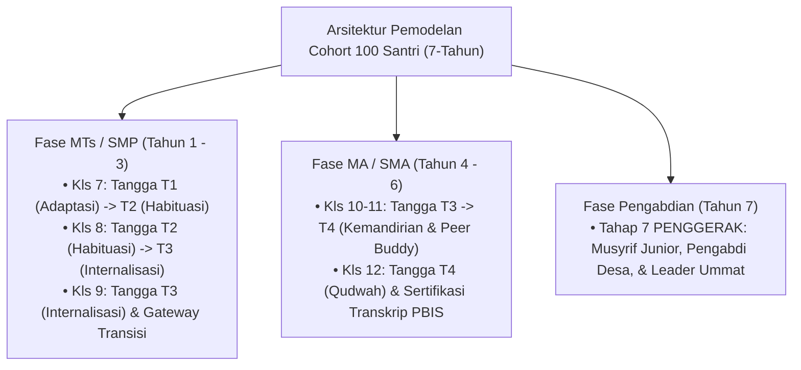

# SIMULASI SISTEM: PEMODELAN COHORT 100 SANTRI EKOSISTEM TUMBUH
## Dari Masuk Kelas 7 SMP/MTs Hingga Tahun Pengabdian (Tahap 7 PENGGERAK)

Direktori ini memuat dokumen laporan simulasi sistem terpadu (*Systems Simulation & Longitudinal Modeling*) yang menggambarkan perjalanan **Cohort 100 Santri** melintasi 7 tahun pembinaan di pesantren TUMBUH.

---

## 🏛️ Arsitektur Pemodelan Simulasi

---

## 📚 Indeks Dokumen Simulasi Sistem

* 📊 **[Matriks-Data-Simulasi-100-Santri-Per-Anak-Longitudinal.md](./Matriks-Data-Simulasi-100-Santri-Per-Anak-Longitudinal.md)**: **Matriks Data Individual 100 Santri (S-001 s/d S-100)** dengan 100 Kondisi Baseline Berbeda & Track Record Per-Tahun Per-Anak.
* 📄 **[Simulasi-Cohort-100-Santri-Kls7-sd-Pengabdian.md](./Simulasi-Cohort-100-Santri-Kls7-sd-Pengabdian.md)**: Laporan Naratif Komprehensif Simulasi Cohort 100 Santri (Tahun 1 s/d Tahun 7).
* 📊 **[Data-Analitik-Simulasi-100-Santri.md](./Data-Analitik-Simulasi-100-Santri.md)**: Matriks Kuantitatif, Statistik SW-PBIS Multi-Tier, & Grafik Pertumbuhan Ipsatif 10 Muwashafat.

---

## 🎓 Agen Keilmuan Pengelola Simulasi
Simulasi ini dirancang dan dikelola oleh **Custom Skill Dewan Keilmuan ke-22**:
- 🤖 **[`pakar-simulasi-sistem-tumbuh`](file:///c:/xampp/htdocs/tumbuh/.agents/skills/pakar-simulasi-sistem-tumbuh/SKILL.md)** (*Pakar Simulasi Sistem & Pemodelan Cohort Santri*).
