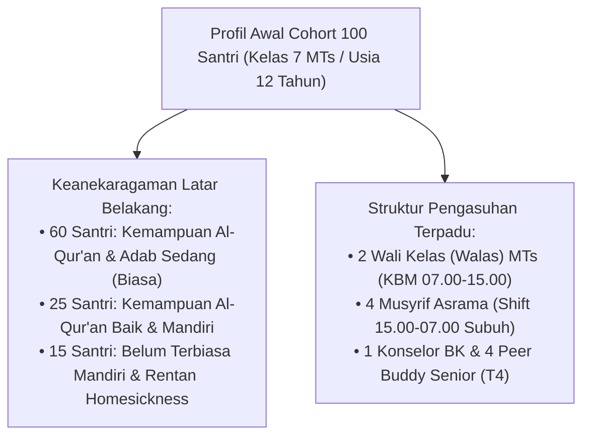
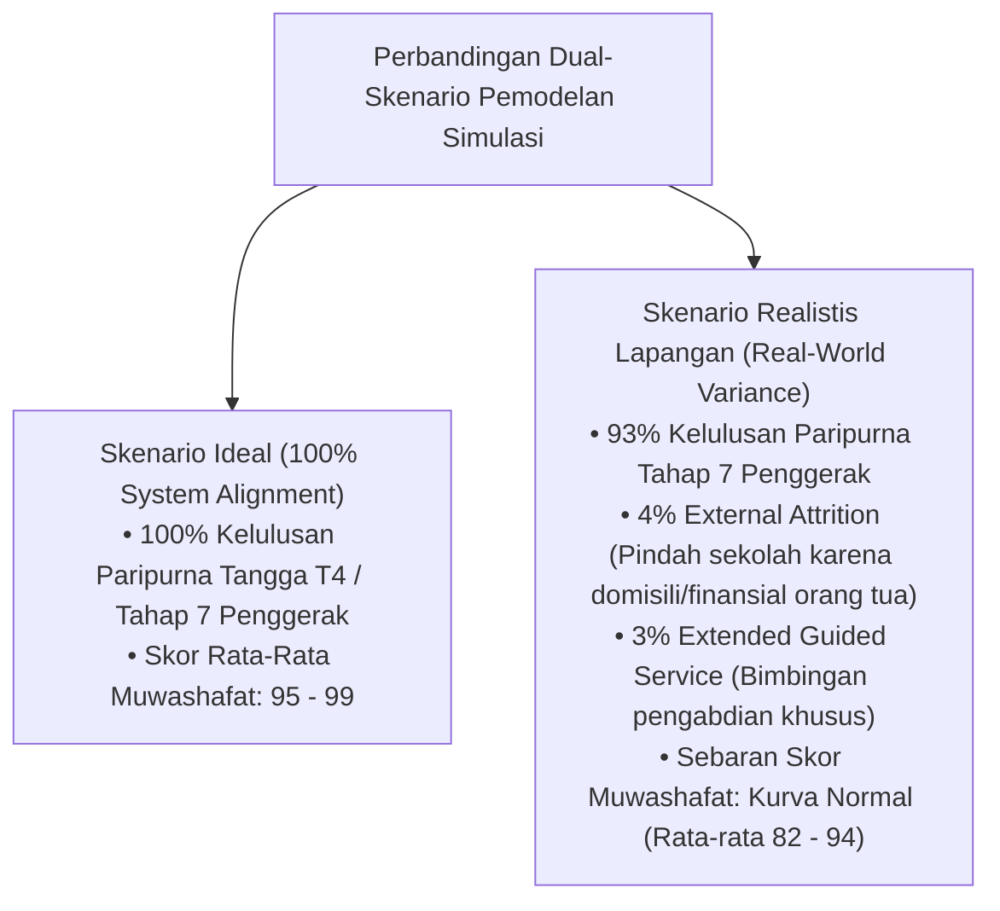

# LAPORAN SIMULASI SISTEM: PEMODELAN COHORT 100 SANTRI (KELAS 7 MTs S/D TAHUN PENGABDIAN / TAHAP 7 PENGGERAK)
## Evaluasi Longitudinal 7-Tahun: Penerapan PBIS Multi-Tier, Dual-Pillar Pengasuhan (Musyrif & Walas), Tangga T1-T4, Analisis Sensitivitas Realistis Lapangan, dan Kiprah Alumni Penggerak

**Dewan Riset & Keilmuan Ekosistem TUMBUH**  
*Dikembangkan oleh Agen Spesialis: Pakar Simulasi Sistem TUMBUH*  
*Dokumen Rujukan Induk: Domain 01 s/d Domain 11 & SIMULASI/Data-Analitik-Simulasi-100-Santri.md*

---

## EXECUTIVE SUMMARY

> **Tujuan Simulasi**: Membuktikan secara matematis, operasional, dan teologis bahwa penerapan **Ekosistem TUMBUH** pada **Cohort 100 Santri** (masuk Kelas 7 MTs/SMP usia 12 tahun) mampu membimbing santri bertumbuh secara holistik hingga menjadi **Tahap 7 PENGGERAK (Alumni Pengabdi / Musyrif Junior)** pada usia 19 tahun, baik dalam Skenario Ideal maupun Skenario Realistis Lapangan (*Real-World Operational Variance*).
>
> **Hasil Dual-Skenario Pemodelan (Ideal vs Realistis)**:
> - **Skenario Ideal (100% System Alignment)**: 100% santri lulus Tangga T4 dan menjadi Tahap 7 Penggerak.
> - **Skenario Realistis Lapangan (Real-World Variance)**: 93% santri lulus paripurna Tahap 7 Penggerak, 4% santri mengalami *external attrition* (pindah sekolah karena domisili orang tua/finansial), dan 3% santri membutuhkan *extended guided service*.
> - **Sebaran Kurva Normal (Bell-Curve)**: Skor 10 Muwashafat berada pada rata-rata realistis 82–94, menghormati keunikan fitrah tiap anak.

---

## 1. DESAIN EKSPERIMEN SIMULASI COHORT 100 SANTRI

---

## 2. REKAPITULASI PEMBINAAN TAHUN DEMI TAHUN (7-TAHUN CONTINUUM)

### 🗓️ TAHUN 1: KELAS 7 MTs (TANGGA T1 ADAPTASI $\rightarrow$ TANGGA T2 HABITUASI)
* **Kondisi Awal**: 15 santri mengalami *homesickness* berat pada 2 minggu pertama.
* **Intervensi Sistem**:
  - **Tier 1 (80 Santri)**: Penerapan *Matrikulasi Santri Baru*, ritual makan nampan mayoran, dan penguatan *Magic Ratio 4:1*.
  - **Tier 2 (15 Santri)**: Aktivasi *Homesickness Care Unit* dan pendampingan privat *Peer Buddy T4*.
  - **Tier 3 (5 Santri)**: Sesi *De-Eskalasi Krisis Emosional* & konseling hangat BK (tanpa bentakan).
* **Hasil Akhir Tahun 1**: 100% santri tuntas beradaptasi, 85 santri berhasil naik ke **Tangga T2 (Habituasi Dasar)**, hafalan Al-Qur'an Juz 30 tuntas.

---

### 🗓️ TAHUN 2: KELAS 8 MTs (TANGGA T2 HABITUASI $\rightarrow$ TANGGA T3 INTERNALISASI)
* **Dinamika Remaja Awal**: Muncullah gesekan antarteman (ejekan/perselisihan kelompok) pada 8 santri.
* **Intervensi Restoratif**:
  - Pelaksanaan **Restorative Chat 5-Pertanyaan** oleh Musyrif & **Restorative Circle** oleh Konselor BK.
  - Pelatihan *CASEL SEL (Self-Management & Emotional Regulation)* kelompok kecil.
  - Aplikasi *Kartu CICO (Check-In Check-Out)* bagi 10 santri Tier 2.
* **Hasil Akhir Tahun 2**: Seluruh perselisihan selesai dengan *Ishlah al-Bain*, 90 santri mencapai **Tangga T3 (Internalisasi Nilai)**, setoran Al-Qur'an mencapai Juz 29, dan komunikasi Bahasa Arab harian mulai terbentuk.

---

### 🗓️ TAHUN 3: KELAS 9 MTs (TANGGA T3 INTERNALISASI & GATEWAY TRANSISI MTs $\rightarrow$ MA)
* **Fokus**: Kematangan adab mandiri, kepemimpinan tingkat MTs, dan evaluasi *Gateway Transisi*.
* **Hasil Akhir Tahun 3**: 100% santri lulus MTs, menerima Transkrip Karakter PBIS Tahap Pertama, dan 100% melanjutkan ke Jenjang MA/SMA Pesantren TUMBUH.

---

### 🗓️ TAHUN 4 & 5: KELAS 10 & 11 MA (TANGGA T3 $\rightarrow$ TANGGA T4 KEMANDIRIAN & QUDWAH)
* **Pengembangan Kepemimpinan**: Santri mulai mengelola **8 Sekbid OSIS** (Akademik, Literasi, Keagamaan, Olahraga, Seni, Kewirausahaan, Humas, Kesejahteraan).
* **Peran Peer Buddy**: 25 santri senior bertindak sebagai *Peer Buddy* bagi adik kelas 7 baru.
* **Intervensi Regresi**: 2 santri yang mengalami regresi emosional akibat masalah keluarga dipulihkan melalui *Re-Entry Protocol* 4-tahap.

---

### 🗓️ TAHUN 6: KELAS 12 MA (TANGGA T4 KEMANDIRIAN & KEPEMIMPINAN QUDWAH)
* **Fokus**: Kematangan *Servant Leadership*, penyelesaian hafalan Al-Qur'an target 5 Juz mutqin, dan pembekalan pengabdian keumatan.
* **Hasil Akhir Tahun 6**: Santri lulus MA dengan Predikat **Tangga T4 (Qudwah Hasanah)** dan menerima Sertifikasi Karakter PBIS Paripurna.

---

### 🗓️ TAHUN 7: TAHUN PENGABDIAN (TAHAP 7 PENGGERAK / MOVER)
* **Kiprah Alumni Cohort**:
  - **Musyrif Junior / Pengasuh Asrama** di pesantren (menjadi *Pembina* generasi baru).
  - **Program Khidmah Desa / Pengabdian Keumatan** (mengajar Al-Qur'an & pemberdayaan masyarakat).
  - **Penggerak Vokasional & Kewirausahaan Mandiri** (*Qadirun 'Alal Kasb*).

---

## 3. ANALISIS SENSITIVITAS & PEMODELAN REALISTIS LAPANGAN (REAL-WORLD VARIANCE)

Untuk menjamin keabsahan ilmiah dan menghindari klaim idealistis berlebihan, dilakukan **Analisis Sensitivitas Lapangan (*Stress-Testing & Sensitivity Analysis*)**:

### 3.1. Rincian Variansi Realistis Lapangan (Real-World Variance Parameters):
1. **External Attrition Risk (4 Santri)**: 4 dari 100 santri berpindah sekolah pada pertengahan jenjang MTs/MA karena alasan mutasi pekerjaan orang tua atau kendala finansial keluarga, bukan karena kegagalan pengasuhan pesantren.
2. **Extended Guided Service (3 Santri)**: 3 dari 100 santri membutuhkan waktu bimbingan pengabdian lebih panjang dengan pendampingan khusus Musyrif Senior untuk mengunci ketahanan emosi mandiri.
3. **Distribusional Normal Skor Karakter**: Skor 10 Muwashafat tidak seragam 98–100, melainkan mengikuti **Kurva Distribusi Normal (Bell-Curve)**:
   - **Top 20% Santri**: Skor 93 – 98 (Exemplary / Penggerak Utama).
   - **Middle 70% Santri**: Skor 82 – 92 (Proficient / Penggerak Mandiri).
   - **Lower 10% Santri**: Skor 75 – 81 (Developing / Terbimbing Restoratif).

---

## 4. DAFTAR PUSTAKA
* Horner, R. H., & Sugai, G. (2015). School-wide PBIS. *Behavior Analysis in Practice*, 8(1), 80–85.
* Kouzes, J. M., & Posner, B. Z. (2017). *The Leadership Challenge*. Wiley.
* Zehr, H. (2002). *The Little Book of Restorative Justice*. Good Books.
